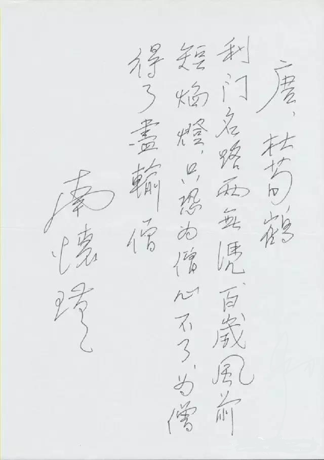

# 量子意识 - 现代科学与佛学的汇合处

朱清时/2013.03

## 序言

谢谢慈雄先生的介绍。今天我很荣幸能够应邀在南老师九十六岁诞辰日来作这一次报告。南老师一生用了七十年来教化众生，被他教化的人无以计数，我就是其中一个。我在2004年，有一天很有幸去拜访南老师，当时在上海康平路的一座别墅里，我们从中午一直谈到晚上吃饭，谈了整整一下午，谈的主要内容就是佛学、现代科学、生命科学。谈完之后，在吃饭前，南老师就给我手书了一首诗，唐朝杜荀鹤写的：“利门名路两无凭，百岁风前短焰灯。只恐为僧心不了，为僧得了尽输僧。”这首诗充满了南老师对我的关怀和开导，我知道南老师希望我能把精力投入到科普上。从那以后，我每年一有机会就到南老师那里去，接受南老师的教导，听南老师讲课讲经。

我觉得，南老师对自然科学非常尊重和渴望。在近十年我参加的他的讲经活动中，他多次提到了科学技术的重要性。我记得有一次讲《楞严经》的时候，他跟我们说，释迦牟尼讲经用了当时自然科学的最高成就。比如“佛观一杯水，十万八千虫”，那个时候就能够看到一杯水里有十万八千个微生物，这是相当相当了不起的。他讲楞严经、讲了光学，讲了很多东西，也讲了生命科学，那是当时自然科学的最高成就。他有一次又讲过：佛法有八万四千法门，佛在传授法门的时候是因时、因地、因人而设教，用不同的方法对不同的人。那么对现代的人，你要引导他了解佛法，最好的法门是自然科学法门，就是要用自然科学的方法来把佛法讲清楚。南老师自己在著述和讲经中，也处处引用现代自然科学的成果和概念来说明深奥的佛学原理。

南老师对我的教化，就是希望我能够把精力投入到科普工作中去。科普不是个简单的东西，南老师一生把古代圣人的名著包括佛经，用普通大众能够接受的语言讲出来了，使大家能够看懂古代这些经典名著和佛经。他的功力非常深、他的功德很大，现在我们自然科学界还没有人有他这个功力，能够把现代自然科学的知识用普通大众能够了解的语言来讲清楚。所以我发愿，在南老师的开导之下，努力从事科普，把自然科学的语言，忠实地、原汁原味地编成老百姓能够理解的语言，把它讲清楚，供大家研究自然科学和佛学之间的关联。

今天我给大家汇报的就是，我在南老师指导之下，在近十年的时间里，把自然科学和佛学作比较，得出的两个心得。之一是：我在最初的五六年中间跟南老师学习“空观”，这是佛学中的一个非常重要的基本思想，就是万法皆空，一切有形态的东西实际上都是空的，有色相的东西都是空的，这个观点用现代自然科学的成果已经比较好理解了。我之前在南老师那里写过好些读书心得，其中一篇就叫做《物理学步入禅境——缘起性空》，就是写了这方面的心得。但是在进一步的学习中发现，光理解佛学的“空观”是不够的，因为如果大家都知道“一切皆空”，那岂不是你做好事坏事最后都“空”了，好事坏事没有分别了吗？一定有个东西，能把好事坏事区别得很清楚，才能够抑恶扬善，才能使大家一心从善。佛学进一步的道理是什么呢？就是南老师后来用数年时间给我们讲的唯识法相宗的学说，其中说，人的每个念头、每做一件事，都被记录在阿赖耶识的种子里头了，这些种子一旦有缘就会发芽开花。这种唯识法相宗的学说，我觉得是我们最应该下工夫理解的。我今天要报告的读书心得就是围绕着唯识法相宗来看现代自然科学有些什么样的进展和发现。

今天讲的题目是《量子意识——现代科学与佛学的汇合处？》，大家一听到这个题目可能觉得很玄。意识怎么会是量子？量子这个东西大家可能都觉得很神秘，实际上一点儿也不神秘。二十世纪被最精密地证实的自然科学理论就是量子理论。二十世纪有大量的科技成就和社会的技术发展，都是跟量子理论有关的，像核能、半导体，我们现在用的手机、计算机，这些都和量子理论有关。下面我再简要介绍量子理论。

那么意识是什么呢？学自然科学的人都知道，意识是被科学拒之门外、唯恐避之而不及的东西。我们这代人都知道一句老话，叫做：“科学研究的是不以人的意志为转移的客观规律。”这句话大家是不是很清楚，这是以前的老生常谈了。“不以人的意志为转移”的“意志”就是意识，就是说自然科学把自己摆脱得干干净净的，把所有意识的东西都排除在外，它不承认自己的东西跟意识有关，所以自然科学和意识是撇得很清楚的。但是人类发展到今天，发现意识是规避不了的。我今天要讲的就是，自然科学发展到后来，发现意识是怎样都规避不了的，而且意识在自然科学理论中，反而可能是最基础的。这就是我今天要讲的主要内容。如果大家听懂了，为什么意识是规避不了的，而且意识在自然科学理论中是最基础的，大家就可能知道自然科学最终应该会和佛学殊途同归。

佛学研究的正是“意识”（当然不能完全用意识来概括佛学），而自然科学要研究的，就是刚才说的，要和意识撇得很清楚的客观世界。它把所有意识都排除在外，它研究的是“不以人的意志为转移的客观规律”，是客观世界、物质世界。那么人类另一部分的知识、宇宙中间另一部分的东西，就是意识，实际上是从释迦牟尼之前就开始研究，释迦牟尼之后就更发达，佛学研究人的意识。如果佛学跟科学研究的东西是分不开的，那么佛学和科学一定就会走在一起。果然现在自然科学就发现，意识和客观物质世界是不能截然分开的，随着研究的深入，相信佛学最终会和自然科学殊途同归。

这就是我今天要讲的主题，也是我现在对佛学和科学的认识。

有很多人习惯说佛学是迷信，我说不，佛学不是迷信，佛学研究的东西和自然科学不同，是宇宙的另一方面，就是意识。佛学和自然科学的研究就像爬喜马拉山一样，一个从北坡往上爬，一个从南坡往上爬，总有一天两者要会合的。

大家对这个说法先有了思想准备，对我后面讲的东西可能就容易接受了。

## 一、 科学和佛学认识真理的不同方法

科学研究的是物质，科学研究的基本方法就是假设客观世界和主观世界、也就是物质和意识必须要截然分开；佛学研究的东西是意识，佛学反而认为主观和客观、物质和意识不能分开，就是“心物一元”的道理。大家要接受佛学不是迷信，必须要了解佛学为什么能够发现真理，而不是胡思乱想呢？

我们先来比较一下佛学和自然科学认识真理的不同方法。

首先自然科学（以后简称科学）的方法，科学界有定论，是逻辑推理加实验。逻辑推理是亚里士多德时代的形式逻辑，实验是培根的科学归纳法的基础。还有个大前提，就是刚才说过的，假设客观物质世界和主观意识能截然分开。

佛学的方法跟科学完全不同，佛学的方法不做实验，不作推理。佛学通过提高人的认知能力来认识更深刻的真理。什么叫提高认知能力？打个比方：一个小孩儿对世界的理解，对于我们成人来说很幼稚。这个小孩儿要提高认知能力，要等他长大。长大以后，他的大脑已经达到更高的水平了，他就会发现他小时候不能理解的许多道理豁然开朗。这就是提高认知能力来认知真理，就是人靠自然成长，从小孩儿变成大人。另外我们人类和猿猴的脑容量相差并不是太多，但是有很多我们看来司空见惯的东西，猿猴就是怎么理解都理解不了。人类对猿猴不能理解的东西，一看就能理解，这就是人类的认知能力比猿猴高了一等，自然而然就理解了很多猿猴不能理解的东西。所以佛经上经常说，有些人没有慧根。没有慧根的人很愚钝。愚钝实际上是认知能力不高。有慧根的聪慧的人，往往能够一眼看懂愚钝的人百思不得其解的东西。佛学怎样去提高人的认知能力呢？用的办法就是禅定，禅定让自己的大脑和全部身心细胞处于高度安静的状态。这个时候，就像电流遇到超导体一样。电流遇到普通导体时，有很强的电阻，那是因为普通导体里的分子、原子都在扰动，扰动增加了电流流动的阻力。当把导体冷却到绝对温度附近的时候，电子通过的路径上，分子和原子的扰动全部都消失了，这个时候导体就畅通无阻了，一下子电流就极其强。人在禅定状态下，如果你能达到那种功力的话，你的大脑就像超导体一样，足够安静，一下子你的思维和你的意识就会变得比过去强大得多。所以佛学认知真理是靠禅定，靠一个人的心静下来，提高了自己的认知能力，而认识到更深刻的真理。佛学认知真理是靠[直觉](https://github.com/gwsice/buddhism/wiki/%E7%9B%B4%E8%A7%82)。直觉人人有之，但直觉有大有小，佛学的直觉，是通过禅定提高之后的直觉，即是更高智慧的开启。

自然科学研究的是独立于观察者之外而存在的客观实体，无论谁去观察、用什么方法观察，结果都应该相同，这就是自然科学的可重复性原则。因为它摒除了主观，所以它的研究结果谁都可以重复。佛学的研究，是通过提高认知能力，那可不是任何人都能重复的了。佛学的认知方法叫“循业发现”，就是每个人的认知能力只有跟循自己业力的大小，业力的大小意味着认知能力的高低，发现宇宙真理的层次就不一样。这两种不同的方法往往不能混淆。如果搞自然科学的人用自己的重复性原则加之于佛学，那就完了，佛学不可重复。一个人能够认知的东西，另一个愚钝的人永远不可能认知，要这个愚钝的人提高了自己的认知能力才能够认知，所以是不可重复的。就这个意义上说，很多人不理解佛学的方法，把佛学斥之为迷信。这是今天我要说的第一部分，就是佛学不是迷信，佛学是研究意识的，其研究意识用的方法不是自然科学的那种逻辑推理加实验，它是靠提高人的认知能力来达到的。认知能力提高了之后，你对意识的认识才会上一个台阶。

## 二、量子力学的诡异现象

现在开始进入第二部分，可能大家有点吃力，所以希望认真听。懂得这一部分，才知道二十世纪人类科技的最高成就，而且才能听懂我刚才说的，为什么科学和佛学可能异途同归。

这部分讲量子力学。当然我不是讲授量子力学，我力求向南老师学习，把它讲得通俗，大家都易懂。量子力学这个理论非常之怪，刚才说了二十世纪人类物质进步的每一个重大环节，都跟量子力学有关。量子力学也是自然科学史上被实验证明最精确的一个理论，但是量子的观念，没有人能够理解。我说的没有人能够理解，绝不是指像我们这个层次的人，而是说连量子力学的创始人都不能理解。量子力学创始人有两个，一个是爱因斯坦，一个是玻尔。他们一辈子都在争论量子力学的问题，“世纪大辩论”，结果还是不能理解。玻尔就说了，如果谁说他懂了量子力学，他就没有真懂，因为量子力学连我们都没有搞懂，这就是他们的观点。那么量子力学最不好懂的是些什么问题呢？我先把量子力学中人们最不好懂的东西介绍给大家，而最不好懂的东西最后恰好是证明了：意识不能被排除在客观世界之外。一定要把意识加进去你才能够认识搞懂它。

### 1、叠加态与坍缩

量子力学的第一个诡异现象叫做态叠加原理和坍缩。

为了解释量子力学观念，我先说说普通人的日常经验。一个物体在某个时刻，一定会处在某个固定的状态。比如说，我的女儿现在在客厅里面，或者说我的女儿现在不在客厅里面，两者必居其一。只有一个对，要么在客厅里头，要么不在客厅里头。这就是普通人的关于状态的概念。一般人认为客观物体一定要有一个确定的空间位置，这种存在，是不以人的意志为转移的、是客观的。这个客观的定义，所有人都理解，而且认为这是天经地义的。

但在量子力学里就不一样了。量子力学的基本原理就是微观粒子可能处在叠加态，这种状态是不确定的。例如电子可以同时处于两个不同地点，电子有可能在A点存在，也可能在B点存在，电子的状态是在A点又不在A点的叠加。这个话大家就不太理解了。聪明的人会说，你说电子既在A点又不在A点，就像说你的女儿既在客厅又不在客厅，女儿在不在客厅，你一看不就明白了吗？这还用辩论什么？但是恰好量子力学就认为，你要去看这个女儿在不在，你就实施了观察的动作。你一观察，这个女儿的存在状态就坍缩了，她就从原来的，在客厅又不在客厅的叠加状态，一下子变成在客厅或者不在客厅的唯一的状态了。所以量子力学怪就怪在这儿：你不观察它，它就处于叠加态，也就是一个电子既在A点又不在A点，既在B点又不在B点。好，你说我去观察一下它在A点还是在B点。你一观察，它这种叠加状态就崩溃了，它就真的只在A点或者真的只在B点了，只出现一个。那有人就会说了：你这是诡辩，你怎么知道电子不观察它的时候，它既在A点又不在A点呢？好，这就是量子力学发展过程中，很多实验确证的事情，其中一个最著名最重要的实验，就是干涉实验。

我先说一下干涉实验的概念。如果有一个波，经过了两个狭缝，出来就变成两个子波了，这两个子波在随后传播过程中就会出现干涉。干涉的意思就是这两个子波在每个点都叠加，在有些点上两个波的运动方向相同，波的振幅就加强；在有些点上两个波的运动方向相反，振幅就减低，或者抵消为零。所以最后你观察到的波就是一些干涉条纹。如果看到干涉条纹，你就知道你观察到的是个波，而且这个波是在两个狭缝同时出现的，也就是既在A点又在B点，因为只有这样的情况，波才能出现干涉。

如果用电子来做实验，当每次只发射一个电子的时候，这个电子通过双狭缝打到电子屏上，激发出一个小亮点，这是电子的粒子性。但是事先也不知道电子会出现在屏幕上的什么地方，结果多次重复，经过大量的观察发现，这些电子不是完全没有规律的。它有时出现在这里，有时出现在那里，在某些地方出现的可能性要大一些，在另一些地方则小一些。电子的规律就是，它出现频率高的地方，恰好是波动规律所预言的干涉条纹的亮处，而它出现频率低的地方，对应于干涉条纹的暗处。所以，大量的实验证明：电子尽管是粒子，但是其运动像个波，而且每个电子必须同时出现在两个小孔。因为只有同时出现在两个小孔，它才能干涉。就如刚才说的，你没有观察它的时候，电子一定不会取一个确定的状态，它一定是所有状态都要同时存在，这样它才能干涉起来。这就是量子力学诡异的地方。这个性质，随后有很多很多应用。

刚才说了，电子一定要同时存在于两个可能的状态，电子才能与自己干涉起来。那么如果我们观察它，比如在两个狭缝处设置探测器，电子会怎么样呢？电子一被观测，就只出现在一个狭缝上了，干涉条纹立刻消失。这个状态就叫做波函数的坍缩。就是你一观察，电子就在一个确定的地方出现了。那么有些人就想，我观测它出现在确定的地方，它是不是早就出现在这个确定的地方，只不过我们不知道而已？不对，刚才的干涉实验告诉我们，在没有干涉之前，它肯定出现在所有地方。假如, 当我们不观察时，电子真的存在于某个地方，它便只能通过一道狭缝，这就不能解释实验中观测到的干涉条纹。其实，严格的实验已经完全排除了这种可能。电子在没有观测的时候，没有确定的状态。所以这件事是量子力学最诡异的事情。懂了这个，就懂了量子力学最诡异的东西，而且随后我们就能来证明：量子力学离不开意识，意识是量子力学的基础。

搞物理学的人开个玩笑，说观测为什么能够改变电子的状态呢？就好像一个男的和一个女的在恋爱时，不知道结婚的结果是好是坏，可能是好也可能是坏，是好与坏的一种叠加状态。这个时候你想要确定是好是坏怎么办呢？只有结婚试试吧。一结完婚，状态就改变了，就再也不是原来的状态了，变成只有一个状态了，要么好要么坏。刚才我讲了半天，实际上就是和这个例子一样。在观察之前，大家都不知道电子处于哪个状态。你去观察一下，就像结婚了，那电子就出现在一个确定的状态上了。这就是观测对系统的影响。

### 2、单体的叠加态：

薛定格的猫---证明测量的核心是人的意识刚才说的是量子力学第一个诡异之点，现在我们来看看这个诡异之点往下推论，能够推出什么结果。最后结果会使大家认识到，意识是量子力学的基础，物质世界和意识不可分开。

这个实验是量子力学的创始人薛定谔提出的，被称为“薛定谔的猫”。薛定谔的本意是想批驳量子力学和量子力学的态叠加，他认为一个东西既存在这个状态，又存在那个状态，像女儿即在客厅，又不在客厅一样，那是荒谬的。他就想了个办法来批驳量子力学，结果没有批驳好，最后反而证明了量子力学最诡异的地方，也就是意识和物质不可分开。

现在我来说薛定谔的实验是什么：把一只猫放进一个封闭的盒子里，然后把这个盒子接到一个装置上，这个装置包含一个原子核和一个毒气设施。原子核有百分之五十的可能性发生衰变，衰变的时候就会发射出一个粒子来，这个粒子一发出来就会触发毒气设施，毒气一触发就会杀死这只猫，这是他想象中的一个实验。根据刚才说的量子力学的态叠加原理，没有观察的时候，原子核是处于已经衰变和没有衰变的叠加状态，就是它既可能衰变了又没有衰变，它是两种状态的叠加，就像电子既在A点又不在A点一样，这个原子核既衰变又没有衰变，50%几率衰变，50%几率不衰变。这个时候猫的状态是可能活着，也可能死了，就是说猫也处于这种既死又活的叠加状态。

猫可能处于这种状态吗？聪明人可能会说：那你打开盒子一看不就行了吗？但是打开盒子一看，就是作了观测，猫就只能是死或者活了。这个问题一提出来，物理学家一个个都惊呆了，原来以为只有微观世界才有这种态叠加，就是状态不确定，既处于这个状态，又不处于这个状态。现在宏观世界也一样了，猫不就是这样吗？有一只既死又活的猫。大家都不承认有这种状态。但是量子力学的诡异之点，量子力学的态叠加原理就是说：你在观察之前，猫就是处于既死又活的状态。这个问题争论了很长时间。怎么办？量子理论很确定，这是毫无疑问的，如果没有揭开盖子没有观察，那薛定谔的猫的状态是死与活的叠加，这只猫永远处于同时是死又是活的叠加态。这与我们的经验严重违背。这个实验实际上就是“女儿在客厅里，女儿不在客厅里”变了个样子说出来。这个猫是死了还是活着？既死又活是同时存在的，量子力学就认为两者同时存在。那么怎么可能既死又活同时存在呢？人不能想象这种状态，于是大家就把这个实验进一步讨论下去。

1963年获得诺贝尔物理学奖的维格纳想了一个新的办法，他说：我让个朋友戴着防毒面具也和猫一起呆在那个盒子里面去，我躲在门外，对我来说，这猫是死是活我不知道，猫是既死又活。事后我问在毒气室里戴防毒面具的朋友，猫是死是活？朋友肯定会回答，猫要么是死要么是活，不会说是半死不活的。他这个说法一出来大家就发现，问题在哪儿呢？一个人和猫一起呆在盒子里，人有意识，意识一旦包含到量子力学的系统中去，它的波函数就坍缩了，猫就变成要么是死，要么是活了。也就是说猫是死是活，只要一有人的意识参与，就变成要么是死，要么是活了，就不再是模糊状态了。维格纳总结道，当朋友的意识被包含在整个系统中的时候，叠加态就不适用了。即使他本人在门外，箱子里的波函数还是因为朋友的观测而不断地被触动，因此只有活猫或者死猫两个纯态的可能。

维格纳认为，意识可以作用于外部世界，使波函数坍缩是不足为奇的。维格纳这个认识已经是量子力学界的共识了，确实只能这样认为。因为外部世界的变化可以引起我们意识的改变。大家想过没有，牛顿第三定律说作用力与反作用力是相等的。我们的意识能够受外部世界的影响而改变，大家都觉得没有问题，对吧？人的意识就是受外界客观世界的影响改变了，随时都在变化。那为什么客观世界就能改变意识，意识就不能改变客观世界呢？他就说意识是能够改变客观世界的，意识改变客观世界就是通过波函数坍缩，就是使不确定状态变成确定的状态，这样来影响的。所以波函数，也就是量子力学的状态，从不确定到确定必须要有意识的参与，这就是争论到最后大家的结论。

自然科学总是自诩为最客观、最不能容忍主观意识的，现在量子力学发展到这个地步，居然发现人类的主观意识是客观物质世界的基础了。因为量子力学是我们客观物质世界最基础的理论。刚才说过了，二十世纪人类技术进展都跟量子力学有关，而且量子力学经过了最精确的实验验证。量子力学的基础就是：从不确定的状态变成确定的状态，一定要有意识参与。这是物理学的一个重大成就。到此为止我讲的全都是物理学。大家有兴趣的可以去买关于薛定谔的猫等量子力学诡异现象的通俗读物，现在出的这种书已经很多很多了，我讲的这些都是上面的说法。到这一步，我们对量子力学的诡异已经有所了解了，诡异的基础实际上是：意识和物质世界不可分开，意识促成了物质世界从不确定到确定的转移。

这点很像在佛学中，一个念头一下子使物质世界产生出来了，这样的概念。物质世界产生出来实际上是从不确定一下子变成确定的，这两者很类似。刚才讲了量子力学两个诡异之点，诡异之点到最后就达到了物质世界离不开意识，意识是物质世界的基础，意识才使物质世界从不确定到确定，发生这样的坍缩，也就是变化。

### 3、多体的叠加态：

量子纠缠现在再来讲量子力学第三个诡异之点，这个和前面讲的状态有关，是它们的直接结论，叫做量子纠缠。量子纠缠与“薛定谔的猫”是类似的，只不过“薛定谔的猫”讲的是同一个东西处于不同的状态的叠加，量子纠缠讲的是如果有两个以上的东西它们都处于不同的状态的叠加，它们彼此之间有什么关联。这就是量子纠缠。

量子纠缠最典型的例子是：如果有一个原子在空中爆炸，它变成了两个碎片向两个方向飞去。这两个碎片的状态一定有明确的关系，比如角动量守恒就告诉我们，这两个碎片的状态，如果一个角动量是正的，另一个角动量一定是负的，这样它们的和才是零。在没有被人检测的时候，两个碎片都是处于不确定的状态，比如它们的角动量既可能是正，也有可能是负。而一旦被人检测，受测的碎片马上选择一个确定的角动量，或者正的，或者负的；另一个未检测的碎片，也马上选择与之相反的状态，或者正的，或者负的。这就是刚才讲的两个的状态从不确定到确定。

关于这种关联，可以打个比方，我们从北京买了一双手套，把手套中的一只寄到香港，另一只寄到华盛顿，那么寄到香港的是左手戴的还是右手戴的？谁都不知道，如果香港的人收到了打开一看，是左手的，那华盛顿的人不用看就知道收到的是右手的，因为手套是左右配对的，这是个规则。一旦寄出去了，寄的过程中不确定，但是一个人只要观测了他收到的手套是左手的还是右手的，另一个人不用观测就知道了。这就是纠缠的一个例子。大家可以说，手套在寄的过程中，只不过大家不知道而已，是左手右手早就确定了的。这就和“女儿在客厅里还是不在客厅里”一样，大家觉得在不在客厅里是早就确定了的，只不过你没有去观察。手套也是一样，大家会认为，你看没看它没关系，它早就确定了。但量子力学大量实验证明，如果把同一个量子体系分开成几个部分，在未检测之前，你永远不知道这些部分的准确状态；如果你检测出其中之一的状态，在这瞬间其它部分立即调整自己的状态与之相应。这样的量子体系的状态叫做“纠缠态”。就好比这个手套在寄出以后，在还没被观测之前，它是不是确定呢？肯定不确定。只有在你确定了其中某一个的状态，另一个的状态立刻就变化了，也变得确定起来了。这种关联就叫作量子纠缠。

大家也许很难理解这个纠缠，说实话，这个已经超出了我们人类的理解能力的范围之外，你只能去试图想他、接受他，跟我们日常生活中的客观经验已经不符了。我再举个例子。人跟人之间的关系也是有这种纠缠关系，比如我跟我儿子之间的关系。我们一个父一个子，如果有一天媳妇生了一个孩子，虽然我完全不知道，但是我也马上晋级为爷爷了。晋级跟我知不知道没有关系，儿子晋级了，做爸爸了，我作为爷爷的状态也就马上明确了，这个也是一种纠缠。这个例子还说明纠缠的一个重要特点：纠缠一方得到的任何信息，另一方也会马上感到，不需要信息传递。这一点很重要，后面要用到。

这种纠缠的例子大家还容易理解，但是对于物质世界的纠缠大家不太容易理解，原因就在于大家的观念都认为一个事物永远都有个确定的状态，但是量子力学发现微观世界的事物，在还没被观察之前没有明确的状态。大家记住量子纠缠就是对于多个微观物体，在被观察之后，它们的状态会从不确定到确定，作一个有关联的突变。量子纠缠现在已经变成一个工具了，这个工具可以用来传输东西、传输信息。

我先来说，非量子力学的经典物理学的信息传输。比如一位女士有一本书，或者任何信息，她想传输到一位男士手上去，这个男士在纽约，两个人根本看不见。经典物理学的传输方式是女士拿扫描仪来扫描这本书，扫描之后通过网络系统，把信号传到男士那去，男士再把它打印出来，这就是经典信号传输了。但经典信号传输有个大缺点，就是不完全。因为一本书在扫描时候只能得到它的部分信息，这本书的颜色、纸张的厚度、纸张的原子分子结构那就传不过去，传的只是照相的图象，这就是经典物理学的信号传输。

量子信号传输就完全不同了。量子信号的传输利用量子纠缠态。如果这位女士与男士离得很远，一个在火星上，一个在地球上，他们可以用量子纠缠来传输信息。如果女士在A点，她有光子A；男士在B点，他有光子B。光子A和B处于纠缠态，对A光子施加的任何作用或给她的任何信息，B光子都马上得到。如果把这本书的全部信息作用于A光子，那么B光子也马上得到。这就是量子隐形传输中，最后的B点得到的是和原来完全一样的信息。经典物理传输后所复制出来的，只是纸上图像的信息，没有复制出任何“实体”本身。而量子隐形传输却是从“实体”得到完整的信息，从而复制出了“实体”本身，尽管只是一个小小的量子态！这个过程要讲的话比较复杂一点，我就舍弃这些细节。

这个工作现在在全世界做得最领先的是欧洲国家，然后就是中国。中科大有个年轻教授叫潘建伟，他做这个在全世界很有名，做得很好。这个量子隐性传输能够实现，就使得人类有这种可能：可以把在地球上某个东西的全部信息传到火星上去，而且瞬间就传播了。现在传播的是某个东西的全部信息，总有一天能实现把一个人的全部信息传递到火星上去，然后在那个地方用原子组装出来，不就变成传输了一个人了吗？这个超远距离隐性传输，就类似于中国古典小说中的幻想。

我讲这个，主要想让大家理解并记住，如果两个地方的物质处于纠缠态，从纠缠的一方的所有信息可以瞬间传递到纠缠的另一方去，这种传输没有时间空间的限制，是瞬间传播的。这是量子力学第三个诡异的地方。

## 三、意识是量子物理现象

意识很可能是一种量子力学现象。为什么这么说呢？比如你面前出现了一朵花，这时有两种可能的状态：

一个没有任何分别心的人，“对境无心”，看花不是花，此时他的意识处于自由的状态，他没看到花是不是红的，好不好看，他看它并不是花，他根本就不动念头。这种状态是南老师在《人生的起点和终站》中讲的“昭昭灵灵，一灵不昧，清清楚楚，没有妄想没有杂念”，就是一念不生，你无论看到什么东西，你都不生念头，这是一种境界。这种境界在唐代张拙的诗中写道“一念不生全体现，六根才动被云遮”。一念不生的境界就是看到一个物体，不生任何念头，对境无心。

所以看花不是花，这时候意识处于很自由的状态。这个自由状态与刚才所说量子力学的诡异现象怎么可以比较起来呢？就是电子这些东西，在你没有测量的时候，它处处都存在，也处处不存在，一旦你测量，电子就有个固定状态出来了。

意识也是这样，如果你看到这朵花，一下子动念头了，动念头实质上就是作了测量。你用鼻子作了测量发现是香的，你眼睛进行测量发现是红色的而且美丽，你动意念去测量它，发现它很令人愉快。于是这些测量的结果，也就是念头的结果，一下子使你产生了进一步的念头：这是一朵玫瑰花，就认出它来了。人意识的发动的过程实际上是通过动念进行测量，然后产生念头。这时候念头产生出来了，实质是通过测量得出的几个我们制造出来的概念。这时意识不再自由，它突然坍塌到一个概念“玫瑰花”上。因此是念头产生了“客观”，念头就是测量，客观世界是一系列复杂念头造成的。

所以我们说人的念头和量子力学的测量很类似，意识在不测量的时候是空空灵灵的、清清楚楚的、没有产生任何妄想杂念、是对境无心的，看花不是花。但是一旦你产生念头了，对它进行测量了，于是花就固定为一种形态而跳出来了，你就认出它是花了。这就是人的意识。这就是意识和量子力学测量的类似之处。

说得更深一步，《楞严经》讲“性觉必明，妄为明觉”，是什么意思呢？这个解释是我根据南老师所讲的笔记归纳的：宇宙本体如来藏本是清净本然，元自灵明，因为明极了，而忽生妄念，想看看自己是什么样，就动了念头了，就发生照明感觉的作用。这个后天妄动的感觉照明，就形成有所为的动用。这个有所为的妄动生变动，就形成了物质世界。这就是说，整个物质世界的产生，实际上在意识形成之初，宇宙本体本来是清净本然的，一旦动了念头想去看它了，这念头就是一种测量，一下子就使这个“清净本然”变成一种确定的状态，这样就生成为物质世界了。《楞严经》最早、最清楚地把意识和测量的关系说出来了。

下面我们再来比较一下，佛学和量子力学对物质和意识测量之间关系的阐述。

量子物理严格的实验已经证明了：基本粒子在没有观测的时候是没有确定的状态的。佛学中的意识是：意识的本体是“一念不生”的境界，处于这种境界的人，面对所有事物都对境无心，这时意识处于不确定状态，不住相。如来的法身其实不在任何具体的空间，不住相，又存在于任何地方；不在某处又存在于任何一处。人的意念也是不住相，没有任何具体的色相。

在量子物理中，这种没有确定的状态，一被观测，也就是人的意识一参与，基本粒子的波函数就开始坍缩了，电子就会出现在个确定的位置，就出现某种客观实在，所以客观实在产生于意识参与的测量。在量子力学中，物质是由测量而产生的，而起心动念的实质我们也可以把它叫做一种测量。起心动念的时候意识本身就不再自由了，它突然就坍缩到个具体的概念之上了。这就是科学与佛学的比较。

作这个比较的主要目的是想让大家理解，为什么现在我们要开始把意识现象当作是一种量子力学现象来看待了。

把意识当作量子力学现象看待，这个时候的意识就是量子意识，量子意识是现在科学发展的一个新的前沿，已经有很多人在研究它。

## 四、量子意识

这一部分介绍现在世界上的科学家研究量子意识达到什么水平了。这些材料取自于《科技日报》上一篇大文章，标题是《物理学和数学能完整描述真实吗——世界著名物理学家论辩量子意识》，其中介绍世界上对量子意识的研究。

科学家们现在已经开始认识到了，意识是种量子力学现象。这点可能与我前面讲的这些东西有关：意识像量子力学的现象，意识的念头像量子力学的测量。人的意识过去一直都没有搞清楚，包括中医经络学说讲的“气”，“真气循环”。“气”用任何实验方法都没有找到。

很可能意识或是“真气”这种东西，实际上是量子力学现象，用经典物理学的电学、磁学及力学方法去测量，是测量不出来的。量子力学现象的一个主要状态，就是刚才说的量子纠缠。

大脑中有海量的电子，它们处于复杂的纠缠状态。意识就是大脑中这些处于纠缠状态的电子在周期性的坍缩中间产生出来的。这些电子不断坍缩又不断被大脑以某种方式使之重新处于纠缠态。这就是现在量子意识的一种基本观念。这个假说在解释大脑的功能方面已经开始有一些地位了，形成了量子意识现象的基础。

目前关于量子意识的理论有好几种，这里介绍影响最大的：英国剑桥大学的教授彭罗斯（Roger Penrose）和美国一位教授哈梅罗夫(Stuart Hameroff)他俩创立的理论。彭罗斯曾和霍金合作发现了黑洞的各种特征，是现代顶级的物理学家。他写了一本非常著名的书叫《皇帝新脑》，不知大家看了这本书没有，现在到书店去还找得着。他这本书就是研究意识，他认为人的大脑有一点是现在的计算机和机器人做不到的，就是人的大脑有直觉。计算机和机器人都是逻辑运算，所以它不能产生直觉。直觉这种现象，彭罗斯认为只能是量子系统才能够产生。所以，彭罗斯和哈梅罗夫就认为，在人的大脑神经元里有一种细胞骨架蛋白，是由一些微管组成的，这些微管有很多聚合单元等等，微管控制细胞生长和神经细胞传输，每个微管里都含有很多电子，这些电子之间距离很近，所以都可以处于量子纠缠的状态。在坍缩的时候，也就是进行观测的时候，起心动念开始观测的时候，在大脑神经里，就相当于海量的纠缠态的电子坍缩一次，一旦坍缩，就产生了念头。

如果按照他们的理论，脑细胞里存在着大量的纠缠态的电子，那就不可避免地有量子隐性传输存在，因为宇宙中的电子和大脑中的电子都来源于“大爆炸”，是可能纠缠在一起的，一旦纠缠，信息传输就能不受时间空间限制地隐性传输了。

按照彭罗斯和哈梅罗夫的理论，我们的大脑中真是存在海量的纠缠态电子的话，而且我们的意识是这些纠缠态电子坍缩而产生的，那么意识就不光是存在于我们的大脑神经系统细胞之中，不只是大脑神经细胞的交互，而且也形成在宇宙之中，因为宇宙中不同地方的电子可能是纠缠在一起的。这样一来，人的意识不仅存在于大脑之中，也存在于宇宙之中，在宇宙的哪个地方不确定。

量子纠缠告诉我们，一定有个地方存在着人的意识，这是量子纠缠的结论。如果人的意识不光存在于大脑之中，也通过纠缠而存在于宇宙某处，那么在人死亡的时候，意识就可能离开你的身体，完全进入到宇宙中去。

所以他们认为有些人的濒死体验，实际上是大脑中的量子信息所致。在这个时候，心脏停止跳动、血液停止流动，微管失去了量子状态，而大脑中的量子信息并没有被破坏，它只是被干扰驱散到宇宙中去了。如果一个人死后复生，苏醒过来，量子信息又回到他的大脑中去，此时他会惊讶地说：“我经历了一次濒死的经验。”如果这位患者没有死而复生，最终死亡之后量子信息将离开身体，从而可能被模糊地鉴别为灵魂。

所以，彭罗斯和哈梅罗夫就认为，如果是用量子信息的方法来解释，说人的大脑意识真是产生于量子信息的状态，有量子纠缠存在的话，那么人体的信息是不会消灭的，只会回到宇宙的某一处。他们认为人体的这种信息可以模模糊糊地定义为灵魂。不是和大家说的那个灵魂一模一样，但是它的状态与我们过去说的灵魂非常类似。

以上的这些是彭罗斯和哈梅罗夫的理论，现在的科学家正在开始进行大量的实验，来验证人的大脑中是否存在量子纠缠态的电子。已经有一批实验做出来了。

2003年到2009年之间，有个叫康特的人做了一系列实验，他证明了人的精神也就是意识状态，存在着量子纠缠的现象。

加州大学伯克利分校的物理学家，认为他们发现了生物系统量子相干现象的证据，相干是纠缠的一种。他们认为绿色植物在光合作用中就是表现出了量子计算的能力，量子计算就是量子纠缠的一种运用，所以量子纠缠在大脑中是存在的。

2010年，英国牛津大学的科学家，在《物理评论快报》上发表了一篇论文，他们发现在欧洲有种鸟，叫欧洲知更鸟(European robins)，这种鸟是候鸟，它们飞得很高，但是每次找路都找得很准确。他们发现在这种鸟的眼睛中有一个基于量子纠缠态的指南针，所以它们能用量子纠缠态的指南针来感知地球磁场很微弱的变化，来指导它们的飞行。因此如果鸟的感知系统使用了量子纠缠的话，那么人的系统中自然就有可能存在量子纠缠了。

总之，关于量子意识理论的实验仍正在进行之中，目前还很难下结论。但是毫无疑问，物理学已经从任何事物都是“如露亦如电，应作如是观”这个方向往佛学的境界上又靠近一步了。世界上可能存在着类似灵魂的东西，它在人生结束之后不死，只是回到宇宙中的某个地方去了。这种观念跟唯识的根本-阿赖耶识学说是相一致的。

好，我现在就结束我的演讲。谢谢大家。请大家指正。

201303 南师诞辰纪念讲座
