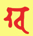
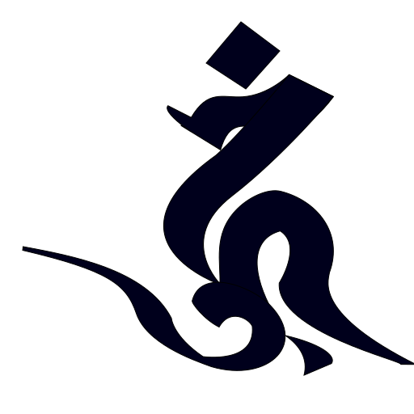

# 大樂金剛不空真實三昧耶經般若波羅蜜多理趣釋卷上

開府儀同三司特進試鴻臚卿肅國公食邑三千戶賜紫贈司空謚大鑒正號大廣智大興善寺三藏沙門不空奉　詔譯

「如是」者，所謂結集之時，所指是經也。「我聞」者，蓋表親從佛聞也。「一時」者，當說經之時，其地六種震動或天雨眾花，餘時則無此相。又三乘種性皆獲聖果，乃稱一時也。「婆伽梵」者，能破義也。所破者，破四魔也。又有六義，如聲論所釋，熾盛、自在與端嚴等也。「成就殊勝」者，毘盧遮那自覺聖智也。「一切如來」者，准瑜伽教中五佛是也。其五佛者，即盡虛空遍法界無盡無餘佛聚成此五身也。「金剛加持」者，表如來十真如、十法界、十如來地，以成上下十峰金剛大空智處。加持者，表如來於中道，十六大菩薩普賢智從此展轉流出，共成三十七位，已成解脫輪大曼茶羅。「三昧耶智」者，誓也，亦曼茶羅也。勿令將來最上乘者不從師受而專意自受也，是故得知修最上乘者必須師受三昧耶然後可修行也。「已得一切如來灌頂寶冠為三界主」者，如來在因地從灌頂師入三昧耶智曼茶羅，阿闍梨加持弟子身中本有如來藏性，發金剛加持，以成修真言行菩薩法器，則堪任持明等乃至傳受印可等灌頂階位，以此為初因，由三密四智印相應，成究竟三界法王主以為果。「已證一切如來一切智智瑜伽自在。」已證一切如來者，同上所說五佛也。一切智智者，唯佛自證之智，皆以瑜伽法相應，獲得於法自在。能作一切如來一切印者，四智印也。「平等種種事業，於無盡無餘一切眾生界，一切意願作業皆悉圓滿。」能作，由獲瑜伽自在故能作。一切如來，五佛，亦如前釋。一一佛皆有一切印平等羯磨處智，遍至無盡無餘佛剎眾生界，能作種種利益，究竟安樂一切有情界悉令圓滿，上中下一一皆成九品悉地。「常恒三世一切時」者，身語意業金剛大毘盧遮那如來也。常恒者，表如來清淨法界智，無始時來本有，處煩惱而不減，與淨法相應，證清淨而不增也。三世者，為過去未來現在是也。一切時者，在於異生時，後證聖果時，三業清淨猶如虛空，身語意業不被虛妄分別所生煩惱所染故也。金剛者，證得佛地一切法自在。得證身口意三密金剛，於藏識中修道，煩惱習氣堅若金剛難摧，用以大空金剛智三摩地證得法身光明遍照毘盧遮那如來也。

經云「在於欲界他化自在天王宮中一切如來常所遊處，吉祥稱嘆大摩尼殿，種種間錯鈴鐸繒幡微風搖擊，珠鬘瓔珞半滿月等而為莊嚴。」他化自在天宮者，名為欲界頂，他化自在天王宮殿。菩薩證得第六地，位現前地菩薩，住般若波羅蜜觀，多作此天眾王，為天人說般若波羅蜜。其天界，五欲殊勝超越諸天，是故毘盧遮那佛為金剛薩埵說大樂大貪染，加持現證瑜伽理趣速疾。由是得聞，不染世間雜染諸煩惱，超越摩羅之境。其宮殿是大樂不空金剛薩埵大曼茶羅，皆從毘盧遮那佛福德資糧出生。大妙金剛五寶所成金剛峰寶樓閣，其曼茶羅四方，八柱列八位。四門中位毘盧遮那遍照如來內證之智，解脫是也。其八位，後當說。

經云「與八十俱胝菩薩眾俱，所謂金剛手菩薩摩訶薩、觀自在菩薩摩訶薩、虛空藏菩薩摩訶薩、金剛拳菩薩摩訶薩、文殊師利菩薩摩訶薩、纔發心轉法輪菩薩摩訶薩、虛空庫菩薩摩訶薩、摧一切魔菩薩摩訶薩，與如是等大菩薩眾恭敬圍繞而為說法。」一一菩薩同類種性，有十俱胝眾。金剛手菩薩者，在毘盧遮那前月輪中，表一切如來菩提心。初發菩提心，由金剛薩埵加持，修證普賢行願，證如來地。觀自在菩薩者，在毘盧遮那後月輪，表一切如來大悲。隨緣六趣，拔濟一切有情生死雜染苦惱，速證清淨三摩地，不著生死不證涅槃，皆由觀自在菩薩金剛法現證。虛空藏菩薩者，在毘盧遮那右月輪，表一切如來真如恒沙功德福資糧聚。由修虛空藏菩薩行，行四種施，後當說。三輪清淨，喻若虛空，無盡有為無漏成受用變化身資糧也。金剛拳菩薩，在毘盧遮那左月輪，表一切如來三種祕密在金剛拳菩薩掌。由真言行菩薩，以入輪壇得灌頂者，得聞如來三業密教修行，獲得世出世殊勝悉地，淨除無始十種不善惡業，證得無障礙究竟智。文殊師利菩薩，在東南隅月輪，表一切如來般若波羅蜜多慧劍。住三解脫門，能顯真如法身常樂我淨。由菩薩證此智，便成等正覺也。纔發心轉法輪菩薩者，在西南隅月輪，表一切如來四種輪：金剛界輪、降三世輪、遍調伏輪、一切義成就輪。由修真言行菩薩，得入如是等輪，依四種智印以成十六大菩薩生，便證無上菩提。虛空庫菩薩者，在西北隅，表一切如來廣大供養儀。由修真言行菩薩，修得虛空庫菩薩瑜伽三摩地，於一念頃，身生盡虛空遍法界一一佛前，於大眾會以種種雲海供養奉獻如來，便從一切佛聞說妙法，速滿福德智慧資糧。以虛空為庫藏，隨緣諸趣拯濟利益諸有情，漸引致無上菩提以為巧便。摧一切魔菩薩，在東北隅，表一切如來大悲方便。外示現威怒、內懷悲愍，住加行位，護持修行、辟除諸障。成菩提時，摧伏天魔及摩醯首羅一切難調伏者，令彼等受化，致於無上菩提，以忿怒智而成究竟。如上所釋八大菩薩，攝三種法，所為菩提心、大悲、方便是也。如上所釋諸菩薩，包括一切佛法真言門及一切顯大乘，如是等大菩薩眾恭敬圍遶。八供養及四門菩薩等，以表如來三昧眷屬。

經云「而為說法初中後善」者，所說何法？諸大菩薩般若理趣。初善者，一切如來身密，一切契印，身威儀也。中善者，一切如來語密，真言陀羅尼，法王教勅不可違越也。後善者，本尊瑜伽，一切三摩地無量智解脫也。又一釋：初善者，增上戒學；中善者，增上心學；後善者，增上慧學。「文義巧妙」者，文巧，依聲論，詞韻清雅，具六十四種梵音也。義妙者，依二諦，世俗、勝義諦也。「純一」者，表如來瑜伽不與三乘同共教故，唯如來究竟內證不共佛法法園樂智。「圓滿」者，由如上智能斷三界九地見道修道一切煩惱及習氣，斷二種障，二種資糧圓滿也。「清淨」者，表離垢清淨。由瑜伽法，一念淨心相應，便證真如實際，不捨大悲，於淨穢土受用身變化身成佛。

經云「潔白」者，清淨法界本來不染，與無量雜染覆蔽異生無明住地，其性亦不減；預聖流證佛地，其性亦不增加。

經云「說一切法清淨句門」者，為修瑜伽行者於生死流轉不染故，廣作利樂有情事故，速證無量三摩地解脫智慧故，速集廣大福德資糧故，超越一切魔羅、毘那夜迦眾，速疾得世出世間勝願滿足故，說如來大悲。「愍念最上乘種性」者，脫十七種清淨瑜伽三摩地，是故諸契經說三界唯心，由心清淨有情清淨，由心雜染有情雜染。又說有情界是菩薩淨妙佛國土，由修得十七清淨句門是也。

經云「所謂妙適清淨句是菩薩位」者。妙適者，即梵音蘇囉多也。蘇囉多者，如世間那羅那哩娛樂。金剛薩埵亦是蘇囉多，以無緣大悲遍緣無盡眾生界，願得安樂利益心曾無休息，自他平等無二，故名蘇囉多耳。由修金剛薩埵瑜伽三摩地，得妙適清淨句，是故獲得普賢菩薩位。「欲箭清淨句是菩薩位」者，由修慾金剛瑜伽三摩地，得慾箭清淨句，是故獲得慾金剛菩薩位。

「觸清淨句是菩薩位」者，由修金剛髻離吉羅瑜伽三摩地，得觸清淨句，是故獲得金剛髻離吉羅菩薩位。

「愛縛清淨句是菩薩位」者，由修愛縛金剛瑜伽三摩地，得愛縛清淨句，是故獲得愛金剛菩薩位。

「一切自在主清淨句是菩薩位」者，由修金剛傲瑜伽三摩地，得一切自在主清淨句，是故獲得金剛傲菩薩位。

「見清淨句是菩薩位」者，由修意生金剛瑜伽三摩地，得見清淨句，是故獲得意生金剛菩薩位。

「適悅清淨句是菩薩位」者，由修適悅金剛瑜伽三摩地，得適悅清淨句，是故獲得適悅金剛菩薩位。

「愛清淨句是菩薩位」者，由修貪金剛瑜伽三摩地，得愛清淨句，是故獲得貪金剛菩薩位。

「慢清淨句是菩薩位」者，由修金剛慢瑜伽三摩地，得慢清淨句，是故獲得金剛慢菩薩位。

「莊嚴清淨句是菩薩位」者，由修春金剛瑜伽三摩地，得莊嚴清淨句，是故獲得春金剛菩薩位。

「意滋澤清淨句是菩薩位」者，由修雲金剛瑜伽三摩地，得意滋澤清淨句，亦云喜悅清淨句，是故獲得雲金剛菩薩位。

「光明清淨句是菩薩位」者，由修秋金剛瑜伽三摩地，得光明清淨句，是故獲得秋金剛菩薩位。

「身樂清淨句是菩薩位」者，由修冬金剛瑜伽三摩地，得身樂清淨句，是故獲得冬金剛菩薩位。

「色清淨句是菩薩位」者，由修色金剛瑜伽三摩地，得色清淨句，是故獲得色金剛菩薩位。

「聲清淨句是菩薩位」者，由修聲金剛瑜伽三摩地得聲清淨句，是故獲得聲金剛菩薩位。

「香清淨句是菩薩位」者，由修香金剛瑜伽三摩地，得香清淨句，是故獲得香金剛菩薩位。

「味清淨句是菩薩位」者，由修味金剛瑜伽三摩地，得味清淨句，是故獲得味金剛菩薩位。「何以故？一切法自性清淨，故般若波羅蜜多清淨」者，雖一切法本來清淨，由有客塵煩惱習氣覆蔽身心輪迴六趣。由獲得瑜伽理趣四種智印，所謂大智印、三昧耶智印、法智印、羯磨智印，如前菩薩一一具四種印，相應方得離垢清淨，便證普賢大菩薩位。設使因緣不具不得四智印，如經「所說一聞於耳，獲得勝福決定不異，疾證無上正等菩提。」以為正因。

「金剛手！若有聞此清淨出生句般若理趣，乃至菩提道場，一切蓋障及煩惱障，法障，業障設廣積集，必不墮於地獄等趣。設作重罪，消滅不難。若能受持、日日讀誦、作意思惟，即於現生證一切法平等金剛三摩地，於一切法皆得自在，受於無量適悅歡喜。以十六大菩薩生獲得如來及執金剛位」者，毘盧遮那佛在大眾中，為未來有情修瑜伽者，對諸十地菩薩，說受持讀誦具修行福利，速滅無始時來無量諸重業障，乃至盡未來際，以悲愍廣大願力，周遊六趣利樂有情。由聞及修，不染不受諸不善異熟業，獲得世間出世間殊勝悉地，即於十六大生作金剛薩埵菩薩等乃至金剛拳菩薩，最後身便成毘盧遮那身也。

「時婆伽梵一切如來大乘現證三昧耶一切曼茶羅持金剛勝薩埵於三界中調伏無餘一切義成就金剛手菩薩摩訶薩為欲顯明此義故，熙怡微笑，左手作金剛慢印、右手抽擲本初大金剛作勇進勢，說大樂金剛不空三昧耶心」者，婆伽梵義如前所釋。一切如來，大曼茶羅中五方佛也。大乘有七義：一者法大、二者心大、三者勝解大、四者意樂大、五者資糧大、六者時大、七者究竟大。由諸菩薩承此大乘，證得無上正等菩提。現證者，瑜伽師所證三摩地境也。三昧耶者，名為本誓，亦名時，亦名期契，亦為曼茶羅之異名。一切曼茶羅者，於本部四種曼茶羅：一、大曼茶羅；二、三昧耶曼茶羅；三、法曼茶羅；四、羯磨曼茶羅。以此四種曼茶羅，攝瑜伽一切曼茶羅。金剛勝薩埵者，金剛義菩提心是也。勝，謂最勝。薩埵，名勇猛。於三界中調伏者，三界謂欲界、色界、無色界，於中能調伏摩醯首羅等諸天難調伏者，令得受化無餘。一切義成就者，普賢菩薩異名也。金剛手菩薩摩訶薩者，此菩薩本是普賢，從毘盧遮那佛二手掌親受五智金剛杵，即與灌頂，名之為金剛手。菩薩摩訶薩者，如前所釋。為欲重顯明此義故者，所謂顯明大智印幖幟，首戴五佛寶冠。熙怡微笑，左手作金剛慢印、右手抽擲本初大金剛作勇進勢本初者，本來清淨法界也。左手作金剛慢印者，為降伏左道左行有情，令歸順道。右手抽擲五智金剛杵作勇進勢者，令自他甚深三摩地，順佛道念念昇進，獲得普賢菩薩之地。「即說大樂金剛不空三昧耶本誓心真言吽字」，吽字者，因義。因義者，謂菩提心為因，即一切如來菩提心，亦是一切如來不共真如妙體恒沙功德皆從此生。此一字具四字義，且賀字以為本體，賀字從阿字生，由阿字一切法本不生故，一切法因不可得。其字中有污聲，污聲者，一切法損減不可得。其字頭上有圓點半月，即謂麼字者，一切法我義不可得。我有二種，所謂人我、法我，此二種皆是妄情所執，名為增益邊。若離損減、增益，即契中道。

「(oṃ)唵」字者，金剛薩埵法智印明也。

「(ma)麼」字者，欲金剛法智印明也。

「(hā)賀」字者，金剛悅喜法智印明也。

「(su)蘇」字者，愛金剛法智印明也。

「(kha)佉」字者，慢金剛法智印明也。

「(va)嚩字」者，意生金剛法智印明也。

「(jra)日囉」字者，金剛髻離吉羅法智印明也。

「(sa)娑」字者，愛金剛法智印明也。

「(tva)多嚩」字者，金剛傲法智印明也。

「(jaḥ)弱」字者，春金剛法智印明也。

「(hūṃ)吽」字者，雲金剛法智印明也。

「(vaṃ)鑁」字者，秋金剛法智印明也。

「(hoḥ)縠」字者，冬金剛法智印明也。

「(su)蘇」字者，色金剛法智印明也。

「(ra)囉」字者，聲金剛法智印明也。

「(ta)多」字者，香金剛法智印明也。

「(stvaṃ)薩多鑁」字者，味金剛法智印明也。

此密言十七字，則為十七菩薩種子，即成法曼茶羅；若畫一一菩薩本形，即成大曼茶羅；若畫本聖者所執持幖幟，即成三昧耶曼茶羅；如前種子字各書本位，即名法曼茶羅；各鑄本形安於本位，即成羯磨曼茶羅。

次說安立次第分曼茶羅位。中央九位，外院更加一重，中央安金剛薩埵，依薩埵菩薩前安慾金剛，右邊安髻離吉羅，後安愛樂金剛，左安金剛慢，右邊前隅安意生金剛，右邊後隅安髻離吉羅，左邊後隅安愛金剛，左邊前隅安傲金剛。以次外院如前，次第安布四隅，初安春金剛，次安雲金剛，次安秋金剛，次安冬金剛。外院前安色金剛，右安聲金剛，後安香金剛，左安味金剛。既安布已，則修行者結三昧耶等印，成本尊瑜伽，加持四處，五方佛灌頂被甲，誦四字明，令召入令縛令歡喜，獻閼伽，即與四智印相應，入三摩地念誦。或瑜伽師坐於中位三摩地中，如前布列，即誦十七字真言，心緣一一理趣清淨句，入一一理趣門，遍周法界，乃至第十七位；周而復始，以心得三摩地為限，即名為大樂不空真實修行瑜伽儀軌(已上大樂不空金剛薩埵初集會品)。

「時婆伽梵毘盧遮那如來」，婆伽梵者，如前所釋。毘盧遮那如來，名遍照，報身佛，於色界頂第四禪色究竟天成等正覺，為諸菩薩說四種自證自覺聖智、說四智菩提。所謂「金剛平等現正等覺，以大菩提金剛堅固故」者，由如來淨阿賴耶於大圓鏡智相應，證得堅固無漏之三摩地，能淨無始無明地微細煩惱。「義平等現等正覺，以大菩提一義利故」者，第七無漏末那與第八淨阿賴耶識中無漏種子能緣所緣平等平等，離能取所取故，證得平等性智，流出隨其眾生愛樂身，由如眾色摩尼，能作無邊有情義利。「法平等現等覺，以大菩提自性清淨故」者，猶如來清淨意識與妙觀察智相應，證得一切法本性清淨，於淨妙佛國土為諸菩薩能轉無上法輪。「一切業平等現等覺，以大菩提一切分別無分別性故」者，由如來無漏五識與成所作智相應，現三業化，於淨妙國土及雜染世界任運無功用無分別作佛事、有情事。

「金剛手若有聞此四出生法，讀誦受持，設使現行無量重罪，必能超越一切惡趣，乃至當坐菩提道場，速能剋證無上正覺」者，佛告金剛手菩薩，為未來有情聞此中修理趣福利，心不猶預能發淨信修行，則現世惡報及來生能轉定業，疾證無上菩提也。

「時婆伽梵如是說已欲重顯明此義故此句可以意解不釋，熙怡微笑，持智拳印說一切法自性平等心」者，熙怡微笑持智拳印者，希奇於事，表修行者具一切結使諸煩惱，纔結毘盧遮那大智印、誦心真言，等同遍照尊，則應受一切世間殊勝供養、應受一切如來諸大菩薩禮敬，是故有此微笑也。

「(āḥ)惡(引)字心真言」者，具含四字為一體：

(a)阿字，菩提心義。如此字，一切字之為先，於大乘法中，趣向無上菩提，菩提心為先。

(ā)阿(引)字者，行義，則四智印。瑜伽教中修行速疾方便，由集福德智慧資糧，證成無上菩提正因。第三字極長高聲。

(aṃ)暗字者，等覺義，由證無邊智解脫三摩地陀羅尼門，摧伏四種魔羅，受十方一切如來三界法王灌頂，轉正法輪。

第四惡字者，涅槃義，由斷二種障，謂煩惱、所知之障，證得四種圓寂，所謂一者自性清淨涅槃、二者有餘依涅槃、三者無餘依涅槃、四者無住涅槃。前三通異生、聲聞、緣覺，第四唯佛獨證，不同諸異乘。則此四字是毘盧遮那佛自覺聖智四種智解脫。外現四大轉輪王菩薩，所謂第一金剛薩埵、第二金剛寶菩薩、第三金剛法菩薩、第四金剛羯磨菩薩是也。

修行者應建立曼茶羅，中央毘盧遮那佛，背日輪，頭冠瓔珞，身著白縠繒衣，結智拳印，坐師子座，身如月殿。毘盧遮那佛前。金剛薩埵菩薩，背月輪，戴五佛冠，右手持金剛杵、左手持鈴，半跏而坐。毘盧遮那佛右邊，虛空藏菩薩，背月輪，右手持金剛寶、左手施願，半跏而坐。毘盧遮那後，觀自在菩薩，左手持蓮華、右手開敷花勢，亦半跏而坐。於毘盧遮那佛左邊月輪，金剛羯磨菩薩，二手作旋舞置於頂上勢。內四隅安四內供養，各各如本形。外四隅置外四供養，各各持本供養具。四門置鉤、索、鎖、鈴菩薩，各住本威儀。毘盧遮那佛成等正覺，由四種瑜伽三摩地，所謂金剛薩埵、金剛寶、金剛法、金剛羯摩等瑜伽三摩地。從金剛薩埵至羯磨，次第流出嬉戲、鬘、歌、舞等菩薩。又從四內供養，依次流出香、花、燈、塗香等四外供養菩薩。又從四大菩薩，各流出四門菩薩。四種曼茶羅，大智三昧耶法羯磨輪也，如前大樂中所說類同。若修瑜伽者成就般若理趣，位於中位，即誦毘盧遮那佛真言：

「嚩日囉二合馱都惡五字引」

自作本尊瑜伽，以四字明召請曼茶羅聖眾，誦四出生法，運心一一出生遍周法界，周而復始。皆以五智相應，念念能滅諸宿障惡業，現生證菩薩地，後十六生證成毘盧遮那無邊法身，能現於無量淨穢諸剎土報化，現證無上菩提。