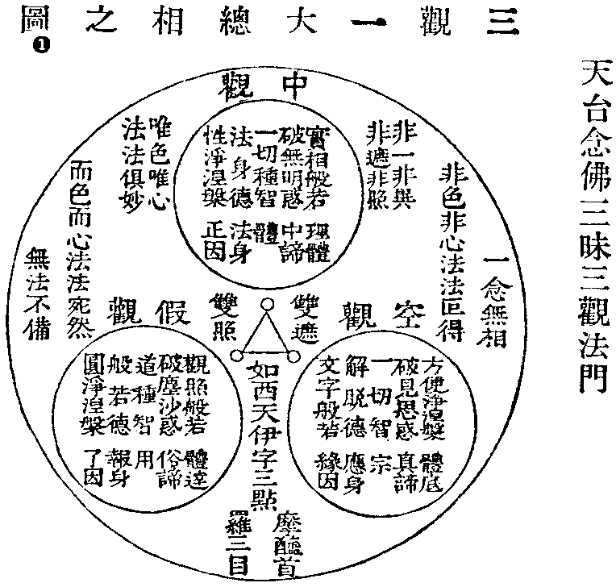
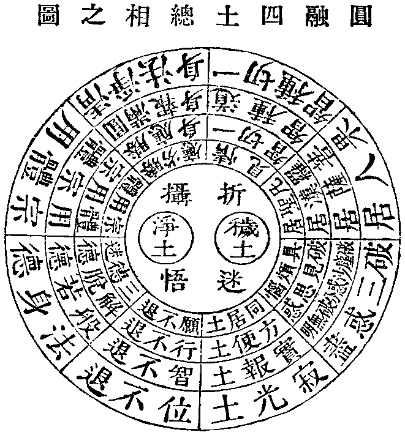
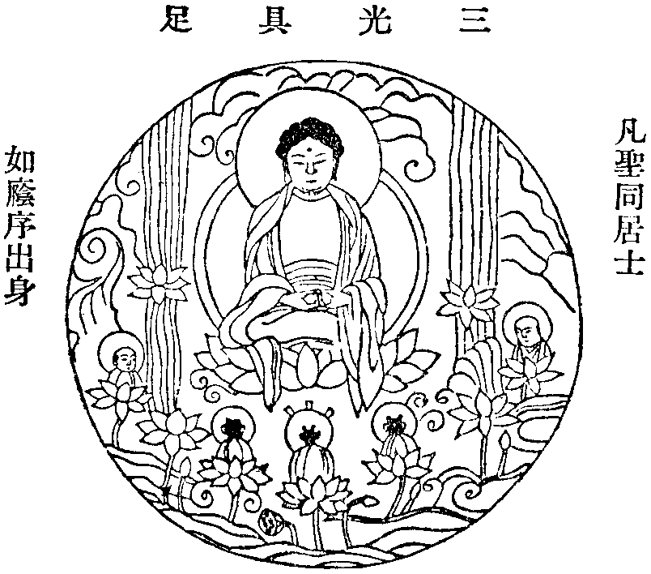
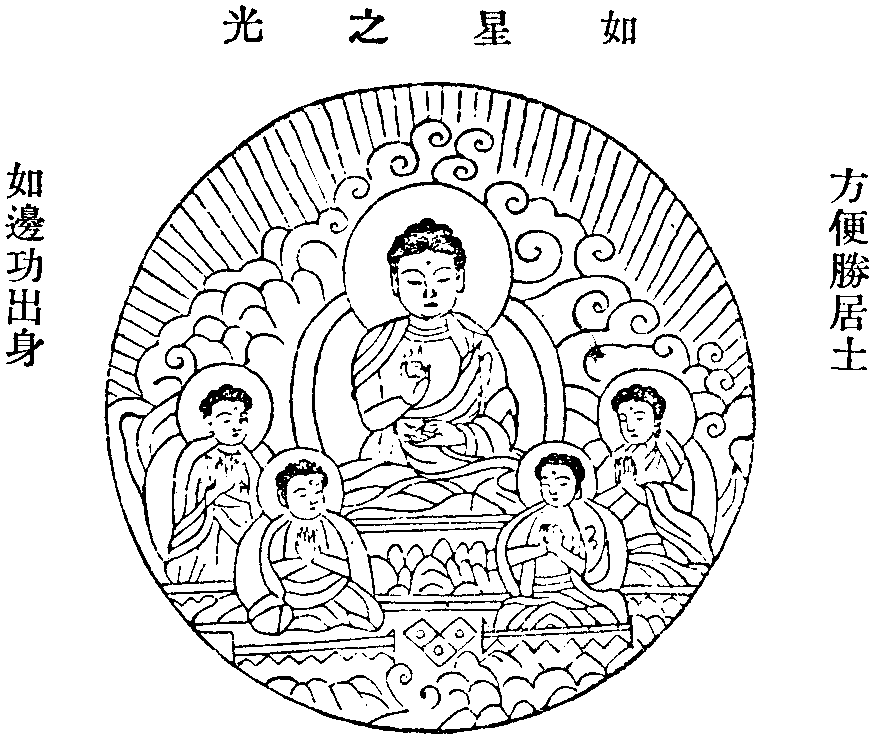
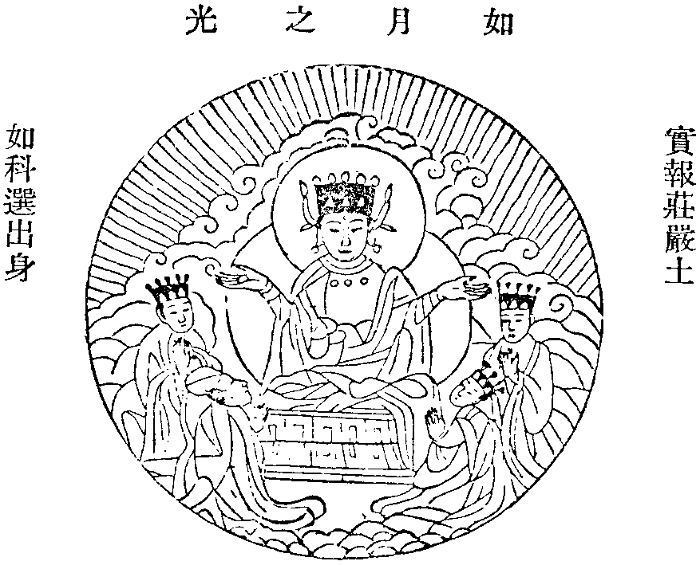
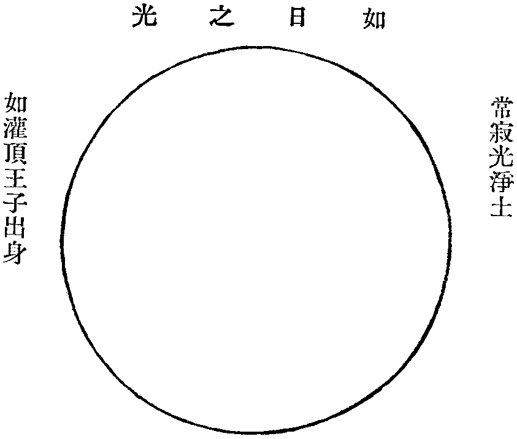
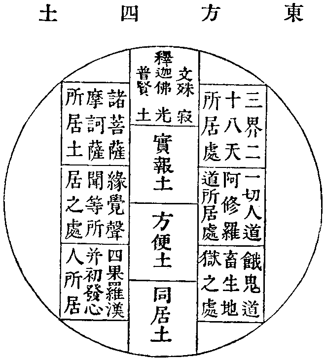
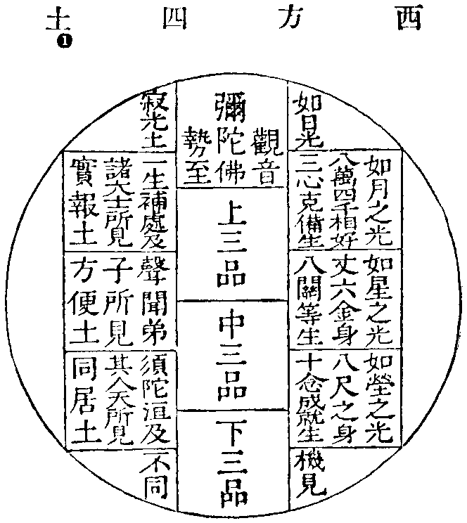
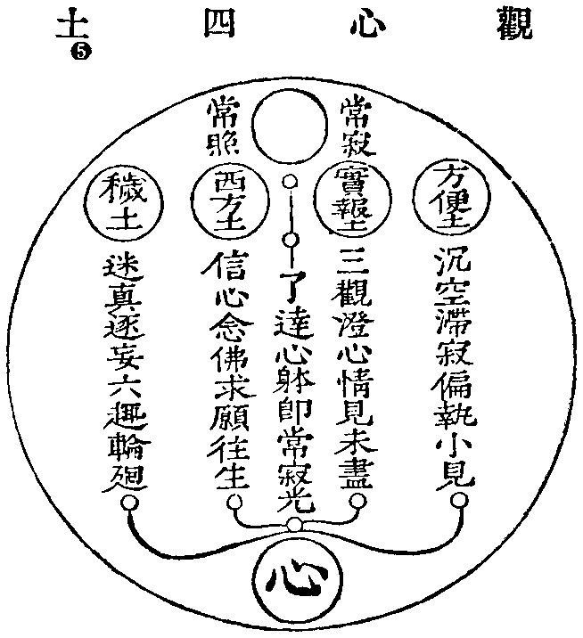
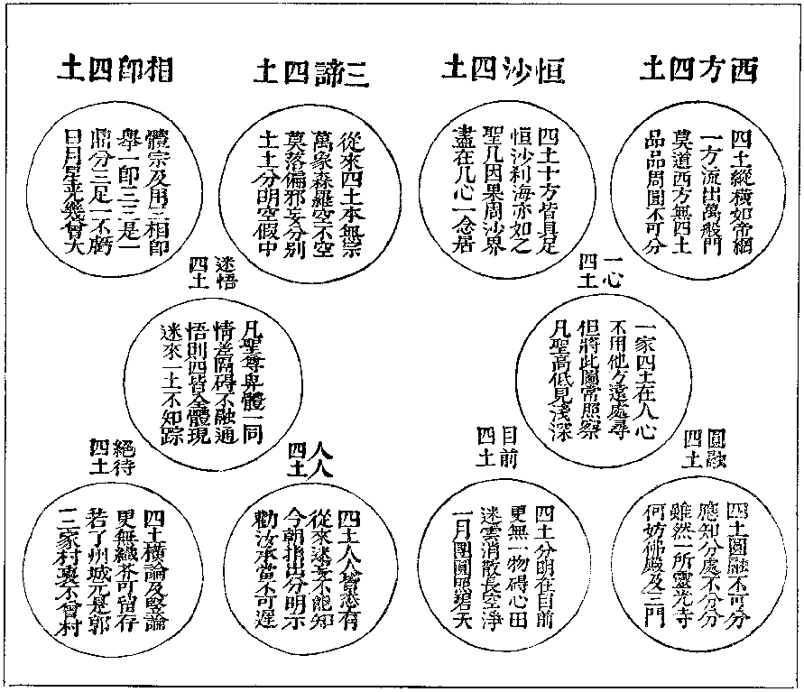

## 庐山莲宗宝鉴念佛正教卷第二(一十九章)

### 念佛正教说

法界本无众生。众生缘乎妄见。如来本无言教。言教为乎有情。妄见者众生之病。言教者众生之药。以药治病则病无不治。以言觉妄则妄无不觉。凡夫日用而不知如来之道鲜矣。故我能仁大觉愍群机之未悟也。于是仰推大慈俯垂妙范。华严顿示声闻尚若盲聋。阿含委说菩萨未蒙获益。方等赞大般若荡空。涅槃殊途同归法华普皆受记。于是群经森列偏赞西方。盖以阿弥陀佛。愿广缘强法尊理备。而然尔其教也。指佛国为归趣。华池宝地胜妙庄严令忻彼。而厌此也其理也。示弥陀即自性。念念圆明心心实相。如大海之混百川也。其行也开示十六观门。摄心妙境了性相空。如明镜之见面像也。其果也。九品次第化生。普摄利钝登不退阶。至无上之菩提道也。是故九界众生以无所得心。而修佛国妙行不亦宜乎。如来出世之怀于斯尽矣。偏赞之辞有其旨焉。真百千三昧之要门。乃一实境界之直道。论事仪则忏六根雪三业。究宗旨则空万法了一心。是谓超苦海之健舟。救急病之良药。信斯道者开本觉心。出五浊苦达真净土了性弥陀。若明月之当空。似莲花之出水。故莲宗之教以是名焉。杨无为云。莲者出乎淤泥。不舍众生界也。处空无染显露清净体也。华而有实非魔境也。华实同时因果一如也。华开莲现示权显实也。华落莲成废权立实也。一莲生无量华。建立一切法也。十方同一华藏示佛境无异也。莲教之义得非是欤。所以兴慈运悲者。游戏于常光之界。戒珠义海者涵泳于解脱之渊。是以天龙护持。王臣致敬。古今不坠其化。士民仰慕其风。非夫大悲愿力抚哀未习。其孰能臻此哉。是故龙树论证之。晋贤社修之。天台判释之。慈恩通赞之。慈照集而忏之。宗坦疏而解之。宿衲名儒奉之者宝珠有集。高贤达士修之者简编有题。於戏大法下衰去圣逾远。事佛者众。谋道者稀。竞声利为己。能视流通为儿戏。遂令法门凋瘵教网倾颓。实赖后贤克荷斯道。普冀亡躯为法。洁己依师欲达真乘。须亲教典禀教乃能明理。明理然后修行。行愿无亏。道果可证。故知耳闻目见当依四法。以思修口诵心违。纵解千章而何益。是乃心以教照。佛以念持。非以戒防。罪以忏雪。道以实践动以礼行。近则期于立身扬名。远则希于革凡成圣。发挥佛祖之道。舍我辈而谁欤。坚秉慧刀裂开魔网。饮正法之甘露。伐邪见之稠林。避恶友如避虎狼。事良朋如事父母。谨守志节母退大心正觉可遵。非道莫履有过务速改。有善勿矜夸。自然与祸斯违与福斯会。现居尘世则人敬之天祐之。他日净方则圣可期道可至岂在乎相形。问命谄求荣达之时。又何必望影瞻光卜度终归之日。此匪道人之见识。实乃凡庸之妄情莫徇他求。但依本分在当仁而不让。宜见贤以思齐。名利不足动于怀。死生不足劳其虑。欲功成而志遂必自迩。而涉遐当验果以推因。信有作而有报。智足以照惑。明足以烛幽。言斯可法行斯可乐。德义可尊。进退可度辩伪识真。若试金之美石。除昏鉴物犹照世之真灯。是大导师作不请友。掷出龙宫之宝均施群生。撤开祖门之关普容来者。蠲涤邪病指归妙源。俾昏镜以重磨。若垢衣而再净。使真风复振福及大千。睹慧日增明辉腾万古。可谓法主之真子。可谓大丈夫焉。以此而奉西方大圣人之教者。复何愧欤

### 佛为父王说念佛

宝积经云。世尊父王。顶礼佛足一心合掌而白佛言。云何修行当得诸佛之道。佛言。一切众生皆即是佛。汝今当念西方世界阿弥陀佛。常勤精进当得佛道。王言。一切众生云何是佛。佛言。一切法无生无动摇。无取舍无相貌无自性。可于此佛法中。安住其心勿信于他。尔时父王。与七万释种闻说是法。信解欢喜悟无生忍。佛现微笑。而说偈曰。释种决定智。是故于佛法决信心安住人中命终已。得生安乐国。面奉阿弥陀无畏成菩提

### 善财五十三参首见德云比丘说念佛门

华严经入法界品云。德云比丘告善财言。善男子。我得自在决定解力。信眼清净智光照耀。普观境界离一切障。具清净行。往诣十方供养诸佛。常念一切诸佛如来。总持一切诸佛正法。常见一切诸佛随诸众生种种心乐。示现种种成正觉门。于大众中而师子吼。善男子。我惟得此忆念一切诸佛境界。智慧光明普见法门。所谓智光普照念佛门。令一切众生念佛门。令安住力念佛门。令安住法念佛门。照曜诸方念佛门。入不可见处念佛门。住于诸劫念佛门。住一切时念佛门。住一切刹念佛门。住一切世念佛门。住一切境念佛门。住寂灭念佛门。住远离念佛门。住广大念佛门。住微细念佛门。住庄严念佛门。住能事念佛门。住自在心念佛门。住自业念佛门。住神变念佛门。住虚空念佛门

### 智首菩萨说念佛

华严经云。一切威仪中常念佛功德。昼夜无暂断。如是业应作

### 龙树大士劝念佛

大智度论云。佛是无上法王。诸大菩萨为法臣。诸臣所尊重者。惟佛法王。是故菩萨应当念佛。又云。有诸菩萨。自念往昔谤般若。堕恶道经无量劫。虽修余行未能得出。后遇善知识教行念佛三昧。即得并遣罪障方得解脱。又偈云。若人愿作佛心念阿弥陀。即时为现身。故我归命礼

### 念佛功德有七种胜

甘露疏云。一词少易行胜。唯称一句南无阿弥陀佛一切人可念故。二念缘佛境胜。一心缘念佛身相好。净国为境故。三离难获安胜。诸佛菩萨加护念佛者。无诸患难安庆吉祥。四称名灭罪胜。念佛一声灭八十亿劫生死重罪。五持念获福胜。称佛一声胜四天下七宝供佛及阿罗汉。六果感见佛胜。众生念佛必定见佛。七亲迎往生胜。化佛菩萨放光迎接行者。往生佛土

### 修持法门

夫无为境界迥绝名言。有漏色心要凭修证真如具含众德。方便而有多门。上自离相平等下至十念称名。总括不离三乘往生冥符九品。有念终归于无念。有生直至于无生。可调一句弥陀群机普应矣

### 离相念佛三昧无住法门

慈照宗主云。离相念佛三昧者。上根智人悟此深理。常运虚空平等。心无我人众生寿者相。经云。离一切诸相。即名诸佛。论曰。我以计内人以计外众生。以续前为能寿者。以续后为义。既无内外前后执心。则一切诸相悉皆空寂。故经云。知无我人谁受轮转。亦无身心受彼生死。是名离相念佛三昧。此则见一切众生本性皆同弥陀。既不执有相无相二边。亦无有断见常见之说。由是念念弥陀出世。处处极乐现前。如此念者。无念之念。念则真如无生之生。生则实相故知无念即离念。实相乃无相。无相则无住。无住则入佛境界。此乃无上正真大菩提道。若到此地无修无证。无生死可脱。无涅槃可求。性相俱空圣凡齐等。无佛道可成。无众生可度。无己灵可得。一念无为十方坐断。无一法本有无一法始成。自他互收事理无碍。尘尘具足刹刹全彰。法本如然思议莫及。可谓十方薄伽梵一路涅槃门

### 天台念佛三昧三观法门

&emsp;&emsp;掜不成团拨不开&emsp;&emsp;看来看去转成呆

&emsp;&emsp;人人若到呆田地&emsp;&emsp;三观元来是祸胎

智者大师云。诸佛教理既明。非观行无以复性。乃依一心三谛之理。示三止三观。一一观心念念不可得。先空次假后中。离二边而观一心。如云外之月者。此乃别教之行相也。又云。破一切惑莫盛乎空。建一切法莫盛乎假。究竟一切性莫大乎中。故一中一切中。无假无空无不中。空假亦尔。即圆教之行相也。如西天伊字三点。首罗天之三目。非纵非横并列。故三观圆成。法身不素。即免同穷子也。龙树菩萨偈云。因缘所生法。我说即是空。亦名为假名。亦名中道义。斯与楞严圆觉经说奢摩陀三摩钵提禅那三观。名目虽殊。其致一也。亦曰。三谛天然之性德也。中谛者统一切法。真谛者泯一切法。俗谛者立一切法举一即三非前后也。含生本具非造作之所得也。秘藏不显盖三惑之所覆也。无明翳乎法性。尘沙障乎化导。见思阻乎空寂。然兹三惑乃体上之虚妄也。由是立乎三观。破乎三惑。证乎三智。成乎三德。空观者破见思惑。证一切智成般若德。假观者破尘沙惑。证道种智成解脱德。中观者破无明惑。证一切种智成法身德。非各别也。非异时也。天然之理具诸法故。然兹三谛性之自尔。穷理尽性。故与禅宗异而非异也。行者念佛之时意根为因。白毫圆光为缘。所起之念。即所生法。谛观念佛心起。即是假名。体之即空洞鉴。此心有如来藏离边显中。若根若尘并是法界。诸佛众生一念普应。即边而中。无佛无念。此乃大乘圆修三观念佛也。可谓无相无空无不空。即是如来真实相

### 空观念佛三昧无念法门

空观念佛三昧者。即祖师序云。思专想寂志一不挠。气虚神朗无幽不彻。入斯定者昧然忘知。尘累顿消滞情融朗。非天下至妙。孰能与于此哉。智者大师以空观而荡一切法。故云一空一切空无假无中而不空。入此观者是审实真谛也。今欲令行人反妄归真故谓之从假入空观。盖假者是入空之诠。先观一切法是假。乃至四大五蕴六根六尘六识。尽十方世界山河大地皆无一物。了知虚妄而得会真。故名二谛观。修此者先要摄心静坐。将世间一切虚妄不实境界。尽情扫荡俱不住著惟观于空。故般若经云。内空外空内外空空空空亦不可得。如是顿入如来宝明空海。性觉真空。即如来藏空性圆明灵光遍照法界性故。如摩尼珠随意出生。如大溟海深广含摄。平等性智名佛知见。可谓诸行无常一切空。即是如来大圆觉

### 日观念佛三昧专想法门

观无量寿佛经云。佛告韦提希。汝及众生应当专心。系念一处想于西方。凡作想者。一切众生自非生盲。有目之徒皆见日没。当起想念正坐西向。谛观于日令心坚住专想不移。日欲没时状如悬鼓。既见日已开目闭目皆令明了。是为日想。名曰初观。行人入此观者须于静处屏绝外缘。正坐摄心谛观日轮现在目前。注心一境凝然寂静。如对明镜自睹面像。心若驰散制之令还。心息住定。即得三昧。可谓海底金乌天上日。眼中瞳子面前人

### 参禅念佛三昧究竟法门

远祖师禅经序云。禅非智无以穷其寂。智非禅无以深其照。禅智者照寂之谓其相济也。照不离寂。寂不离照。感则俱游。应则同趣。慈照云寂而常照。照而常寂。常寂常照。名常寂光念佛之人。欲参禅见性但依此法。要于静室正身端坐。扫除缘累截断情尘。瞠开眼睛外不著境。内不住定。回光一照。内外俱寂。然后密密。举念南无阿弥陀佛三五声。回光自看云见性。则成佛毕竟那个。是我本性阿弥陀。却又照觑看只今举底。这一念从何处起觑破这一念。复又觑破这觑底是谁○参良久又举念南无阿弥陀佛。又如是觑如是参急切做工夫。勿令间断。惺惺不昧。如鸡抱卵不拘四威仪中亦如是。举如是看如是参。忽于行住坐卧处闻声见色时。豁然明悟。亲见本性弥陀。内外身心一时透脱。尽乾坤大地是个西方。万象森罗无非自己。静无遗照动不离寂。然后兴慈运悲接引未悟。悲智圆融入无功用行。得生上品名实报庄严土。得一切种智。可谓万古碧潭空界月。再三捞漉始应知

### 摄心念佛三昧调息法闻

大集经贤护品云。求无上菩提者。应修念佛禅三昧。偈云。若人专念弥陀佛号。曰无上深妙禅。至心想像见佛时。即是不生不灭法。坐禅三昧经云。菩萨坐禅不念一切。惟念一佛。即得三昧。初机修习未免昏散二病。须假对治人天。宝鉴云。凡修禅定。即入静室。正身端坐数出入息。从一数至十。从十数至百。百数至千万。此身兀然此心寂然。与虚空等不烦禁止。如是久之一息自住。不出不入时觉此息。从毛孔中八万四千云蒸雾起。无始已来诸病自除。诸障自灭。自然明悟。譬如盲人忽然有眼。尔时见彻不用寻人指路也。今此摄心念佛欲得速成三昧。对治昏散之法。数息最要。凡欲坐时。先想己身在圆光中。默观鼻端想出入息。每一息默念南无阿弥陀佛。一声方便调息不缓不急。心息相依随其出入。行住坐卧皆可行之。勿令间断。常自密密行持。乃至深入禅定。息念两忘。即此身心与虚空等。久久纯熟心眼开通。三昧忽尔现前。即是唯心净土

### 一想念佛三昧专念法门

大般若经云。曼殊室利白佛言。菩萨修行何法疾证无上菩提。佛言。菩萨能正修行一相庄严三昧疾证菩提。修此行者。应离喧杂不思众相。专心系念于一如来。审取名字善想容仪。即为普观三世一切诸佛。即得诸佛一切智慧。天台十疑论云。一切诸佛悉皆平等。但众生根钝浊乱者多。若不专心系念一佛。则心散漫三昧难成。故专令念阿弥陀佛。即是一相三昧。宝王论云。修持一相念佛三昧者。当于行住坐卧系念不忘。纵令昏寐亦系念而寝。觉即续之。不以余业间断。不以贪嗔等间隔。随犯随忏悔。不隔念不异念。不隔日不隔时。念念常不离佛。念念清净圆明。即是得一相三昧也。可谓是若了一万事毕

### 六时念佛功德回向法门

远公祖师。东林结社僧俗同修。大智上贤深入禅观。得念佛三昧中流之士。六时修礼净土。回向西方。唐有诗云。远公独刻莲花漏。犹向山中礼六时。凡修此法先于净室。安置佛像香花灯烛随分供养澡浴尘垢著清净衣。每日于日初时。日中时。日没时。夜初时夜半时。夜终时。自对三宝端身合掌。信礼西方每一时。目睹慈容称念南无阿弥陀佛圣号一千遍。礼佛四十八拜。念西方文发愿回向。每日昼三夜三六时行道。精专不倦志意修持。坚固行愿净业圆成。他日必得中品中生矣

### 忏罪念佛功德系念法门

大弥陀经云。我作佛时。十方无央数世界诸天人民。闻我名号烧香散花。燃灯悬缯饭食沙门。起立塔寺斋戒清净益作诸善。一心系念于我。虽止于一昼夜不绝。亦必生我刹。不得是愿终不作佛。又云。我作佛时。十方无央数世界诸天人民。以至蜎飞蠕动之类。前世作恶。闻我名号即忏悔为善。奉持经戒愿生我刹。寿终皆不经三恶道。径遂往生一切所欲无不如意。不得是愿终不作佛。凡修持者先当严净坛场。烧香然灯广设供养。请一比丘及诸上善人。同坛尊证白佛陈意。绝虑去忧。勿预家事。勿近内人。斋戒修持系念。彼佛名号。一昼一夜每佛一千声。诵弥陀经一卷。如是三次。志心忏悔回向云。我今自忆有生以来造诸恶业。愿此念佛功德。得入如来大誓海中。承佛慈力众罪消灭冤尤释除。三业所生一切诸善。庄严净愿福智现前。愿得临命终时自知时至。身无病苦心不颠倒。如入禅定于一念顷。径生西方极乐国土。见佛接引于七宝池中莲花台上。蒙佛授记得闻经法。顿开佛慧广度众生满菩提愿。可谓水向石边流出冷。风从花里过来香

### 晨昏念佛功德信愿法门

在家菩萨奉佛持戒。逐日营办家缘未能一心修行者。须是早起焚香参承三宝随意念佛每日黄昏亦如是。礼念以为常课。如或有干失时次日当自对佛忏说此之法门要且不妨本业。为士者不妨修读。为农者不妨耕种。为工者不妨作务。为商者不妨买卖。晨参夕礼之外。更能二六时中。偷那工夫持念佛号。百声千声志诚为功。期生净土回向云。弟子某礼念功德愿。命终时。径生净土莲花池畔。亲见弥陀宝树行中相逢善友。普为父母师长法界众生同满此愿。可谓积尘成巨岳。滴水渐成河

### 简径念佛功德十念法门

慈云式忏主云。在俗人尘务忙冗。每日清晨服饰已。面西合掌念南无阿弥陀佛。尽一口气为一念。如是十念但随气短长气极为度。其念佛声不高不低调停得中。如此十念连续不断。意在令心不散专精为功。显是藉气束心也。回向云。某一心归命西方阿弥陀佛。愿以净光摄我。我今称如来名经十念顷求生西方。佛昔本誓若有众生。欲生我刹十念我名。若不生我国者。我誓不成佛。今以十念功德愿命终时心不颠倒。于一念顷生极乐国。闻佛妙法速证菩提。可谓信心如不退。决定礼金仙

### 慈照宗主圆融四土选佛图序

夫寂光同居。一智无殊。情生彼此。见有亲疏。觌面了色。空性如如。本无二路。自见妙粗。吾不如是。一体毗卢。先须识本。免被茶糊。行有行相。智有智模愿有愿力。进有程途。惺惺寂寂。如净明珠。照彻心体。凡圣同途。四土合彻。三身一如。头头净土。处处阿弥。且山僧因见四土。混乱无纶智转行融。致使利钝不分因果俱失。只言净土不知净土高低。只说唯心。不知心之深浅。故见诸家相毁各执一边。谁知自破宗风。非魔能坏。今则略开一线。出四图。削去迷情。顿明心地。然后河沙法界。该收一纸之中。无量法门。出乎方寸之内耳

&emsp;&emsp;自性弥陀佛&emsp;&emsp;唯心净土机

&emsp;&emsp;悟来唯一念&emsp;&emsp;迷后历三祇

&emsp;&emsp;折摄二门设&emsp;&emsp;圣凡一路归

&emsp;&emsp;世情看冷暖&emsp;&emsp;人面逐高低

| 凡圣同居土         | 方便胜居土         | 实报庄严土           | 常寂光净土 |
| ------------------ | ------------------ | -------------------- | ---------- |
| 愿不退             | 行不退             | 智不退               | 位不退     |
| 三德迷             | 解脱德             | 般若德               | 法身德     |
| 宗用体             | 体用宗             | 用宗体               | 宗体用     |
| 胜劣应             | 胜应身             | 圆满报身             | 清净法身   |
| 情见未除           | 一切智             | 道种智               | 一切种智   |
| 具烦恼             | 破见思惑           | 破尘沙惑分破无明     | 破三惑尽   |
| 十念成就生         | 八关等生           | 三心克备生           | 一念不生   |
| 横出三界           | 竖出三界           | 非横非竖出三界       | 冲关透顶   |
|                    |                    |                      | 无上正真   |
| 须陀洹及其人天所见 | 四果声闻弟子等所见 | 一生补处及诸大士所见 | 诸佛所见   |
| 八尺之身           | 丈六金身           | 八万四千相好         | 法界身     |
| 凡圣居             | 罗汉居             | 菩萨居               | 果人居     |

#### 凡圣同居土

如荫序出身

&emsp;&emsp;凡圣情差智有殊&emsp;&emsp;须凭修证契毗卢

&emsp;&emsp;恐人力少行疲倦&emsp;&emsp;权指西方住半途

横出三界少人知。易修易往勿狐疑。尘垢未除求解脱。一心信愿念阿弥。临终正念分明去。三朝七日预知时。既生净土常闻法。何愁不得悟心机

此土但有信愿念佛。不断烦恼。不舍家缘。不修禅定。临命终时弥陀接引。皆得往生净土。便获神通。得不退转。直至菩提。凡圣同居士者。乃自他受用三光具足。总摄四土九品化生据理。后三土皆在其中不别出。而只引下下品者。盖祖师明其易修易往也。其余品位高低。各随行愿修证而成也

#### 方便胜居土

如边功出身

&emsp;&emsp;断除烦恼绝踪由&emsp;&emsp;灭智灰心罢便休

&emsp;&emsp;宝所不能前进步&emsp;&emsp;如来方便故相留

&emsp;&emsp;竖出三界声闻性&emsp;&emsp;烦恼尘劳急断除

&emsp;&emsp;入定四禅频观炼&emsp;&emsp;永超凡世不还归

此土皆是定性小乘根性。怕怖三界如虎鬼龙蛇。破见思惑杀贪嗔痴。断如来种如獐独跳。不顾后群偏执小见。沈空滞寂生方便土如来纯说大乘调伏

#### 实报庄严土

如科选出身

&emsp;&emsp;心法微微犹未遣&emsp;&emsp;应知情尽始除根

&emsp;&emsp;贴肉汗衫既未脱&emsp;&emsp;纤尘犹碍大乾坤

&emsp;&emsp;非横非竖理偏宜&emsp;&emsp;三观澄心进莫疑

&emsp;&emsp;一力未能超彼岸&emsp;&emsp;依然还落圣贤机

此土皆是大乘圆修三观。十住十行十向十地等觉法身大士。如尘若沙各各分破无明。分身十方八相成道。度脱众生皆未究竟。天台贤首教委明

#### 常寂光净土

　　　　如灌顶王子出身

&emsp;&emsp;境智如如绝证修&emsp;&emsp;更无闲事滞心头

&emsp;&emsp;情尽见除消息断&emsp;&emsp;一轮明月挂中秋

冲关透顶不思议但于当念绝思惟。唯心净土唯心净。直下承当第一机。智开惑破无烦恼返本还源独自知。无心身满尘沙界。任运摄将诸子归

此土是寂。上乘境界。惑尽情忘。诸法不生。般若不生。不生不生。名大涅槃。究竟居涅槃山顶。端居常寂光土。名清净法身毗卢遮那佛。名到彼岸。亦名空劫以前自己也

　&emsp;&emsp;四土非方域&emsp;&emsp;情生碍不通
　
　&emsp;&emsp;悟迷分大小&emsp;&emsp;净秽隔西东

　&emsp;&emsp;万有形虽别&emsp;&emsp;千机理自同
　
　&emsp;&emsp;春风俱一拂&emsp;&emsp;何处不花红
　
　 

　&emsp;&emsp;大见始终无改&emsp;&emsp;小见九品差殊
　
　&emsp;&emsp;上智秖在一心&emsp;&emsp;下智东西隔碍
　
　
　
&emsp;&emsp;莫谓西方远&emsp;&emsp;西方在目前

&emsp;&emsp;虽云越十万&emsp;&emsp;曾不离三千

&emsp;&emsp;念佛才开口&emsp;&emsp;花池已种莲

&emsp;&emsp;信心如不退&emsp;&emsp;决定礼金仙

西方是取相。欣厌二门修。若人从此入得。一切处皆净土

阿鼻依正全处极圣之自心。身土毗卢不逾下凡之一念。智者云。岂离伽耶别求常寂光土。须知毗卢遮那遍一切处。善观心者。一切万法唯心本具耳

&emsp;&emsp;欲识天真佛&emsp;&emsp;从来绝证修

&emsp;&emsp;不须外寻觅&emsp;&emsp;但向自心求

&emsp;&emsp;悟后三身合&emsp;&emsp;迷时四不周

&emsp;&emsp;莫生分别见&emsp;&emsp;直下息心休

夫终日寂光而未尝寂光者凡夫也。欲证寂光而未极寂光者菩萨也。具足寂光而住持寂光者如来也。常寂光净土是离相心。若到此地见一切处皆常寂光

教是佛眼禅是佛心。心若无眼心无所依。眼若无心眼无所见。心眼和合方辨东西。禅教和融善知通塞。当知机有利钝法有开遮。若容作一路。收机都成谤法。四门入郭都至府前。四土修心各登彼岸。听教之士不可偏邪。参禅之流应如是会。权实方便运用在人。惟宜事理融通。不可执法而成病○闻思修三慧。戒定慧三学。各要反本还源。尽欲革凡成圣。今人不了各执一边。只说教不通禅。禅不通教。本为去执反属偏情。平等修心却生分别。禅云。黄花翠竹总是真如。教云。一色一香无非中道。势至菩萨因念佛故自得心开。智者大师诵法华经得见真法。是处各存妙道岂在喧争。今要凡心与身土和融。念佛与禅教一道。入门虽别到底是同。休起爱憎莫分彼此。各须究本勿竞枝条。不可执实而谤权。执权而谤实也

#### 清凉国师云

&emsp;&emsp;尘劳业海&emsp;&emsp;结惑坚执

&emsp;&emsp;情尽见除&emsp;&emsp;不劳收拾

夫法报应之三身。寂光同居四土。各要归源咸回一路。一身三身四土一土。非后非前无来无去。情见有差。非佛隐覆秖许心传。不通言句。周遍圆融无尽无穷。一真无碍重更重重。帝珠莫喻梵网难同。拨转机关八达四通。不在伶俐。唯假惺惺。毗卢得道许汝便成。永绝生死即放光明。若不拟议海晏河清

&emsp;&emsp;一土分四土&emsp;&emsp;土土各三身

&emsp;&emsp;身土无有尽&emsp;&emsp;情见恰如星

&emsp;&emsp;如来无碍力&emsp;&emsp;似月在天轮

&emsp;&emsp;州州皆见月&emsp;&emsp;处处有光明

#### 后颂

&emsp;&emsp;大道通天下&emsp;&emsp;明明几百州

&emsp;&emsp;州州各道路&emsp;&emsp;路路合春秋

&emsp;&emsp;迷后三身别&emsp;&emsp;悟来一也休

&emsp;&emsp;这般无彼此&emsp;&emsp;莫把结怨仇

#### 念佛提纲

&emsp;&emsp;本自无踪无迹&emsp;&emsp;方便与君拈出

&emsp;&emsp;有人问我何为&emsp;&emsp;南无阿弥陀佛

#### 念佛心开

&emsp;&emsp;因修三昧念弥陀&emsp;&emsp;忽睹弥陀心上过

&emsp;&emsp;始觉行行皆宝所&emsp;&emsp;方知土土悉交罗

#### 禅教相成

&emsp;&emsp;天台贤首慈恩教&emsp;&emsp;达磨南山意不殊

&emsp;&emsp;法门头数无穷尽&emsp;&emsp;不离毫端绝妙粗

#### 三身体同

&emsp;&emsp;三德秘藏及三身&emsp;&emsp;舒卷临机分不分

&emsp;&emsp;处处融通无挂碍&emsp;&emsp;勿教一向作三人

#### 三宝不异

&emsp;&emsp;佛法僧宝最为真&emsp;&emsp;岂异而今一点灵

&emsp;&emsp;举一即三三是一&emsp;&emsp;莫教错认定盘星

#### 身土不二

&emsp;&emsp;毗卢即是寂光土&emsp;&emsp;寂光即是大毗卢

&emsp;&emsp;身土本来无二相&emsp;&emsp;皇城元是大京都

#### 心佛无殊

&emsp;&emsp;此心即是弥陀佛&emsp;&emsp;弥陀即是自心源

&emsp;&emsp;皆道蟾光有亏减&emsp;&emsp;谁信从来日日圆

#### 绝迹无相

&emsp;&emsp;一念圆明法界周&emsp;&emsp;免向三祇著劫修

&emsp;&emsp;若也此中明了得&emsp;&emsp;一点微尘也不留

#### 情尽宛然

&emsp;&emsp;毗卢海藏全无迹&emsp;&emsp;寂光妙土亦无踪

&emsp;&emsp;劫火洞然毫末尽&emsp;&emsp;青山依旧白云中

#### 头头见道

&emsp;&emsp;寂光金宝及泥沙&emsp;&emsp;到处无心便是家

&emsp;&emsp;了得个中玄妙意&emsp;&emsp;优昙元是白莲花

#### 处处逢源

&emsp;&emsp;心心念念弥陀佛&emsp;&emsp;头头处处古毗卢

&emsp;&emsp;微尘刹海如星布&emsp;&emsp;撮在山僧一画图

庐山莲宗宝鉴念佛正教卷第二(终)