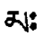
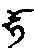

# 亥母甚深引导

分十六：

## （一）明显目录

1. 此目录
2. 本法根源
3. 亥母灌顶
4. 拙火教授
5. 大乐密修法
6. 马头亥母修法
7. 父母无二密修法
8. 自身大乐觉受
9. 他身事业手印
10. 智慧明炬引导
11. 智慧理趣除障
12. 金刚引水教授
13. 女印受持密修
14. 乌金口诀摩尼鬘
15. 下化身种法
16. 智慧决定本来清净解脱见

## （二）本法根源

莲师在桑那岩洞中闭关，移喜磋嘉请师开示一切法集。合体之灌顶云何？甚深解脱之法云何？请以大悲开示金刚空行甚深教授，唯一真实之道。莲师告曰：“移喜磋嘉，汝其谛听。我于汝当许开示金刚亥母之法。其中外计算法，如择日期等；内计算法，如脉等密修气、脉、明点建立法。此中当先灌顶令成熟；修马头、亥母起分；然后于密修中修气、脉、明点净分及自他亥母降等四法。于空乐智上，认识俱生智；凡所显现，了知为法身。决定正见以后，任运修持光明之身，令有漏成无漏，趋入普贤王如来位。如此教授，当为汝说。”移喜磋嘉乃以黄帛书其教授，以赤铜为椟，藏于桑爽那柘。此后持密歌吉登谱（为多吉扎大喇嘛）取出，又藏于孟余山。宁玛巴举古取网柘波请出，供养贡通王。于王宫开椟而视，则为黄帛二张，宽约四寸、长约一尺，字为西藏书法之琐体，中即亥母甚深引导教授。

## （三）亥母灌顶

未译，详见贡师所传。

## （四）拙火教授

敬礼吉祥莲花空行母

受持瑜伽具足堪能者，当分修外、内、密。

外拙火者，诸法从本无自性，本来空而离戏。本来清净大智慧坛中，不灭离勤显现中，当先皈依三宝，积集资粮、精进修上师瑜伽；此为加行。

正行者，莲、日上红放光二利已。自成亥母，红色，一面半怒，二臂，右钺高举，左颅当胸，右足踡踵近莲花，左足申，半跏趺坐于莲、日上。五骷髅冠庄严，五十湿人头为鬘，六种骨饰庄严。身显无自性，顶有猪头，黑色，出声，能胜诸魔，坐于火焰中。于内显外现本体上修等持。

内拙火者：身中三脉、四轮。中脉上达顶，下至脐下具纹处。中脉具如下四相：

1. 明如麻油灯，
2. 红如紫草汁，
3. 薄如莲瓣，
4. 直如芭蕉。

由小观大，由马尾、箭、竹、中等竹、身大、等虚空大。又渐小如中等竹。左右二脉皆如房中柱。心法轮三十二脉，语十六脉，顶三百六十脉，脐六十四脉，密二十八脉，皆如伞骨，具如上四相。中脉之底，日轮上成一指高亥母，红且具光。又自顶、莲、日、月上根本上师，水红色，如成就者相。其上依次而叠，有仁尊取光网波、朗卡匠错，仁尊多等守、若札宁柘蒋尉，承巴藏波，仁尊取已巴藏，仁尊登吝领巴，仁苏爱居蒋寸，此上有亥母立智炬中。此上有移喜磋嘉，水红色、发黑润披后。此上八岁莲师抱莲花空行母，师二手持铃杵。此上白马兮鲁噶，身红色，持铃、杵，抱莲花空行母；母持钺刀、颅器，二足各跨立，如勇士状。此上为普贤王如来佛父母，赤裸、双跏，安住五智光明中。于显空无自性明体上念启请文$$\color{orange}（师云：“可自拟”）$$。上师等依次化光，趋入中脉内小亥母，此又化成，成火焰，心专注于此。

修九节佛风。持瓶气，观放火光，不能持即放出。火渐炎上，心专注于彼而修等持。此后火渐及心喉等，于彼为所缘。

复次瓶气者，二手外交叉，其指抱二膝。上身抖摇，腹转百次。头左右如伞转，于左右前后摇头。左右手相擦而抖其指。上身左右扭。下身跳起。足互擦、伸屈，猛厉而行。身内如火充满，从毛孔出，于彼专注脩然后镇压，久乃呼出。最后当持柔和气，修诸拳法。由此脉开身煖。安乐生已，当修火上明点下降之法，此中分共、不共二种。共者，顶上白罕$$\color{orange}（音）$$向下注点，以火燃之、融化白明点，充满顶轮，由中脉至喉，乃至遍身毛孔内。红白交杂，于安住本体上脩等持。明点欲出，以长、短吽提上。行各畜生四种拳法，如羊抖等以散之。不共者$$\color{orange}（即密拙火）$$，于亥母密修法中明显述矣。

修拙火者，多服类似黄老鼠肉$$\color{orange}（无以名之故云）$$。以大牛胆$$\color{orange}（师云：“此牛之肉重及千斤，心如斗，寒山野牛也”）$$或普通公牛胆、亚大黄（于洗身后涂之，无垢白布拭擦之令光洁。又加黄鹅油涂足心，不致成跛。

## （五）大乐密修法

敬礼大乐兮鲁噶

密中之最密者，则当依于身明点，修大乐法。于无缘空性中，自成马头金刚：一面二臂，右钺高举，左颅当心，如勇父而立火光中，三目獠牙，发红黄竖立，披虎象人皮，具诸庄严，于顶有绿色马头。此马自眉间至额上有一白色直纹，口出嘶声，现空无自性。怀中生亥母，顶有亥头黑色、出声，与佛父相抱。顶轮各有三百六十班札札格父母，身白色。喉，也那札格父母，各十六，黄色。心，不打札格，三十二，黑色。脐，六十四，白马札格，红色。密，二十八，事业空行父母，绿色。毛孔，一京零六亿杂种空行父母，杂色。其手印依次，右为金刚、宝、钺、莲、剑、左颅，各相抱甚亲昵。顶上水大种澄清为成金刚空行父母，喉地大澄清成宝生空行父母，心空大澄清成佛部空行父母，脐间火大澄清为成莲花空行父母，密处风大净分为成事业空行父母。总之，金刚身中，皆空行父母，如芝麻夹开，彼等相抱双运中。

劝请勇士空行。如是顶上金刚空行父母从双运中降红白甘露，乐遍于顶。融入中脉，灌注喉间，乃至密处。每到一轮即转其轮，如是全身毛孔供养周遍。复提气从下灌上，涌出梵门外，供莲师。莲师金刚持复放红白菩提，到一切有情心中，清净后，安住莲师佛位。复化光入莲师心中，师复化光，入任运大光明中。修等持。持气、抖身最后发愿回向$$\color{orange}（文如下）$$：

&emsp;&emsp;大乐法界宫殿中&emsp;&emsp;空乐无二双运力

&emsp;&emsp;勇士空行无余众&emsp;&emsp;大乐游戏大欢喜

&emsp;&emsp;自他父母合为一&emsp;&emsp;勇士空行坛城中

&emsp;&emsp;俱生安乐之功能&emsp;&emsp;无漏智慧得通达

&emsp;&emsp;明空无别为本真&emsp;&emsp;空乐无二为报身

&emsp;&emsp;专一修持所出生&emsp;&emsp;法身密意究竟得

如上发愿，最后行拳法等：想自马头身内外明空，以清油擦身、持气。从头至足，四肢互擦。虎呕等拳法，用力而行。最后应如下法：头摇抖三次。二手金刚拳于乳协拍打，上身三扭。二手如满引弓而擦。跏趺坐，手置膝，直腰，腰左右各转十次。前后左右各三拍打。半睡，手勾大趾打腿胫；左右互行。跏趺坐大跳七次。坐定，伸屈其足三次。身前后俯仰。起立，上身三次俯仰，哈气三次，金刚波三次。此为增长安乐法，气、脉、明点，由此安住。身本尊明显，念咒，安乐定中，任运增长，最后修虹身。此为密法，不可宣泄。

## （六）马头亥母修法

敬礼本尊莲花兮鲁噶

于我莲花头鬘悲心流出之马头，为调伏众生而变化，此即我莲花生心修源法，为未来众生故，愿具堪能者得早遇之。

初自加持自身成马头佛父母身，如缘明显。顶上上师莲花生，脩无自性，眷属空行围绕，发胜菩提心。莲日上放红光，烧尽众生之业、习气。光返，自成马头，身红，抱亥母，杵莲契合。顶上上师莲花生父母，亦如马亥相抱，作殊胜灌顶。右有勇士，左有勇母，后有法宝，下有护法、空行、天龙八部，如教奉行。念莲师长咒后，加空行勇士总咒：

嗡、阿、吽、啥、马哈惹缕沙、惹札洗夜、三昧耶、札、札！

念启请文及咒，请灌顶加持。此后摄入定中，又起幻身如常。得加持已，自心生起证悟。如阙犯，当补足。修息、增、怀、诛四事业，得胜、共二成就一切法。如非器，无有加持，当具足戒为要。

## （七）父母无二密修法

敬礼秘密语本尊

如我所修秘密法为秘密中之极秘密者。于尸林中或寂静处，陈设五空行三角食子，箭上安鹫毛系红绫、红铜片、海螺等，此为空行所依物。具三节如竹而实之藤上，以五色红等绫庄严。颈上涂处女血及黄丹，此为爱敬法所依。如僧人当备红法衣。黑纸上以金书五部空行母咒。具相十六岁空行女血及自明点，五肉五甘露完全之阿米打，五位、五宝。独片天灵盖，为女而未坏者，此中，中画马、亥，四方画四空行，复以此贮上诸物，并悬佛像，陈供养、箭、镜等。

正行当知四种橛：

1. 初、三摩地橛，为勾召空行之法要。
2. 二、恶咒不变橛，语功能无碍出生。
3. 三、密义不变橛，于真实胜义上安住。
4. 四、收放手印不变橛，四种事业可成办。

以上四者具足，空行母不由自主而来矣！

初、三摩地橛者，以天灵盖身相为所依，于彼观察所缘，专一注视，三摩地身可现。

二、恶咒不变橛者，多念如上五部空行心咒。念已无余，可勾召主伴。身三处三字，余亦各有心咒围绕。可得勇士、空行现前授记。说法如我所欲，皆得成办。心咒当如河流水相续而念。

三、密义不变橛者，当知自己、勇父、母、空行各别非也，实为法身一体。心意识与空行无别，脉为勇父，一切念分别为勇母，此等皆法身流出。了知此要，即尸林鬼女修之，亦可成胜、共二德。

四、收放手印不变橛者，修四事业，以息法寂八怖畏，以增法益福寿财宝，以怀法摄空行，以诛法制诸魔障。心中所欲空行、勇士，如蚁集羶，一切空行母如母慈视，一切姊妹如我侍者。于心所缘，放四光等。当励力行，一切如意。身成光明，摄持三界。特别女子咸敬爱我。最后修大空乐。

五部空行以心供我，我故开许而说。移喜磋嘉，汝其谛听。修智慧空行，有男人单修、女人单修法，皆远而难行。如男女无二而修，则为一切空行勇士法中之最胜者。自成马头抱大乐空行母，脉无余成空行勇士。净分不可漏失。从大乐中劝请空行，不修而任运行。自修本尊明显，守护明点。如有漏失，则为断空行心命。心虽修，等于无修。于起正瑜伽士自身修空行、明点。不漏，则于安乐中劝请，其语业功能兼带出生。心正定增长，神通出现。修长寿此为最胜，是故应当精进，具足堪能。

## （八）自身大乐觉受

自身大乐轮者，具力瑜伽士，为增长无漏智，当修气脉明点。如法灌顶，拙火作已，于寂静处坐安乐垫上，随自欲乐想一佛母。此为与心相合修智慧母法。如彼真实闻其语言，窥其形容，按乳等工作，向空虚拟而行。如上以不定法，令生安乐。身生热出汗，杵出牛涎，此时当观体性本来空。头身等抖颤，如是一刹那提马头佛慢、自杵观为五股杵，红头向下，塞杵口，以右手为亥母而行，观无自性。顶上五轮等，如前密修而修。虽遇命难，明点勿泄，如是意乐，当数数生起。慢慢手淫，乐如生起，上气安住本处，中气鼓腹，目看明空体，抖身。乐小再淫。不忍乐如昏迷时，身不动，中气外张，上气按抑，背气提上，以长吽、短吽出气，腹贴背。如上无间，连行三次，复如龟而行于五轮供养。乐到顶上诸脉皆动，中气张腹，明点自然安住不流失。此后空声而提，心目专注顶上。数数而提，既返本处，行如羊抖等拳法，可散布全身。此后又渐行之。气脉未熟行者或见未决定者，明点欲落时，以第二指按大小便间，气稍压住，心注顶上罕字。此后中气渐次镇压，上气吸向下按。背气用力提，出长短吽声，如肠将断。此后持瓶气，由此净分不漏。如是精进，净、浊可以分开，并得坚固。空行、勇士，任运摄持，福寿增上，身鲜明如童子，顶无白发，额无皱纹。他身红分不可多提，多则身成紫黑色，故当恰如其量。具堪能者，如此要诀，当知受持。

