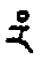
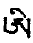
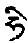

### 3 令成熟法

若得具足性相手印母已，为作甚深密法灌顶。令其成熟灌顶后，开示令知解脱道。依次修持身三灌。灌顶之利益者，切须不与世间法邪见相合，使心转入佛法。心量小者令生广大心，令生无上密乘决定知解，广说甚深修持方便道之利益。并用咒力使不离散，令成事业手印母器。

### 4 正修持法

尔时当思凡圣一切法因，皆由明点圆满而出生，故应修持明点增长口授法。于不令人窥见之寂静茅蓬中行之。令其洗身庄严，涂以香油，佩以香囊。始启请勇父、空行母众，次于具相明母腿上伸置自足，互抱吻、以手摸抚口唇舌，揉双乳或莲杵互观，杵置彼手，尽力表示生乐之方便。正作业时若生贪欲，应了达其自性即法身之妙用，故于贪上认识自性，本来面目，而定于本面上。普通贪欲自能摧坏，是为由贪欲显大乐之方便，故应精勤修持。

复次，自他加持者。初发最殊胜菩提心。观一切法空，空中现卧具，即莲、日轮。轮上自成马头金刚，一面二臂，如生起次第所说。次、自密处现吽字，由吽转成五股杵。空隙中现蓝色吽字，头向内。杵尖口有黄红呸字向外。佛母一刹那转成金刚亥母，一面二臂，具足庄严。极安乐喜悦，双乳突鼓，嘎嘎丰盈，乐不可支。观密处无缘现四瓣莲花，花中现花胚，字庄严。自佛父、母诸脉轮中，想一切勇父、勇母同时密修相同。此后莲胚上以杵击下，稍定于离戏论本来根本定上。继续如羊抖身，周身颤动，想明点如瀑流下，应如农夫以锄挖沟引水，不使外流，而散布全身，降于各轮，如密修法修持。但降于各轮，身应作摆动事业，令明点不漏为要。此后明点降密处时，想供献密处佛父空行母如前而行。尔时于持之善巧，如塞池中出水之口。上根持时，住于离一切戏论网边际之如来体上。中根持时，以气为主，须持上气，而下气如惹比鸡瓶，有风不漏。如是持下气，则下气自然盘旋，及持中气$$\color{orange}（即不男不女气）$$，则脐稍外张，可以稳持。更以持善巧观想法论之，亦分上、中、下三根。上根持时，则缘离一切戏论网边际本来清净见。中根、观想上罕字如拴马椿。下根，观自顶上现上师勇父、母如水晶光，内外莹澈。

初修业者，若立刻泻下，则应以三指如梯按会阴处而持之。逆提善巧者，如提水于井，想杵中以吽字之心，有如铁钩，钩事业手印母莲宫中之红字净分，即长声念吽字，吸入杵中$$\color{orange}（尽力死心上提）$$供密处诸本尊。次由中脉道相续吸入脐、心、喉、顶，于诸本尊供养后，由梵穴出，供顶上金刚持上师、莲花生上师及佛父母众。尔时身要，应齐四洲收于顶弥$$\color{orange}（如蛇缠须弥）$$，翻目上视，舌抵上颚，地角压喉结，全身颤动；语要，长声念吽字，尽气量不断而提之。提时于各轮身要、气要、观要，三要同时动作，直往上提，如行提甚难，则于各轮，三要同行三次。

次离手印母后，应行狐子坐势法，提上散布。此法身要：足随安乐而坐，手握金刚拳置前地上；气要：持柔和长气；观要：缘顶上上师莲花生父母或观顶上字，或观顶上虚空。念微细长声吽字，吐出柔和气，吐尽，又微吸一次，仍念微细长声吽字放出。如是吸放四五次，则全身自然颤动，此名自然提引散布法。依气无勤勇所出生后，回向发愿，契合善因。平时多修瓶气，心定于本来体性上为要。

### 5 指示功德与所得果

$$\color{orange}（渝本缺详，散见他本。）$$

本法与五部空行密修相契，为诸瑜伽者圆满二种资粮，并多分与生起次第相应。本法为令空行母欢喜道次第教法，行者珍视为要。

## （十）智慧明炬引导

敬礼薄伽梵莲花大自在忿怒尊

于具堪能开示真实智慧庄严。此中起分修本尊，内修气出入加行，令脉清净。于外修已详前。内拙火者，外住处清净，具加持力，顺缘集合。前吉祥诸大成就者所在之地，无鬼魔及恶业众生，人不能见者，树木、水等无过失，地方坚固而具寒水石者。具诸药物者。饮食顺缘，具补品精华，能调养四大之资粮食品齐全。令心散乱之诸食品当舍。衣宜轻柔，伴为初修业者，如法趋向者，能修气脉者，顺法行者。于具足教授、修习能纯熟之教师前，领受口诀。本尊咒念圆满已，脉界空行、勇士所显起分坚固。明点增长之物者，仙人掌、白芨、大云虎儿$$\color{orange}（皆坚固明点必须多购）$$、麻雀肉丸，又好干肉、好肉、酥油等当集合，非辟谷难行可比。药如广者无有，则仙人掌、白果、官桂、蛇肉等当备，能生煖物与资具集合。此后修拙火者，初发心为利众生愿成佛。集资供师，积福德诸事当多行，故当供曼达，修金刚萨埵等。为得加持故，当修上师相应法。如是方入正行。

不共加行者。拙火、三脉、四轮、修明空。外拙火，一切无缘上，自成亥母，内外莹澈。心专一而修。身中脉轮，如前观想，此为内拙火。密拙火者，三脉集合处红火遍全身。习拳法六灶印、修带、身抖等，当行。乐增长故，顶上罕向下，拙火上燃，明点融化滴下，充满脉中。不变本体无生离心者，是为密密真实拙火。具足堪能士，于大乐智慧修三身。本来清净地坚固摄持，于一切利众生事，当令增长，乐亦增长。

乐增长法有二：一、钵那$$\color{orange}（师云：“莲花”）$$，二、他缘乐。

修钵那者，分二：一、心了别，二、真钵那。

初者，脉界空行明显为第一种。想一人间女子，十六岁，乳肥等，于彼生起贪行。自马、女亥，父密五股杵有吽，杵口有红黄呸字塞住。母密四瓣莲花，中阿字，四字哈、惹、尼、沙，在四方。自、他脉明空，如内修法而观杵莲抽掷。乐起已，供养顶上金刚空行父母，而住于本来清净上，乃至供养密处而修，于各各轮而抖其身，此为降法，党如龟而行。认持善巧者，如水池塞孔，有四法：

- 初、上气收摄如二口瓶，一指按一口，由手收放而水有收放。
- 二、中气张腹，以大手印认持。
- 三、下气提升，以脉管摄提。
- 四、如束柴要断，以心离勤勇摄持。

此于余经秘密引导中已详。提善巧，如水池引水者，以大象拳法，供莲花空行；以狮拳法供佛部空行；以虎呕拳法供宝生空行；以狐嗅拳法供金刚空行；以羊抖拳法供襍种空行。最后住于无缘，又当多行拳法。

二、真钵那。右手为金刚亥母，密杵上擦。乐生已，供养如前，而行拳法。初学疑欲漏失，左足蜷于密处三角尖处镇压，向上提，拳法如前。初向上提；余未提起者，以手擦，向外放出。向上提拳法者；手置跏趺，身右抬提，口念长吽二十一，短六，想到顶罕；身左抬提，念长“衣”二十一遍，短六遍，想到顶罕，提中脉者，念长，音如英文之“he”，二十一遍，短六遍，送至顶罕内。二手金刚拳置跨，腹贴背，抖身。最后安住空性。回向大菩提。如上当修一年。当如水貉守护其口，秘密而行。

## （十一）智慧理趣除障

敬礼大乐莲花兮鲁噶

《文殊真实名义经》云：

> 具足十六半半点。

盖金刚身中，安住十六明点，其一半为持命明点，唯死时舍，其余八者分净、浊二种。浊分生贪时，如口出涎时即是，持之无益，失之无损。认持有益，不持有损者，有六明点；此中又分净分之浊分、净分之净分。白带粘著者为净分之浊分。净分之净分者，白而光，如芥子，如睛，此为种子之因。女子者，为紫茸色，如霜点，与明点合，可成胎儿。浊分女子者，必向外出。虽为净分之浊分，行者亦当摄持。浊分虽泄、净分可提者，其相鼻端有光彩如油。又净分之浊分，如鼻涕，散失后，身必瘦弱。如此亦净分，能持则生涅槃功德，不能持则生轮回过失。当护之如保命。行者净分不泄而行业印，内身力生起，上师本尊皆欢喜，可摄空行，身体日健，福德增广。依于此已，持命明点，长寿不老，无白发、皱纹等，三摩地增上；否则反是。散失明点一滴，如断空行母命，十方彼等皆哭，戒根本坏失，福德减少，寿命短夭。虽修本尊，等于未修，身力微、无光彩、白发、皱纹、喘气、三摩地等持不生、明显安乐定不生、拙火不生煖、多病、饮食不化，如此过失，说不能尽。令明点散失之助伴、饮食、地方、女人等当舍。自修本尊大乐不断，依具相悦意之女子；上等真实女，中等观想。世间女子仅一次可行，最后发愿回向，此女子到金刚亥母位无疑。女子月经中行，无益有损。女子净分之净分，为紫茸色，大如霜点，明如水银，为凡圣命所依。乐生起时，被行者提点，则身干枯、易老，是故女子明点，亦不应坏$$\color{orange}（持法见女子引导）$$。行者与明印行时，五轮脉及诸脉内明点净分及四大种净分，为因地明点，于全身动摇，身觉安乐。大种净分及智慧功能，由气力普遍，气复动摇大种，互为助伴，从顶至密明点动摇，乐如水荡漾、煖如火炽然，定任运成办四大种平等住持。乐到杵尖，不应再住莲中。漏失明点过患已如前述。乐上提持，余经已详。由能修此，于任何所修，本体上翻转为要。又当知四大种明点，不平等住则生病，故提后当散，散后当住无缘，此为重要。散中殊胜之法，即安住本来清净见上，可成空乐自解脱，此即无缘本净，离一切戏论。此见如墙基，受持四种事业，皆为此无缘本净体所摄，此当切知。能住此本体者，净分之浊分虽不能提，净分必能返上。当如农夫耕毕，撤手归家。能持命明点与业印住而不外出者有八。彼等安住之处，即在脉结轮中，四大种净分平等安住。从父所得白净分，安住眉间；余经云安住顶轮；水大种为主。从母所得净分红点，安住杵与莲中；余经云安住脐上之阿洗；此以火大为主。胜义明点安住心中。以上为八明点安住法。双运生乐，以此为身命所依，男女二者无别。彼等住处迁移，大种错乱，则近死期；暂时散乱，则成病苦。如上乃明点住法。

欲令明点增长，行事业手印，当用十六岁，莲、乳皆肥者，腰细令男生不忍乐。自他本尊身明显。三处三字，脐红啥字安住莲、月座上。自顶天灵盖下脑髓、皮内有白罕向下如水银，明点十六，如母者子围之。顶上肉髻、莲、日上，上师金刚持佛父母双运间，降红白甘露入梵门，到罕鲜明增广。红白光明充满。明点十六降喉，乃至心。持命八明点即安住于此。余八降脐，存四为持命明点。余四降密处，存二持命。余二降至杵尖，与贪自法尔解脱之绿黄色呸字相融。身中脉处明点充满。此为持气所缘双运甚深法，为全身安乐广大之要诀。与亥母密修，脉界本尊同时双运。黎明不断而行。力大、根明显、脉界不乱，主要教授即此。于具性相前加持自他密处，最后不存平庸凡夫想。二根相合，种种贪行，当作种种身心鬆缓，安住无缘本净上，此为如池塞孔真实教授。动摇时，初修者，乐起即当持。于乐知量而动摇。乐生不动，鬆缓其心为要。当如龟法，如水池中冷，慢慢向外行，一遇太阳太热，慢慢向池内行，此为上师口诀，善巧之法。如太猛行，则如悬崖落石，不能返矣。当如上喻。身明显本尊，心鬆缓、无执、安住本净为要。

由上降下有四喜，由下升上有四喜。双运四喜，自顶十六点降喉为欢喜，为瓶灌，为通达明点双运；从喉降心为胜喜，为密灌，为通达空乐双运；到脐为离喜，为通达慧灌，为通达舍喜执着，断二执分别，空色如离云虚空，法身显现；到密处为俱生喜，为四灌，为通达空乐俱生智。上根即于法身本体上认持。若能安住于此，提散功能自然具足。中根，中气鼓腹，具身要，目视顶罕字，净分可返。以羊抖法，令遍全身。由下升上四喜，明点在杵尖不流失，升于三脉会合处，有字，彼为大乐般若佛母，此明点集合第一种空色，如离云虚空，通达胜光，大乘见道登地，此时中脉结开。从此至脐明点上升，次第为二地、三地，其功德具清净正见，为诸续所许。明点充满脐轮时，脐上住父音、母音，佛所说十二教授，无碍了知。从脐以下为具足莲花种性功德。此后到心，安乐充满，心间脉开，法身智慧力大增，无分内、外光明显现。身脉界，如四肢能显四洲，离能、所修，通达修道智。此后到喉开脉，得报身成就，佛所说一切教授辩证，皆得自在，不同诸语言皆能通达。此后到顶大乐轮，现证无学道光明，到华藏世界，地道一时圆满，通达道种智及十地见。由此到肉髻，充满其中，中脉三十二脉结，令开解已，一刹那圆满断证功德，得从本以来普贤王如来位，现证十三地无上智。从上降下四喜，为资粮、加行一切世间道；由下升上为出世道，一生成佛。

即此甚深女子之道，专一精进为要。对治、清净见、精进，三者必具。不可以自欺。于女子行漏失菩提，犯别解脱戒。自心贪图安乐，犯菩萨戒。断丧明点即断一切本尊、空行心命，犯密宗根本戒，念咒无有力量，为本尊及一切空行所舍，事业不成办。护法由自垢染而自遮断，一切事不能成功，是故明点当勿漏失，同伴犯戒者当离开。吾子，汝欲修此密宗法，当爱护明点如护佛目，当知次第生起四喜。初与业印平等住、从顶降喉，身乐生起，由欢喜智舍二执，契合二乘见。净分到心，乐更大，由胜喜断我执分别，契合菩萨见。明点到脐，身普遍大乐，由离喜智断手印执，契密宗见。此后到密处，安乐无分别、无说之因，生俱生喜，断三灌欢喜智分别，契无上秘密持明见。如是于安乐体上观察，领纳无说，澈见本性；于彼觉受不散，当精进焉。

初修业印，安乐大动则易漏；当知持善巧，如水池塞孔口诀。当知持久不提，明点必与尿同出；当知提善巧，如井中汲水。提面不散，身必生病；故当知散中善巧，如洒水田中，令其普遍。散已不固，明点如水漏失，故于令坚固法，当励行焉。最后修空观见；彼等教授，余经已详。

又乐与六度相配者，佛父母由本尊明显圆满资粮，是为布施；明点如命防护，是为持戒；清净诸苦，所显皆乐，为忍辱；于彼义安住，为禅定；于乐不疲不怠，为精进；乐自了知，通达空乐无二，为智慧。与四灌相配：父母本尊明显为瓶灌；脉内明点动摇，煖生起，为密灌；清净能取执粗细分别，为三灌；离心智慧大乐显现，为四灌。与三戒相配：刹那不断，为别解脱戒；乐为他故，为菩萨戒；自生本尊明显，不越空乐大乐智慧，为密宗戒。乐与四道相配：发心已，自他本尊明显，大乐智上游戏，为圆满资粮道；佛父母平等住，现证空乐，此为见道；能、所修无执着，此为修道；此之本体离心所作，为无学道。

此后当开示者，自他若不修本尊身，则堕于平常贪欲，故加持自己及密处为重要。若不发菩提心，则堕二乘，故发心为要。明点降善巧如龟，不然则如山崖落石，永无返期，故降善巧当知，则如军人步哨，自有回报。若其时能安住本净，降等四者无功用出生，此为善降等法。如此则净分仅出少许，唯出浊分而已。又当知者，散失明点之缘。行者未先习业印，降善巧不知或与恶手印相合$$\color{orange}（即犯淫女人）$$，造业犯戒，或坐不净处或白日身心过疲，或食有垢饮食，此为散失之五缘，当除之。

如明点增盛，杵如木不倒，多行拳法。不除，则多依业印作提散拳法。又不除，于业印不致生子时，莲宫中观寂静、忿怒诸本尊，而放点供养。此后于业印莲上，上品以舌取之，中品以指取之，下品以匙舀服，念阿米打咒$$\color{orange}（即甘露咒）$$，自供。作已，罪亦不生，身不致衰，可以圆满资粮。

金刚阿阇黎放缘有四：第一为密灌顶，充三昧耶物；第二作甘露丸；第三为利他，生菩萨子；第四障难出生时$$\color{orange}（师云：“观如蒲巴而杀之”。健按：现自死相及除明点住病，然不必阿阇黎也）。$$

除此则不能放。放之过，如前已详。行者除有病时，不能放。

由鬼、罗叉、地主、妖精、具毒等所害而散者，当用具力之明点、处女血、黑芸香、古鲁札那$$\color{orange}（师云：“脑髓”）$$、芥子烧灰、阿米打、黑犬矢。以红绫包之，念下咒：

嗡，班札噶马惹洗，佐朗让沙哇，只耻呼鲁通，呸！

念一万或一千，缠杵上。此法为甚深口诀。

又金刚杵如铁打时，当观如火燃，用死人衣缠之。

又一见美女即漏点，当观女化光，入杵到心。当知贪乐除心以外无有，如幻如梦，数数而观，安住法尔本体上。

又身寒重而致失点，用五根本乐$$\color{orange}（仙人掌、白芨、天门冬、玉竹、黄精）（不可靠）$$、加二倍药$$\color{orange}（师云：“为白豆蔻、益智仁”）$$、加三倍白马惹打，加一倍三辛$$\color{orange}（师云：“荜拔、姜及胡椒”）$$和糖服之，可除。用雪豹等热兽皮为衣。由饮食而致散失者，当舍无精华饮食；食自明点。又松茸、石花磨粉，和牛乳中，饥时食之。以哭花$$\color{orange}（师云：“花中有甘露如珠泪，黄者文殊泪，白、观音，蓝、金刚手”）$$、仙人掌和蜂蜜食之。由犯戒而散失者，修忏悔、供磋$$\color{orange}（食子）$$等。犯戒印当舍。积福净障上努力行，用不犯戒手印，上师前请灌顶。明点若不能全提而塞于金刚杵脉内，尿亦停住，生热烧等病，则于杵近密处一部分，以手揉搽，而后于佛母莲宫中本尊行供养。明点又或者粘于身脉内，所出如水，则当行提散拳法，以手揉搽之，如取乳然，如去水池之塞然。食未落地之自明点，念阿米打咒，自供本尊。若闭塞杵道，以小蜀季花之根、叶、螃虾小虫（）及硇砂$$\color{orange}（能利尿）$$熬水服之，即愈。