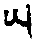

自明点能自在已。提女者有二种：一、依气，二、依物。

初、依气者，被提女人，已生子者七，不及未生子者一；有夫者七，不及无夫者一；身端正悦意者七，不如年青者一。年十三至二十五者可提；年二十六至三十五唯能资以自提耳，彼明点无有可被提者。各种空行中，以莲花种性者可提$$\color{orange}（健按：可提者，易提也，彼易漏故）$$说为长寿所依。莲花女肉红白鲜嫩，其红菩提如雨而降，腰细，身材适中，美丽悦意，男一见生乐。女一被触则自欢悦战栗，此必身中存精华者。以杵近其莲，自然生出大乐声。杵入其中，如小孩吮乳，自知含茹，此即莲种。距外间四指中，有脉圆形。于彼当先觅脉。觅脉加行，则在吻、抱、搜肋等贪行为。彼乐生起，以杵外探，多说贪语。

彼面红、气喘、身抖，莲内有水润，此时不可即行，当以补品酒服之，再以冰片、丁香、红白檀令服，令其明点净分增长，然后平等住。当男女大乐相等时，方可提上。此属脉好者，于此不能提，当行觅脉方便。于女身搽酒、蜂蜜、酥油。另作毡质杵，形大如自大杵，唯应略长，头宜略尖，以绫缠之，上涂鹫油酒及酥油，插入其肛门中。另作二线球置其腰，以薄腰带缠之。背枕以鞍，令仰卧，由此二腰落近臀部，脉从阴门伸出，如小鱼，如乳头。以指拨开莲瓣，于彼脉用药涂之，以手伸脉，可令出莲六指，中、四指，下亦二指。引此脉插入杵孔中，则可提矣。于乐平等时，自明点努力提上。果提上已，身亦生暖烘烘之相。此后生不忍乐，当行散法，如羊抖身。又法，以毡杵入莲，女出欢声。以左四指，将指甲磨光，敷药于脉，可以长伸而出，极柔。肛门中毡杵当取出，然后入莲而提$$\color{orange}（健按：杵入、毡杵出，当同时行，如军对仗，一进一退）$$。又法以毡杵插入肛门，肢分抱臀，然后以药涂脉，插入杵孔。杵稍入后，即将毡杵取出$$\color{orange}（贡师云：“二杵同时内逼，女应力而死，宜慎重之”）$$开脉之药，生蜂糖、干乳$$\color{orange}（亲师云：“即乳桶内常粘之乳”；贡师云：“取乳后，余乳再垂者是。”未知孰是。）$$、白狗杵、管仲、花椒、乌取花、硇砂涂其脉上，并涂杵、莲。杵入莲中，勿上气下按。生猛贪，下部动作宜慢。杵含脉必生大乐，自身提散当励行，令明点坚固。他身明点者，自马头明显，心目专注于缘马头眉间之白纹。杵左右上下力动。女子发抖出娇声、喘气。自杵孔内之吽，勾其莲中红，念长吽，提至顶，与罕相合。具足六支身要$$\color{orange}（健按：如翻目等）$$，用力而行，必提无疑。

又佛母提佛父者，自亥母顶，亥头红色，目专注于此，以左右踵靠佛父臀部，二手交叉捻自大趾，念长吽，男明点即如水银入于脐上，与脐红

无二和合。目上翻等六支如前，行七或十次，男净分必可提。男乐增上时不可放松，当乘势用力而动，此为要诀。此后当行散等拳法，用力为之。女分清浊者，二足心相抵，置莲花前，二手指交叉抱二足背，上气下按，下气放松，足与臀等在垫上跳跃、抖身，由是浊分出而净分提。男子明点遍者，观红白相合，身如囊满贮乳，乳血相合，自己乐大，身用大力抖身，其散功用自然出生。福慧相合，此为要诀。

特别拳法，以左右第四指在地上支持体重，持散等自然出生，此为依气之法。

依物者，以吸铁石、哭花、小蜀季花、松子、硇砂，一并合乳而食，决可摄业印之红菩提。又男用吸铁石与白糖和丸，女则以铁屑、螃蟹、小蜀季花、花椒、蜜糖作丸，一黄昏，一下午，一黎明服之。男三丸于相合时置舌下，由此昼夜不分，平等住时父明点不出。女明点从毛孔以内者，皆可摄入。能提之相，身烧热生乐，心无执着。此由药力提净分之口诀。

以拳法提者，杵入莲，女不忍乐生起，杵亦热。乐生时，自己顶上为所缘，杵从根部完全插入，又稍向外提升，念长吽三，观母化光入杵孔中，从中脉至顶，与罕合，无二。普遍全身，安住空乐无二定上。杵忽弯软而烧热独存，此为能提之相也。他日必得鲜色光明等功能。具性相空行母，从十六至二十五岁，上等一夜十次，中等四次、下等三次，最下等一次。不间，气必能入中脉。具相二孔同时等出，空乐无二自然出生。其受持光明，行者可出五色光。乐之觉受，虽入丛刺，身乐不阙，此名狮子游戏三摩地，此为依具性相业印之功德。又自业印决定时，当为彼说大、小乘法，为行第三灌顶，心细柔而摄受之。当令听我吩咐，我亦当守秘密，则一切空行皆可摄持。

气息受持猛利法。左、右、中气猛利呼出，以猛利气吸女子。前气下按，后气上提，持气不放。气所住处松缓而住，识安本净，身安乐炽然，凡所显皆为安乐，俱生智不断出生，得自身不死成就。其能提净分者，长寿无病、面容光洁，受持三界财物，摄一切空行母，并得其授记，名称普闻，语可随类说法，以空乐觉受度日，成办事业、八大成就，得俱生法身，成办虹光报身，及各种化身无间出生。三身无二，得安乐大身；上等现生成办金刚身，中等中阴成就空行，下等第二生成佛。

## （十二）金刚引水教授

敬礼大乐莲花兮鲁迦

具足种性行者，欲依事业手印，当于密乘甚深引导法中所说具相手印者吸取净分。当先自习其力，自得界分稳固后，方可行。此手印须端严悦意，莲花煖且丰盈，十三至二十五岁间，无嫉妒、悭吝，不为世法所染。以种种方便摄受自在后，俱生时须吻口、抱腰、咂舌，竭力以种种方便令生贪心，发生安乐。见其面紫红、气喘、声颤动及手足抖战时，行者自观本尊马头，印观亥母，如生起次第而修。加持两密处而修，其觅脉方便，于前已述。于自他二根相合生乐时，当如龟徐行，认识喜乐。乐大，恐失菩提，观杵摩尼顶有青黑色吽，头向内，勾向外。心定于本来清净上，离一切戏论边际，缘此青黑色吽字。初修业者，心缘此观想，犹龟有椿焉。但大行者，能定于安乐无分明体上，自能令定增上。后持逆提法，如他身事业中已详。

取其精华者，当知手印莲花净分之脉头，手触之如有二头状。次想金刚顶，经五轮直提中脉，上达梵穴，下达莲花。想莲花并无经血、黄水等浊分。手印具足一切相。用长吽字吸提入中脉，想吽又生吽、如丝线相连贯之数珠。此时头应左右摆动，不断念长、短吽，应以海卫须弥、眼上翻、舌抵颚、身缩抵背，直往上提。次身覆于手印上，两足长伸，第二指触地，以二手大指紧按中、无名、小指之屈曲上，两指伸按地，尾闾、臀部稍向外张，行者余身不令触地，口诵长吽，想手印红界净分，如紫茸花之红润，此净分，以吽勾吸入中脉。依次入四轮，收入顶罕，无分别住。但背腹相合、下气猛提、颌压喉结、眼上视等，与余相同。

若于各轮用气功之次，吸菩提决能提升矣。得吸提相后，须行分布全身，如羊抖身法，并放手三跳等。若分别净浊二分，当多行阿鲁事业$$\color{orange}（亲师云：“即放收肛门”）$$，自能排浊分得净分。后应行狮子游戏拳法，遣一切障，心定于本净见上。气随自然出入。若于具相观想生执着，于所缘明点当生凝结之过患。未行此法前，当备豆蔻、丁香、红花乳细末和酥酪置座旁，至此以药涂其脉上。行者须先习身要：应具六法口诀，诵长、短吽，身不可令日光照。修习一月后，自然吸取$$\color{orange}（此上贡师主译）$$。此中扼要知已，杵入孔中，气乃可提，终成马阴藏相，明点即落莲中，亦可返。自净分得坚固，具足性相印者，亦可提入。印身当无病，精华无染污。其提有三法。上提者，以下行气得坚固者，可行。中提者，自生本尊，领纳三昧耶物，于母降净分时，口中含阿米打甘露，以竹筒吸取与甘露相合，以舌自扰动，供养自界本尊。由此圆满资粮，领纳秘密三昧耶物，殊胜游戏能令寿延，后抖身。下提者，身界增广时，母降点，其腰垫枕，莲以下以盘承之，不可为阳光所照。以右鼻孔接竹筒而吸之，二手按二鼻孔，令气专由筒达右孔，决可提其净分。事后抖身。

其提净观想者，面前虚空莲、日、月上，上师无量寿佛父母双运间，降流红白甘露，充满自顶与鼻孔，趋入一切身脉界内。母明点能提已，其相已详前。此中三昧耶者，当离能所取执着。下提口诀者，以各种方便令生大乐。螃蟹，黑虫，，鸡下冠令食，可开脉口。腰以下用油涂之。起分观想。大杵入莲，深入其中。当知自乐之量，又当知母生起乐相。即以手抱紧女腰，自身端正。女左脉开，降红菩提，自杵如筒，由此提净分。浊分留住，净分从中脉入罕，十六明点间。空声而提，二足大趾内勾，二手第二、三指在自背后左右支身$$\color{orange}（健按：与前异；前卧提，今坐提也）$$。除于大趾外，其余身分，不可支地。提下气六加行中，惟四洲不缩$$\color{orange}（即不缩手足）$$，余皆相同。女无念、昏迷，缩如绒球，不忍、出恶声，此为被提相。此后分离，安住本净。抖身，行狮子游戏、五轮等拳法。女现衰相，当以食品补之，否则易老。又除障等，此处未明显说者，余处详。希哉，空行心血法！奇哉，亥母大教授！吾为贪爱移喜磋嘉而说。藏之名山，愿未来具种性者早遇之。

## （十三）女印受持密修

敬礼莲花空行前

以事业女为主之大乐引导法，当如纯金而述。分三：加、正、结。

初、加行者。智印性相：对密戒未犯；久合无异、无恶口；不乱淫；不爱修饰；深信上师为佛，如教奉行；智慧广大，能分大小乘；精进作佛事，与心相合；能念无常等。如是种性，方可传此胜法，且只可为三空行女说，不宜多传。传时只许一人受。三人当各别传之为要。初令女身清净，于身上涂油。食精华品，习拙火、拳法既久。并当服下物：仙人掌、三果$$\color{orange}（川练子、柯子、山楂）$$、哭花、各种花熬膏作丸，饥时服之。行时当四肢紧缩，持气。特别从莲花空行父母作业间，降无量红、白菩提，充满脐轮。中住气向外鼓，脐左右转，行拳法令向上提。二足心相合，两手指交叉抱两足，足向下用力按，手向上用力提。腹贴背，地角压喉结，目翻，舌抵。观莲中红白和合，提入中脉，供养顶上上师父母。中气内摄，于垫以臀、足向上交换跳。心住本净。由此能除乐所生之痛苦。善行等上，不能安住；虽在寂静，心缘闹市；唯贪男人。以此拳法调整，可除此痛苦。不行此拳法，则由持点而致病痛。

正行有四：一、以秘密心作意。二、以手指行。三、以软和物。四、以男兮鲁伽而行。

初、发菩提心。于三根本启白。自一刹那成亥母，莲四瓣中有阿字庄严。心间由成佛部空行，顶金刚空行，喉宝生空行，脐莲花空行，密事业空行。身相、手印等，于大乐密修中当知。于彼面前，想一令自生贪佛父马头金刚，心有啥字成佛勇士，顶、喉、脐、密各成四部勇士，余如大乐密修。父金刚杵观成五股者，内有供养空行母之物。充满佛父母一切毛孔，生起杂类勇士、空行，如芝麻开荚。自他身外，修眷属者，则东有金刚空行、勇士如常，乃至北方者。于莲花四隅瓣上亦修四空行母。如是男女相合，世间过失无有染犯，如虫蠕动而入，以顶至毛孔诸空行为所缘。彼等空行、勇士生起大乐。莲花跏趺坐，踵抵大、小便口之中间，金刚拳置脐。观想莲中红啥具双圈，为空行命字，入杵中，彼杵供养物如雨而降冰片，以此啥字勾来供顶上上师、五处空行等。最后如羊抖身，如马滚地。安住本体，中气鼓出，令其坚固。初本尊身如影相。降时如龟之口诀者，于顶注意，气次第松缓。以猛利对治行之，此为三要诀：提时用虎呕法，手足心置地，口中念、九次，于左、右、中、三三行之。以狐嗅法，从右提，右呼三次，左、中亦如是。身要，于左、右、中提时，拳按乳，身稍向左右前偏，如头带蛇起势。观想者，于男杵内吽勾之，红白明点沿女中脉供养上师空行如前。令明点安住法者，跏趺，二手置膝，中气鼓出，目视虚空，身如羊抖。二手如射箭式，拍肋而行。下身转变，以跏趺跳起又跏趺坐。拳从膝沿上平伸而出。地角压喉，上身左右各三扭。手到处搽。以狮子游戏法，多次行，可以除一切障。最后持气，安住本净，回向发愿。领纳四喜，无间而修。

第二、于指上修者，与此上相同。

第三、以软和物者，即用竹筒长五寸，彼中贮羊杵$$\color{orange}（未去睾丸者）$$、毛骡明点及悦意男人明点，外以毡缠，以盖盖之。此外复涂秘密物$$\color{orange}（师云：“不知”。健评云：当系男法中之涂物）$$、发大菩提心，观想悦意勇士，作种种贪行。莲花水润，加持自他密处。佛父母平等住，身稍后仰，以左手抱左胫下部，右手持软和物$$\color{orange}（先于太阳中晒热）$$，令软且发热，于莲花上下左右行其贪相。生喘、身颤等，即以此杵深入缓行，同时自身从下向上腾举。安乐大时下身动皆停止，注视顶上上师金刚、空行，目翻。乐散又行，乐大复松。供养脉中五空行。降，当依上师如龟口诀而行。持，当如池塞口。初、当具不失明点誓愿。上等以本净见认持。乐生时，即住于空乐无分本体上。散等如前。中等当以气持。生乐时，中气鼓出，观眉间红色卐字右旋；乐散复行。下等塞孔者，生乐时，以二手第二、三指按有骨、无骨，有毛、无毛，红白会合处$$\color{orange}（二阴会合中间）$$；观想顶上空行。最后行下列各拳法。莲花空行拳法者，二足平身面前，右拳背抵右踵，举起，左拳向前平伸；易手举踵，复行之。此后拳从膝上至乳，拍肋，跳臀，抖身。此为提散合一拳法。勾召红女空行拳法者，二足叠膝而跪、趾近臀，二手于背后交叉，持大趾，念长、短吽提之。金刚空行提红净分拳法者，叠膝如前，二手指交叉抱二膝。气要，以长、短吽提，左、右、中各三次。事业空行提太阳净分者，足前伸，以手攀跖，身左右扭，臀踵前后交换跳起。佛空行拳法入杵法要者，两手指交叉置于垫上，足从外置二手掌中，身端正，气向外持，猛力向上空举臀跳下。其后二手交叉于胸前，又跳臀、抖身。此拳法能令红白混合之明点，从卡卡母卡脉$$\color{orange}（师云：“即海螺脉也”）$$上升五轮，依次供养。此乃金刚空行引导中，外、五大，内、五空行，密、五轮，密密、五明点；再密密、胜义五光明，一切受持之口诀，即在此矣。

第四、以他身，与勇士和合者。彼具足大慧力母，明点得坚固已，真实以身布施者。初、一刹那从空中现亥母身。心放五光作利他事已，光返自身。明空本尊上修等持。此后发心等，如同男性相者，余处应知。此中约摄者，上等为气、脉、明点得自在之上师，如顶严尊敬，守戒如护佛目，以身为侍者而供上师，令其欢喜，除我、法二执，圆满二资粮，迅速成办密器；凡彼所说，如教奉行。得师加持，自脉虽劣，可成胜种，即身成就普贤王如来佛母位。三种欢喜中，以身供养为最胜。中等如自朋友，彼必于气、脉、明点纯熟，于彼生起净观$$\color{orange}（即观彼为马头）$$，以信心恭敬如侍者行，于心相爱不相离，以专一悲心而摄持，彼必具足佛法种性，当如法觅之。最下等，如仆相依，当予彼以衣食，令心欢喜，专一相爱，然后为彼灌顶，令入大乘，令修气、脉。自成亥母，于勇士净身涂油，观其庄严，与杵及自莲花。贪行，无定而行。贪相生已，加持莲、杵而行。乐起，则观顶上上师金刚、空行等，彼等密间降红白甘露；心住于此修定。父力弱而乐胜时，当以六加行上提，想乐充满顶轮，转头、抖身，如上。喉轮开，则摄持饮食。心轮，则安住本净。脐轮，则生暖乐。若女自年幼，于脐轮时即宜上提，长、短吽为主要。若女气自在，明点降至密处而转动，能善巧于各种内外法。气向外持，抖身，毛孔杂类空行尊前供养，彼等降红白充满全身。身左右扭，可令明点坚固。外，天、人、鬼；内，空行、勇士；密，空乐觉受；皆可摄持。此后踵近二腿与密处，二足用力下按。二手从勇士顶上伸出。气外持，猛力提。二手按二足心，气外持，二足用力下按，二手用力上攀。此后跪地结独股杵印。从密处向上，手提升，攀于前方上空，观供从密至顶，诸轮空行、上师。羊抖其身。持瓶气，安住本净上。此为持、提、散合一。

如是胜功德者，得共、不共成就。不老、色美、发不白、面无皱纹、识澄清、觉受增长、长寿、身柔、病少、身脉结开、生地、道功德、净分明点安住、遮止二取分别、智慧增上、身明点觉受生起、见十方佛刹；各种功德，不可思议。如随烦恼增上，现生多病，损害、犯戒，上师、空行不喜，脉与明点破坏，勇士、本尊永不见面，念咒无力，易老、死等，与前相反；于现世、后世生不吉祥事。如上功德、过患当了知。虽过如命难，亦当防护明点，如莲师所说，移喜磋嘉书。

