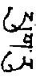
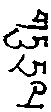
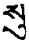
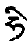
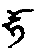

## （十四）乌金口诀摩尼鬘

敬礼大乐莲花兮鲁迦

莲师在桑那，移喜磋嘉启请问曰：“上师气、脉、明点教授已示毕。请以此中口诀传我。特别命勤气入中脉为重要，于彼身要当如何？气要当如何？”师云：“移喜磋嘉，谛听。气脉口诀，当为你说。”

初、瓶气口诀。跏趺，二手置膝，气左、右、中各三出。此后猛吸，头从左向右转，气向脐下压。心专注于中脉下端三脉会合处，气任运不假功用，可入中脉。三脉会合处有佛母，般若波罗蜜母。由心气认持，心无分别，如虚空云散，觉受显现。休息时亦当持瓶气为要。瓶气之量，以一幼年、无病子气出入一次为一息，一息为一次，身要、气要如前。初学、三十二，中、六十四，上、百二十八。初当励行，力达三十二次，次二倍、次四倍。持气法者，其未曾娴熟之脉，一经气鼓，必当不安。于彼对治者，气复少许内吸，跳抖其身，复向下紧按。如此不乐相生，复稍向内吸而为抖跳。此如空袋盛物，当令充满，则以棒等向内紧插，复拍顿其袋，以棒再插；气鼓胀圆满不令间褶，亦复如是。脉处以前未满者，以小吸、镇压、抖跳等，不令外出，生起猛利对治力。气无出处，必自觅住处。如是气未行处、脉弯曲处、干枯处，气必挤入；气由是平等充满其身，则明点净分生乐炽然，梦中见星宿、日、月。如脉种性不佳，则所见觉受不能坚固。如上气不放，向内猛吸，历力防护，气由二脉入中脉，由此通达初地不颠倒智。以入、住、融三者言之：初入、得初地功德；于彼心气安住，生起二地功德；于彼中脉与心气融合无间，二取分别如虚空清净，一切智慧功德增长，渐得长寿无病，行如风疾。是故一切功德所依者，厥为瓶气。

“移喜磋嘉，一切气中皆以瓶气为主，汝其善持之。”

又请问曰：“瓶气不可思议功德得未曾有。修中住气，脐鼓出法如何？其功德如何？”莲师答曰：身要跏趺，上气稍下压，下气稍上提，中气在脐平面鼓出。如是智慧自然在本净上显现。身修起分，心修光明等，由此自然有光明为助伴，明点持、提、散，自然成办与气相合，二取自然清净，昏、掉、散三无有，眼根无少光、病，胆胃等病不生，腹则无胀无响，无有传染病，旧病亦清净，寿命与日月相等。自本尊身端正，气在脐向外鼓出，目看上空，心体本净，此为大智慧合气，又名辨别世、出世合气，亦名心$$\color{orange}（空）$$与了别$$\color{orange}（光）$$分别合气。腰缩小$$\color{orange}（亲师云：“身直正则自小”）$$，脐向对面鼓出。行灌瓶等一切气功时，腹亦宜鼓出。如此要诀，上下气自然集合。一切时依于正念，又以脐气伸张，修本尊、念咒等，修无二智，乃至四威仪等，皆如是勿忘，此名不离秘密大智合气。由佛父依具相佛母或母依父，如此合气不离作已，修长寿最为殊胜。此扼要合气汝当受持。

移喜磋嘉复问曰：“大上师！持、提、散三要诀如何？降、提、反三要诀如何？”师曰：“移喜，谛听！当为你说。”持、提、散三中，以见安住本净为主要，此三无功力成办。于本净见不知，则由有相法作持、提、散，亦当知：随意所至，气亦至焉；随气所至，明点亦至焉。病障等出生之对治，亦复如是。移喜！此三一一以本净摄持为要。与母行时，不持本净，则成为贪行；于彼相续上，错乱出生，明点如岩落石；是故当以持本净为最要。于明点降时，有如龟行法，松缓而行。身生乐时，当认识乐之本体，识在本净上松缓安住为要。如此则贪自解脱，是故为甚深至要口诀。持点之法，人或谓下气提、腹贴背、四肢收缩、目翻、舌抵等，此实为提法，而非持法。持者，上等，身心松缓，身不动，心住本净，无功用认持无疑。中等以气持，下气松、中气伸，目视肉髻，是为气持要诀。提者，具足六加行而行合气。散者，如羊抖身，金刚波等为主要。其共者，以本净见摄持为要。

移喜磋嘉复请问：“男女事业手印，以大乐修长寿法如何？”莲师云，总言之，明点不坏，辗转增上即是长寿根本。别则依事印而修长寿者，一刹那自成无量寿佛，身白色，一面二臂，持长寿宝瓶，具报身庄严，于彼怀中佛母业印，白衣天女，身红色，手持长寿瓶，具报身庄严，抱佛父。父顶中日轮上，无量寿佛白色，一指量。佛母脐日轮上，长寿佛母红色，亦一指量。由彼等心中啥字放光，照情、器及上师、本尊、空行三根本。寿精与余寿自在成就诸持明众之悲心等，勾入佛母脐上母寿瓶中。父母双运生乐，母寿瓶开，涌出寿甘露，到卡卡母卡脉尖$$\color{orange}（即海螺脉尖）$$。如吽形相而提取，供养顶上白色长寿佛。想此一指量长寿佛，亦抱红色佛母，密处双运放光，勾寿精等如前。由是指大佛父母寿瓶充溢，降于顶轮，稍动生乐，依次充满五轮。最后想所抱白衣母，融化为红色甘露，以吽声由杵孔提上。身一切脉不死，甘露充满，自与无量寿佛无二。此后离母，持瓶气，心住本净，身抖，修空乐无二定。此为依佛母修长寿最深、最上、最要秘诀。佛母，具三昧耶，常于命勤气努力，行五空行拳法，明点不错乱，大乐增上为要。移喜！汝自心中秘密受持！

又每月之第三十日，白日父当以水洗足，足心涂芝麻油与红白檀香。初一、二、三，魄、魂、命等住于膝胫以下，当搽密处。父母双运，密轮甘露充满时，当用力行密处拳法，下身力可以增广，少病，外、内缘起增大善巧。初四、五、六，命等住脐中，想脐上莲花空行红白和合，乐遍脐轮。行脐拳法。佛所说十二分教，不学而知，外能摄持莲花空行及一切世间女，内乐密煖，皆可摄持。初七、八、九，住心间，佛空行，如前当行。生起无分别，除尽错乱妄想，作相似疯狂行。初十、十一、十二，住于喉间，宝生空行，如前当行。摄持饮食自在，无方分布施。十三、十四、十五，住顶，金刚空行，如前当行。净分水界增盛如月圆，十五日现证秘密禁住行。顶上八指处剃一指量发，搽如上诸物$$\color{orange}（即指足心所涂者）$$，能生力量。从十六乃至三十日，明点下降。净分增长法如前应知。三十到足心时，月不现。男引导中，杵若缩入中脉，想中脉下端即莲，杵中心于杵尖有吽，其下如铁钩，伸出杵口将杵勾翻到顶肉髻，于彼上以吽为所缘。面气向下按，背气向上提。金刚拳置胯间直伸，二足心相对，肛门稍向外张，由此杵可缩入，成马阴藏相。后于前身要上，掌向左右伸出，后拍胸，复伸出。前气用力向下按，后气上提。以手伸包皮，令杵尖内缩，臀向后伸。观想杵中脉，翻转直上，心注视顶髻，此为令马阴藏相坚固法。

又除恶习气拳法者，跏趺，掌相叉压其顶。次于胸前镇压，次于肋下交叉转腰。于腰四方拍打。起立，以左右腿踵拍腿臀。作双跏高跳。掌拍膝。由此可除气、脉、明点三毒，昏沉如眠等可除。提者，跏趺、手置跨、气空提、长短吽。又法，莲花座、金刚拳交叉胸前、长短吽提。又法，以踵支臀、两手相叉抱后脑、长短吽提。又法，跏趺、二手持胫下端、身端正坐、以吽提。散法者，头摇，上身扭，抖身，转下身，拍打下身，羊抖，马滚，身内外同跳，狮子拳法。由此可除昏沉过患：跏趺、目看上空、猛持瓶气；多行数次。

又除金刚杵不堪能过失者，持气行者，身力衰弱，或须传嗣者，以不丹地方黑、白、小三种豆磨粉、和人胫骨中油，念：“嗡、格里、打惹、走惹、阿、阿、朽乌洗，娑哈$$\color{orange}（一百反）$$！”涂杵，随御随可。又杵不衰法。不丹国红豆、蒺藜、大云虎儿$$\color{orange}（师云：“雪山之物，形似小蛙；其油涂铁上，以背面曝之，其油能透”）$$合以鸽尖、涂杵。又以上三种药和红牛乳饮之。又法，以草决明$$\color{orange}（形如狗杵）$$、人髓、糖、藏红花相合涂杵；或蜂蜜、白狗杵、阿魏、白酥油，念前咒涂杵。虽九十岁可御百女。又法、小蜀季花、白狗杵，蚕豆和敷六月，杵极坚。龙头花、阴干，印度柯子粉和乳，黎明饮之，九十岁可御百女。又法，牛乳、甘草、糖，饿时服，随时可御。人参、白芝麻油、蜂糖、紫大云虎儿和敷脐孔，则杵坚。又，紫云虎儿、糖、仙人掌，饮之，杵大。又，麻雀之脑髓、海马、大云虎儿、草决明磨粉和糖，随食随起。一棒糖、寒水石、一握荜拨、大云虎儿、一指头量麻雀一个，与乳合，饿时服之，随时可御。

配药而摄事印者。补骨脂，羊毒草根，和少许，又大云虎儿，大指量细末为丸。先口水润之，再置舌下，合以自鼻垢涕、及心间汗垢，念下咒：“色色、惹惹、缕”$$\color{orange}（千反）$$，与女人食之，可以摄持。又口诀，麻雀卵黄分、川练子、荜拨、黑矾，等分磨粉，和生蜂蜜。涂杵尖，女心爱不敢舍。又上物与陈酥油和涂杵上亦可。又法，常哭花、冰片、糖、藏红花、甘草、朱砂、鸽尖、白狗杵、小蜀季花、花椒、硵砂、细末、和蜜涂杵，女根相合不离。又法，常哭花、独头蒜、山奈和猪油涂杵，女欢喜。

明点不坏者，常哭花、吸铁石，自明点与羊乳熬，饥服，以涂足心，亦可不落明点。欲印莲小者，常哭花、猫肛门油、酥油、水鸟肉$$\color{orange}（头白，身黑或红）$$涂杵，则莲缩小。欲莲松煖者，常哭花、冰片、麝香、官桂、荜拨和妇乳涂杵，入莲则宽松而热。女引导中，男女根相合不离法者，未开之常哭花、未开之乌取花、未开之棒聚花、未开之无叶小黄花$$\color{orange}（一称铃头花）$$、、公鸡下冠，饥时服之；又涂莲上，提下气，二根分不开。又避免自女与他男人行，则青木香、山奈、咸、白芥子熬服，女不能起贪心。豆花、羊胞衣、马背油与八岁女小便相合，男服之，杵必不起。又以女小便洗杵，不起。又以月经涂男阴毛，置女床上，杵不起。又，补骨脂、乌取花、狗阴、羊阴、淫妇尿、土月精、花椒和丸，以红铜盘盛之，上覆红绫。自成马头，念下咒七日：“嗡、阿、吽、班札、古鲁、白马、悉地吽、嗡、沙木、沙木、恕木、恕木、色索、色索、乌札、朗朗、苦勤札！”

摄持时当观其性相，一年一粒为要。此为空行秘密心要。我勾召移喜磋嘉等十三空行母，皆本乎此。

远行时，自妻莲上行印者。于红色地点之红蹄死尸$$\color{orange}（师云为老鼠，然自谓不可必）$$，于彼尸下草未干时，即以尸藏小坛中，用柴烧之。烧后之灰，与自妻之血相合，涂其身，除四肢。男子未归前，此体不坏。此中当于上师前了知。于上师、法友前，不可行此法。当如孔雀，毒藏心，而口不言。一切所须拳法者。发大心。修起分。用九节风。四肢当用劲。调伏脉，则足伸屈，手如抛石势。调伏身，则用身拳法，提散完结，各作六次。于余经中详，此中摄要者。二手伸屈如抛绳。金刚拳置膝，十指数数伸屈。拳置胯，四肢用力，手指屈，目闭，头转动，可除鼻血、鼻痛。观想身空，五大、五智如虹，青红色充满。顶上有烟冒出。肛收缩，念长、短吽。吽气随力行。腹内修青红色，念“吽、吽”向内吸。腹内如水开沸而转。以长、短吽从顶出，身如气泡、如空。肛门以拳大棉球抵住，上气用力呼出。抖身。提者，如兽法，四肢支地张开，地角压喉。头左右三转、三偏、三中摇。虎呕者，手足置地，念“哈、哈”时，腹向上提，四肢用力，用目翻等六加行。同时观想顶罕，抖身。狐嗅者，足蹲，二手置乳，气从右吸，中脉充满。由中脉向左脉用力呼，心住顶罕。左、中向右亦如是行。行当具六支。大象法者，肘膝支地，念长，明点入罕。羊抖者，二手心、二足心置地，全身抖。马滚者，初、四肢支地。如马，左、右各三滚，抖身。狮子游戏者，四肢支地张开，地角压喉。头左右三转、三偏、三中摇。狮子撒尘者，身稍蹲坐，拳置膝，于腰左右拍，又于肋左右拍。手高攀、身上抬跳。手复置膝，抖身。最后当多搽身。此用力除遣过患口诀。

又提印净分时，莲师开示云：“磋嘉，提印净分，分内、外二种”。内提红净分者，已说竟。身鲜色白净，欲提莲花精华之善堪能者，其印当清净，未与人交。为彼灌顶。初以软衣摩莲，女久而生乐。自己乐生，亦到密杵时，以手开莲。花心中有净分霜点，以杵置之，长吽等提。跏趺、二手置膝，吽由下升顶，念二十一吽、二十一哈、二十一$$\color{orange}（音如英文之he）$$，二十一火提上。无气力，则以竹筒提。最后行散拳法。供养脉中空行、勇士，所生功德如前。与其余男合者，不可提。吻口等生乐已，降、提、持、散。外持精华。以舌根取。提为内持精华。以杵孔取为密持精华。红净分以舌取，为外持精华，以右孔提为内持精华。以杵提为密持精华。自吸铁石，彼铁屑。此教授甚深，当依我口诀而行。

金刚空行口诀，移喜磋嘉书。

## （十五）下化身种法

敬礼薄伽梵无定时、数量尊前

为宏扬佛陀正法而行种化身子方便者，为欲具相手印母生子时，从是清净持戒比丘行之，亦无过失，且能生无量功德。有谓：“密宗大圆满胜慧一切续部中云：‘若稍失芥子许明点，诸空行为之下泪，死堕地狱’，本法奚与此理相违？”答：“本法与此理不相违。小乘调伏戒律，惟说遮止。密乘戒惟说开许。大乘菩萨戒则开、遮二种具说。密修者，若能以大乘菩提心为主，虽有发端许多之罪过亦不染着。”故应发起大乘菩提心，宏扬圣教，饶益众生。发是心已，其具相手印母须具足三昧耶戒、无遗传病、诸根灵敏、端严悦意、本生父母及亲属等皆喜慈善。得如是明母已，行此，须念我为守护教法、传持教法、宏扬教法及令众生住于安乐故，而行种化身子法。发如是殊胜菩提心已，于手印母月经在下半月行者，必多生女，无须种之；上半月初来者，必多生男，故瑜伽者须于月经净后七日内，黎明时方行种子法。尔时供献上师、本尊、空行等，食子会供，广诵护法、忏罪、补过文。于诸尊前殷重恭敬启请化身菩萨，我为宏扬佛法、饶益众生故，愿得菩萨化身现世。观面前虚空三根本圣众降临，并特观无量寿佛、观世音菩萨、莲花生大士住于面前。默祷能为佛陀应现化身菩萨降世，作诸事业，并想有补特伽罗之心识寻觅受生，心住胎门，其识复以至尊文殊菩萨等悲心加持，摄于其上。次想自即马头金刚，密现五股杵，母现亥母，密处观越量宫殿。红净分观为日轮，日轮为化身菩萨座。应于第四日晚，以杵置拔噶内，稍令母生乐，使浊分完全溢出，但其明点切勿漏失。第五日黎明时，父母气息须右鼻行，不然可将父母左鼻以棉塞之，使右鼻行气为要。父表方便，左肋而卧：母表智慧，右肋而卧。父母同缘行，受化身本尊。观自眉间白色卐中堆叠十六明点，其体性即文殊、金刚手等化身。父母明观自他一体。当知为自性所显现菩提心。乐大动时，想眉间十六明点即本尊，如雨而降，直达莲宫日轮座上。以杵于莲右边内作供献，明点则尽量放出，与母日轮和合无分，想以上所缘之本尊即时降临其中，并观所缘本尊放光如勾摄入母越量宫内。次观莲花生大士及持明圣众，心放白光，全降其中。又放光勾召自所亲爱之父母收摄其中，再观受生菩萨之心识，亦收入越量宫。后想宫门紧闭，以守门四护法守之，则一切障碍不受侵扰。次加持身、语、意三业，念真实力文。发愿回向。即离手印母。母则持气而两手高举，向左右稍偏侧三次$$\color{orange}（俗云撑懒腰）$$，此以净成种子器。翌日夜禁行房事。如行，则女之气脉错乱，有损胎之虞。设日后必欲行之，切忌接吻，恐有男胎转女之患。以上所说昼夜。从今日东方黎明起，至翌日东方黎明时止，为一昼夜。若母下月月经不来，即知受胎。若经两、三月，胎在母腹右方为男，左方为女。若为女，则用转男胎法教授之。

转胎之法，在变胎法中。于教授不错乱，决可生子，此为不共之法，当秘密之。男女各六净分同等和合，此子形体光明具足，福德大，具足种姓。四明点则中上品；三明点，中品；二明点，下品，头小形丑；一明点，福德更薄。父母净分量平等，决其男、女，则以父母前业为定。母净分多为女；父净分多为男。二者平等中，而父净分力略大，则瘦而力大，母净分力略大，其睛红而肉色美。净浊杂合，则痴呆。父母有病，儿热病、目痛、体瘦。男净分力缺，而女净分多为黄门，或根有过失。净分平等，而以昏昧时行之，儿必愚痴，根肢必有不合处。由父母净分、气力大小，业异熟，可测其子福德大小，故当生起身力而行$$\color{orange}（莲师口诀毕）$$。

### 变胎之法者

敬礼薄伽梵具大悲尊

于利益佛教为有情作依怙、作众生救护身，而建立变胎口诀。不知此者，或转成女者有之。于此教授，当注意焉。此中分咒、物二者。初、物者。曾生三子家藏之针，钻火铁链$$\color{orange}（此敲石取火物，康藏有之）$$，取以为斧，不经他人手，以滑树$$\color{orange}（其皮滑）$$为柄。出斧上端画一宝形，柄下端，如其量之纸上画一圈，圈中书咒：“嗡、麻缕、妈妈、哈、哈、斗吽、斗吽！愿此胎变为男，娑哈。”写三或七反。将此纸卷于斧柄下端，咒头在斧面，不可错乱。墨中和父明点而书此咒。以曾生三子母顶右发缠之，或自妻之发亦可。斧头顶上，以铁作铠甲式牌。于其母脐下相对之床下，掘一地洞置斧，其头向枕，斧口向上。具三子家取白青稞藏洞中。不令父母以外人知之，此后于儿子甚多家借一磨上之柄，头尾不可颠倒，书咒：“嗡、啥、那札妈惹他！”于柄上节，又书咒：“嗡，麻惹啥，那那、不古、不古！”于柄下端，以羊前足肘毛、及其杵毛$$\color{orange}（师云：“当用未去肾者”）$$，缠此柄于母腰或脐上，由此决不成女。甚秘，当知此女子不可再与男人交，不可食女种姓之肉，为未来必生佛教大化身种故。

莲花生大教授愿有缘者遇之！