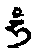
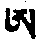

## 第三品 释脉

彼身之脉不知，则气、脉、明点住法亦不知，故当先析脉，就《方便续》、《智续》所载，当如下述。

甲二 乙四分三：丙一、略。丙二、广。丙三：结。

### 丙一、略

初颂云：

&emsp;&emsp;此后详述脉情形&emsp;&emsp;中左右三为主母

&emsp;&emsp;其余轮与生病脉&emsp;&emsp;总数为七万二千

&emsp;&emsp;余最细脉皆当述

此即为初略也。

### 丙二、广

分六：丁一、中左右脉。丁二、主母脉二十四及三十七之决定。丁三、四轮、六轮、十八轮。丁四、生病脉。丁五、广述七万二千脉。丁六、微细脉与界相合情形。

#### 丁一

分二：戊一、体。戊二、与教相合。

共五颂半，颂曰：

&emsp;&emsp;初生身体之根本&emsp;&emsp;实为中脉与命气

&emsp;&emsp;于六轮脉之距离&emsp;&emsp;各有十二指半量

&emsp;&emsp;自密处至顶上轮&emsp;&emsp;上端以罕之自性

&emsp;&emsp;清净白明点为盖&emsp;&emsp;脐下由母亲所得

&emsp;&emsp;红明点血为短阿&emsp;&emsp;二者之中八识依

&emsp;&emsp;并具命气如虚空&emsp;&emsp;脐下四指海螺脉

&emsp;&emsp;其用能降白菩提&emsp;&emsp;此紧抱轮部所云

&emsp;&emsp;心上莲花中竖立&emsp;&emsp;如芭蕉花心中空

&emsp;&emsp;罕字倒嵌而摆动&emsp;&emsp;下端有如灯庄严

&emsp;&emsp;其下明点平降下&emsp;&emsp;此名阿瓦都帝脉

&emsp;&emsp;其用能生俱生智&emsp;&emsp;略言为众生命脉

初生起身之基础已述完。所谓**中脉之中者**，有二：①**修中**。②**住中**。死时散失，许为一种，或谓在脊骨中之筋，或谓脊骨内有细如马尾者，或谓无有，然就经教引证，当如下述。前成身品所言命气，为中脉所依。六轮中间距离各有十二指半量，自密处乃至顶相连。上端有白色本体，为由父所得明点，大如芥子，盖其上。脐下由母所得明点，红色为血本体，名为短阿字。阿罕之中住有第八识，及其所依大命气充满，中空如虚空。《时轮》云：

> **此中如罗睺罗星**，上罕如其白头，下阿如其红尾，中空如其蓝身，**其中为命气**，为一切气之根本；依彼故，有情得住于世。

《喜金刚续》云：

> &emsp;&emsp;说名为降智慧月，&emsp;&emsp;彼者咸称滚打马。

如上所云，降菩提白分者云何？盖此脉于脐下端有海螺脉，能降明点，其上则空云云。故颂有：“其用能降白菩提。”其余脉，净分在中脉下端三脉会合处，和合能生大乐；此意《紧抱轮》、《吻口明点》、《黑圆满次第》三经可以引证。心间莲花中竖立者，初生时于心中竖立，从此分出上下，如芭蕉花心中空者。精血不通行，故倒悬罕字而摆动者，罕字白色，在上端倒悬向下看。中脉下如芝麻明显，即血本体，短阿以塞其下。诸脉菩提心，从此平等降下，其名为“阿瓦都帝”，**其用能生俱生智。阿瓦都帝之义，即能与俱生智**也。总言之，此为一切有情命脉，当了知之。

密宗**红教说心间有五净分明点、集合智，即指中脉之内**：

- 肉之净分为中脉。
- 血之净分为短阿。
- 骨之净分为白罕。
- 气之净分为命气。
- 净分之净分为阿赖耶识。

此理应成，彼说心上五净分明点，大如豆者，则非外道胜论派所言，神我亦如豆大，为佛所破，故不应理。

或问：“彼七生法者七生法，师云：“即依法观察彼七生未堕之尸，取以咒之，生长寿，死往生，非外道法”，观尸心有若札那，为何物耶？”

答：“彼有二净分在心集合，故精华甚大。又中脉异名甚多：曰阿瓦都帝，曰数数马，曰滚打妈，曰微细色，曰其下端为海螺脉，曰上端罗睺脉，曰命脉，曰内独柱脉，曰命树线，曰大道，曰中脉；如是等甚多。”

##### 戊二、析左右脉与教相合

健按：凡科有言与教相合皆与上科混言，文中并非分别。

###### 初、六颂半：

&emsp;&emsp;彼左右之二脉者&emsp;&emsp;从脐分开腰上勾

&emsp;&emsp;转到心间复展开&emsp;&emsp;到胁之后复到喉

初从脐分别向左右展开一大弧形与腰大脉相连；从腰复展开一大弧形，右脉入心房之右方，遍行气行之脉中，左脉入心房左方，提婆气行之脉中；从心复展开一大弧形各别到胁下大脉，此脉名心脉、集汗脉；又从此集合于喉轮之左右二睡脉。

&emsp;&emsp;由颈复升于顶轮&emsp;&emsp;从此乃达二鼻孔

复从此展开达左右耳后，此处有脉名树脉，从此上达脑髓。二脉相集于梵门脉，其二脉端总说则与根门相通，别说与鼻孔齐。

&emsp;&emsp;于脐合处下分开&emsp;&emsp;能放持血大香者

&emsp;&emsp;实为右脉之作用&emsp;&emsp;左脉放精持小香

&emsp;&emsp;是彼左脉之作用

其在脐下于三脉集合处，又分开。血与大香收放属右脉，精与小便属左脉。如《喜金刚》云：

> &emsp;&emsp;左脉降下动，&emsp;&emsp;右脉降下血，
>
> &emsp;&emsp;降智慧月者，&emsp;&emsp;则为滚打妈。

金刚心菩萨为除人疑虑，故于此三上加降三风师云：“右降遍行左提婆中命气”。于脐轮处，从左右二脉分成四脉，从四分十二支脉，每支又各分五，共为六十四脉。

&emsp;&emsp;脐上为气所上下&emsp;&emsp;脐轮脉为六十四

一说七十二师云：“不加十二支则曰六十四”。

&emsp;&emsp;能摄能生内外气&emsp;&emsp;此为最初佛经云

&emsp;&emsp;下为三端上三脉&emsp;&emsp;于蚀则配彼中脉

&emsp;&emsp;太阳之顶为右脉&emsp;&emsp;月亮之顶为左脉

&emsp;&emsp;此三空水火活动

此处能令外气入内，为身之增长守护，又能令内气对于命脉作增长守护。《最初佛》云：

> &emsp;&emsp;下为三端上三脉，&emsp;&emsp;于蚀则配彼中脉
>
> &emsp;&emsp;太阳之顶为右脉，&emsp;&emsp;月亮之顶为左脉
>
> &emsp;&emsp;此三空水火活动

云云。盖左脉本体为水，月气所行；右本体为火，日气所行；中脉本体为空，为命气所行。在下之三端则分泌大、小便、明点，具收放作用，其在身如铁链相勾。

&emsp;&emsp;从左右中之下端&emsp;&emsp;为大小便明点门

&emsp;&emsp;三脉有如铁锁链&emsp;&emsp;有嗣与下行三道

故颂云：“三脉有如铁锁链，有嗣与下行三道。”如上说左右二脉已。

#### 丁二、析二十四脉或三十七脉

分三：戊一、总析。戊二、认识二十四脉。戊三、析隐藏五脉。

##### 戊一、总析

颂曰：

&emsp;&emsp;此上分开之大脉&emsp;&emsp;共有二十四种脉

从左右分出主要二十四脉者，表示清净外二十四境，为意语身三轮，二十四瑜伽母，胜处自性，外加五支分气脉、三主母脉，共为三十二脉。

&emsp;&emsp;依心支分为五脉&emsp;&emsp;以及主母脉为要

&emsp;&emsp;其数共为三十二&emsp;&emsp;根本依靠三十七

三十二脉中，又分二个十五，第一个十五表示上半月天女，第二个十五表示下半月十五天女；黑白二个十六，白分为海螺脉，黑分为离魔脉，住于小舌上，此出《喜金刚》。五根本气所依，五脉者，中脉分二份，三脉集合处以下为海螺脉，此为下行气住处。其上为命气所在处。余三气在心间：前面东方者，为火界平住气所依处，脉名那妈脉；上行气则住于心之东南方，名大象脉；遍行气在心南住，名淡黄脉。此为右脉所分出根本支分，全脉共十。《时轮》中所载，此十脉名为淡黄、微细、羊、那妈、大象、舌、胜、胜行、朗不尔、古嚇、海螺，是《密集》所说亦有之。

三十七脉者(三十二加五根本气脉为三十七)表种姓本尊，及三十七菩提分法，一切密经已明显配合，间亦有不完全者。

##### 戊二、认识二十四脉

颂云：

&emsp;&emsp;脉之从左方生者

从此句共七颂，一句皆脉之名。依那洛大著则云：从左右二脉，各分十五脉，以配合十五天女。此处则依《胜密根本续》，与《三不札》（《胜乐续》注）所云：“上身住大脉十四，为左脉所生，下身为右所生，又十气所住十脉，从中脉生起，其说甚善。”如是二十四脉为三主母脉所分出，此中与《金刚鬘续》亦合。

或谓三十七脉在轮上配合，余不以为然。或问彼等脉住于何处耶？

答：

&emsp;&emsp;不分脉在发四指&emsp;&emsp;细色母脉在八指细色脉住八指距梵门

&emsp;&emsp;游戏母脉在右耳&emsp;&emsp;左者母脉在后脑

&emsp;&emsp;短母脉住在左耳&emsp;&emsp;龟生母脉在眉间

&emsp;&emsp;眼角之外修母脉&emsp;&emsp;灌顶母脉在两肩

&emsp;&emsp;过失母脉在两肋&emsp;&emsp;趋母脉在两乳上

&emsp;&emsp;牛母脉在脐中央&emsp;&emsp;鼻尖则名晚母脉

&emsp;&emsp;唇周布施涼母脉&emsp;&emsp;喉中则为热母脉

&emsp;&emsp;此上皆依左脉生&emsp;&emsp;皆具智慧之自性

趋脉在两乳，牛脉在脐中央，晚脉在鼻尖，施涼脉在唇之周围，热脉在喉，此上十四脉，从左脉分出，表智慧本体、清净上半月。

从右出者为方便自性、清净下半月。

&emsp;&emsp;依右脉者为方便&emsp;&emsp;流汇母脉在胸前

&emsp;&emsp;随喜母脉在膀胱&emsp;&emsp;具胜色脉在密处

&emsp;&emsp;总共母脉接肛门&emsp;&emsp;施财母脉在大腿

&emsp;&emsp;离事母脉在胫后&emsp;&emsp;喜悦母脉足拇指

&emsp;&emsp;成母脉则在足背&emsp;&emsp;煮脉在拇指毛处

&emsp;&emsp;善意脉在膝盖上&emsp;&emsp;如身各处皆具足

如上母脉名出自《喜金刚续》、《胜乐续》；脉依二十四境安立。其他各经亦说二十四脉。

##### 戊三、析隐藏五脉

二颂：

&emsp;&emsp;三转欲母与家母&emsp;&emsp;拙火母如上四者

&emsp;&emsp;眼耳鼻舌与心连&emsp;&emsp;气由此道而出入

&emsp;&emsp;离魔母脉在小舌&emsp;&emsp;身上心中五脉正

&emsp;&emsp;明则为阿瓦都帝&emsp;&emsp;余根本四气往来

1. 三转脉在睛中，能为认持色增上之缘。
2. 欲脉在耳。
3. 家脉在鼻。
4. 拙火脉在舌。

各为其能认持之增上缘。彼四脉皆发于心间，为前所说支分气所行处。离魔脉在小舌，流口涎于能触认持份，为财生气所依，与心相连。《喜金刚续》云：

> 于身上心中五脉正当生；命气在中脉，余即根本气。

然于五支分气脉，则未载，故名隐藏五脉。

#### 丁三、广说轮脉

分七：戊一、略析。戊二、脐轮。戊三、心轮。戊四、喉轮。戊五、顶轮。戊六、决定六轮。戊七、十二支轮。

##### 戊一、略析

颂二句：

&emsp;&emsp;其后四轮与六轮&emsp;&emsp;十八轮等诸分别

诸密经有谓由八八分出，为轮支脉数。本论轮支脉数各别而述。《三菩萨析》亦如此广述矣。

脐轮六十四脉；十二支脉，配十二宫迁移气；于此励力，能生化身。

心间八脉，配每昼夜八时，即清净此八时；于此轮励力，则于四身中得光明法身，清净厚睡眠。

喉十六脉，为时迁移之本体；于是励力，可清净梦境，圆满报身。

顶轮三十二脉，为每昼夜六十时分本体；于明点上励力，可清净贪，四身中得智慧身。

此中如《胜乐》、《密集》、《喜金刚》皆同，惟《时轮》则以喉轮三十二脉为行星本体，顶轮十六脉为月步十六支分，其下于《析气品》中当广述。轮之意就其形相言；又于此精进，则能摧毁四时之迷乱，故说为轮。

##### 戊二、脐轮

颂文九句：

&emsp;&emsp;脐上为化身之轮&emsp;&emsp;从中脉而分四脉

&emsp;&emsp;复分十二次第脉&emsp;&emsp;五五复分成六十

&emsp;&emsp;左右乳换气所依&emsp;&emsp;四脉在中脉来往

&emsp;&emsp;其名金刚鬘经详

其脉名余经甚多异名；本论就《金刚鬘》而言。脐轮功用，能生起身，且具变化。初从中、左、右三脉，分出四脉，属空智界。从被分为十二支，为气迁移宫；又由此分成六十，右三十、左三十，为迁移气所依。其内层四支脉，为中脉之迁移气，其名如颂所云：

&emsp;&emsp;正力与夫彼胜力&emsp;&emsp;极善与夫彼向善

此四从左右脉出，而与中脉相连；具足真实力，故名正力与胜力；能持命气，故名极善与向善。

其余六十脉中：

&emsp;&emsp;大力与夫难忍力&emsp;&emsp;极美与夫大对生

&emsp;&emsp;骄慢相与夫骄分&emsp;&emsp;骄水与夫能疯骄

&emsp;&emsp;骄相与夫骄等流&emsp;&emsp;骄湿与夫彼骄持

&emsp;&emsp;粗重与口水与象&emsp;&emsp;气不顺与夫回涎

&emsp;&emsp;禽兽支分与鹞面&emsp;&emsp;堪食与难忍与呼

&emsp;&emsp;具香击力与摩擦&emsp;&emsp;声咏咏生以及云

&emsp;&emsp;高茎与夫如海蓝&emsp;&emsp;须臾根本须臾支

&emsp;&emsp;回顾背后与夫棒&emsp;&emsp;平棒与夫彼旧派

&emsp;&emsp;节尊与夫彼节节&emsp;&emsp;节量与夫彼擦魔

&emsp;&emsp;节居处与彼节面&emsp;&emsp;节光与夫节连锁

&emsp;&emsp;能调调走与威光&emsp;&emsp;无垢调伏与骄母

&emsp;&emsp;悬飘腹与贪中贪&emsp;&emsp;悬飘半悬与小蜂

&emsp;&emsp;小孩与夫彼众生&emsp;&emsp;树叶与夫树叶喉

&emsp;&emsp;极明与夫胜宝母&emsp;&emsp;为四主六十支名

- 大力等五脉者，属羊宫迁移气。
- 骄分等五脉者，属牛宫迁移气。
- **骄润**等五脉者，属淫宫迁移气。
- 气不顺等五脉者，属蛙宫迁移气。
- 难忍等五脉者，属狮宫迁移气。
- 声咏等五脉者，属女宫迁移气。
- 须臾等五脉者，属秤宫迁移气。
- 旧派等五脉者，属蝎宫迁移气。
- 节居等五脉者，属弓宫迁移气。
- 调走等五脉者，属貉宫迁移气。
- 贪中贪等五脉者，属瓶宫迁移气。
- 众生等五脉者，属鱼宫迁移气。

又从大力起，乃至海蓝，此三十脉为平等六宫。须臾至极明州，为牛等不平等六宫。此安立诸脉名，虽略具，然当时译师声音不同，大半对脉作用未载，故不及详。

##### 戊三、心轮

一颂半：

&emsp;&emsp;心轮八脉之名者&emsp;&emsp;宝冠与夫大莲花

&emsp;&emsp;大金刚与夫大力&emsp;&emsp;大依怙与大声音

&emsp;&emsp;极喜与夫极醉脉&emsp;&emsp;此脉能遍于全身

其名见于《时轮》。即上十名，除羊及海螺，便是《金刚鬘》所载，即本论颂中名宝冠等八，名异而实同。此轮脉遍于一切身分相连。其名之义，宝、莲、金刚、大力四，为能自在意。彼二异名就福慧分健按：《时轮》名就慧言，《金刚鬘》就福言。又四者，大依怙持色，大声持声，极喜持香，大醉持味，此则吾作此悬想耳。

##### 戊四、喉轮

二颂：

&emsp;&emsp;喉上主脉十六者&emsp;&emsp;受用极度用秘密

&emsp;&emsp;行日明与夫根器&emsp;&emsp;修脉与夫灰尘面

&emsp;&emsp;食与给食与饥饿&emsp;&emsp;取精华与以味供

&emsp;&emsp;味败与夫具美味&emsp;&emsp;雁等即住受用轮

此中受用等十六脉，领纳饮食等六味，故有异名。《时轮》谓有三十二脉，与菩提心二十八宿配，余四属中脉，分四空支故。

##### 戊五、顶轮

有顶上大乐诸脉者等四颂，此中脉名，大半表菩提心作用。

&emsp;&emsp;次第名与具贪欲&emsp;&emsp;具贪母与命之身

&emsp;&emsp;短月及给与美月&emsp;&emsp;具贪离言与草脉

&emsp;&emsp;除死与夫彼清净&emsp;&emsp;火与火位及鹦鹉

&emsp;&emsp;汉脉具日与具味&emsp;&emsp;长颐与送酒甘露

&emsp;&emsp;海螺以及海螺耳&emsp;&emsp;海螺目与海螺鼻

&emsp;&emsp;骄权骄与夫爱脉&emsp;&emsp;无上脉与稀奇骄

&emsp;&emsp;平等脉与颂之依&emsp;&emsp;此上为顶三二脉

从次第脉乃至鹦鹉脉等十五为上月增分，满脉为十六日分属中脉。具日脉乃至平等脉，此为外脉黑半月十五日，颂之依脉则为黑月十六日，故决定为三十二。就《时轮》顶轮十六而言，月步增减各七，共为十四，并增灭二界为十六。

如上说各轮脉数，即颂所云：

&emsp;&emsp;如上合计百二十&emsp;&emsp;总说主要脉即此

&emsp;&emsp;此为轮脉主要者

##### 戊六、开示六轮

分二：己一、《金刚鬘经》所述。己二、余经所说。

###### 己一、《金刚鬘经》所述

&emsp;&emsp;顶髻风与髻喉火&emsp;&emsp;所住之脉有九种

师云：“喉者**根**也”**能出诸佛之本体者，为眉间与顶髻轮**师云：“**凡夫之位在眉间，佛在顶髻**”，在眉间清净之风有六脉。在肉髻根，火界脉有三。眉间气轮六脉之名见颂中，分别、旋与难忍等二句。

&emsp;&emsp;于眉间际具风轮&emsp;&emsp;分别与旋与难忍

&emsp;&emsp;善名坚固具胜相

肉髻三脉名者，即颂句云：

&emsp;&emsp;持气无念与充满&emsp;&emsp;其中具有三火脉

###### 己二、余经密意

一颂：

&emsp;&emsp;时轮续中之所云&emsp;&emsp;则系秘密处杵脉

&emsp;&emsp;密集为顶于密轮&emsp;&emsp;则为三十二轮脉

《时轮》与《密集》所载，同为三十二轮脉。《时轮》所云，杵之上头有四脉，与《密集》之肉髻轮四脉相同。密处之根，即脐下能生拙火者。在中脉下端有三脉，其功用能收放大小便明点，与上四脉合为七脉，皆在密处。从此七脉，发出遍杵全体，具有三十二脉，故与《密集》之顶轮数相等师云：“《密集》无杵轮”。

&emsp;&emsp;住各轮中心脉名&emsp;&emsp;是谓六空之脉也

&emsp;&emsp;此处名为密之门

又从眉间乃至杵，持命气为一脉，能降明点者为一脉，合上七脉则为九数，各轮中此未计入，是为《密集》之眉间六脉，肉髻下三脉之九数相同。

又余经所载亦略不同。《菩萨析》所述，眉间以下六轮之心，能依者，为根本气。眉间轮中心脉，名分别。顶轮中心脉名旋。喉轮中心脉名难忍。心轮中心脉名善名。脐轮中心脉名坚固。密轮中心脉名具胜相。此六于《时轮》说名六空脉师云：“《时轮》无眉间轮，故以此六名配六中心脉”。盖为命等气所行境，此中中脉为语坛城师云：“身坛城四门，为鼻、口、大、小便处”。语坛城四门为四轮之四空脉，心坛城四门为心上四根本脉。

又《无垢光论》云：认持身、语、心三明点者，曰三脉，即脐脉、密脉、杵脉。又称有六脉者，则那拉那（右脉）、惹拉那（左脉）、阿瓦都帝脉、小便脉、大便脉、明点脉。又称三十六脉者，顶髻轮与其下五轮，各一；脐持声二脉、持触二脉、持香二脉、持色二脉、持味二脉，共计十脉；脉轮十二迁移气脉；心上八脉；如上合为三十六脉，为诸脉之主。

又一说，界色脉六，根色脉六，境色脉六，事业根本色脉六，事业根本色脉之境色脉六，各轮主脉六，如上为所依三十六脉。色、受、想、行、识、智各六，则合为七十二脉。

又《时轮》金刚各脉数所配者，其杵头四脉配四座时即黎明、正午、黄昏、半夜四座。顶轮十六脉配《时轮》香巴拉国十六人主。又配上下半月各十六日师云：“极圆时，与极无时、亦许为二个十六日”。

喉轮三十二脉者，其中根本四空脉，配四杖时，二十八脉配二十八宿。心上八脉表八曜脉，外层脉六十配六十迁移气。六十坛城与四空脉合，则配六十四时。

密处三十二脉表明点三十二界，如上广说各轮脉竟。

##### 戊七、开支十二支轮

右上肢三节健按：即肩、大、小腕，共三颂：

&emsp;&emsp;右手所具之三节&emsp;&emsp;是谓风界其所生

&emsp;&emsp;各具三十之支脉&emsp;&emsp;于指节上之每节

&emsp;&emsp;脉叶各各具六支&emsp;&emsp;数目合如大节数

&emsp;&emsp;如是左手为火界&emsp;&emsp;右腿则为水之界

&emsp;&emsp;左腿为地如上云&emsp;&emsp;如是十二节轮处

&emsp;&emsp;脉共三百六十支&emsp;&emsp;趾节亦如指节数

右上支为风，左上为火；右下支为水，左下为地，彼等三节每节一轮，具三十支脉，共为三六〇；手足指趾节上各轮具六脉，亦共为三六〇；与月数、日数相配，为父音、母音本体《时轮》父、母音各有三六〇，为气与菩提心所依。

#### 丁四、生病脉

三颂：

&emsp;&emsp;彼发病之能生脉&emsp;&emsp;顶髻四脉及髻下

&emsp;&emsp;其数十六生胃病&emsp;&emsp;喉轮之脉三十二

&emsp;&emsp;心中八脉生胆病&emsp;&emsp;脐轮脉为六十四

&emsp;&emsp;密度外轮有十六&emsp;&emsp;风大错乱由此生

&emsp;&emsp;密处内十六杂病&emsp;&emsp;如上一百五十六

&emsp;&emsp;皆为诸轮外次第&emsp;&emsp;人或认为即此轮

肉髻四脉，与眉间十六脉，能生胃病共二十脉。喉轮三十二脉，心轮八脉，共四十脉，能生胆病。脐轮六十四，密轮外十六，共八十脉，生风病。密处内十六脉，生杂集之病。如上共一五六师云：“四病包括一切病。胃病者，其相小便白、舌苔白、不食、不知味、或呕、或泄。胆病者，小便黄、舌苔黄、欲睡、不喜油、目黄。风病者，耳鸣、舌有小子、上午不痛，下午痛，足肿。杂病者，此上三病杂出也”。

此等脉，在主轮脉外，苟主轮内之界出于其中，则生病；余亦说为即此本脉云。

#### 丁五、七万二千脉

有四颂：

&emsp;&emsp;所谓七万二千者&emsp;&emsp;从金刚鬘中所云

&emsp;&emsp;其中二万四千者&emsp;&emsp;属月亮左脉种姓

&emsp;&emsp;别有二万四千者&emsp;&emsp;属太阳右脉种姓

&emsp;&emsp;复有二万四千者&emsp;&emsp;属风行中脉种姓

&emsp;&emsp;盖从身中之主脉&emsp;&emsp;慈善脉与不别等

&emsp;&emsp;二十四大脉分出&emsp;&emsp;摄入受用与主体

&emsp;&emsp;各分三者七十二&emsp;&emsp;每一脉皆具一千

&emsp;&emsp;譬如一根树木然&emsp;&emsp;春天枝叶皆发生

根据《金刚鬘经》，二万四千月气，降白界，属左脉种性；又二万四千日气，降血界，属右；又二万四千惟有气行，属罗睺罗中脉。如上虽然甚多显出，然皆从前二十四主脉分出，彼等各具三相，颂已有之。所谓：

1. 摄入者，住于身中，事已完毕；
2. 受用者，事正在行；
3. 主体者，事未来作；

如是二十四各具三脉，则成七十二，此七十二各分出一千，则成七万二千。

#### 丁六、此外微细脉及脉与界相配情形

共三颂：

&emsp;&emsp;除此诸脉分细脉&emsp;&emsp;数目三百五十万

&emsp;&emsp;一细脉生一毛孔&emsp;&emsp;此处毛孔之次第

&emsp;&emsp;脐下地界心风界&emsp;&emsp;喉轮火界顶水界

&emsp;&emsp;肉髻虚空密处则&emsp;&emsp;等于智慧之大乐

&emsp;&emsp;于是毛孔通于外&emsp;&emsp;六大能依次第生

&emsp;&emsp;左右中脉各分别&emsp;&emsp;如身口意之种性

又当补述者，七万二千之数，为《瑜伽母续》所载。**此七万二千瑜伽母种族皆从此二十四胜境分出**；除此谓别有十二轮支脉者，不应理。薄伽梵对难陀所说《入胎经》云：

> 身之四方住五脉四十支，支支各具百，八万脉安住，脉中八万虫，充满不净物。

如上已广述矣。

《时轮》所载三百五十万脉，由此出生，三百五十万毛孔云。

又，示彼等界安住者，脐为地界，心、风、喉、火，顶、水，肉髻、空，密、智慧安乐界。以能遍充满于所遍中。余经脐、密就福、慧而分，密为智本体，脐为风。然以脐为地，而以其三脉集合处为风，亦不违。

又，亦有以顶为风，肉髻为智者，喉、心亦配福、慧，喉火而心水。由此理，则能遍所遍，各配福慧，此其一；四轮分配福慧，此其二；六轮亦各以父母种姓配福慧，此其三。总之，智界与空为慧，余四为福；福中又地风为福慧，彼等互为仇伴，故由轮乃至毛孔边际、六界、五界、四界、二界为彼本体。《时轮》云：

> 诸天及诸人，肉髻为空界，密、智，心、风，喉、火，脐、水；手足各六轮，依四肢为地、水、火、风，是每界各具三轮。彼界中三功德，自在转变师云：“苦、乐、舍”。诸指节轮脉及齿为二十五界五中各分五故，是为有情殊胜身上之界云。

余经可引证者甚多，不赘。

### 丙三、结

即颂云：

&emsp;&emsp;如上述脉之性相&emsp;&emsp;身之规矩已成就

此中所谓身者，非一整个自成之物，乃为一切界、缘起显现，虽然显现，而非常非一、非自在、非有我，皆从本来空。一切脉性相，从烦恼网中显现，一经了知解脱，如水中月，显现世俗本体。以其余因缘不能摧毁，乃为金刚本体。如《随念佛三摩地海经》云：

> 如来色身，一切毛孔显现六角宝，具足六种显现色光明本体，由诸多种无对待布施所成。

此义当知。

第三品竟。