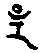
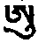

## 第四品 释气

分三：丙一、略。丙二、广。丙三、结。

### 丙一、略

五句颂：

&emsp;&emsp;此下述风之自性&emsp;&emsp;及其住动之情形

&emsp;&emsp;无力有力之次第&emsp;&emsp;入风持风之方便

&emsp;&emsp;过失功德次第述

盖说明气本体与字之安住，气之作用、气之行动、气之有力与无力、气之趋入与认持，其功德与过失，尽其气之一切皆当述。

### 丙二、广述

分五：丁一、能生所生之本体。丁二、住与作用。丁三、内外气行动与作用。丁四、气趋入之利益。丁五、一切世、出世气之自性。

凡六颂，略摄中仅二句：

&emsp;&emsp;风语集合之时间&emsp;&emsp;依诸字形而出生

盖一切有情由气息须臾相集乃成时间，皆依于**大命字而出生**言语气息。如《文殊真实名义经》云：

> &emsp;&emsp;阿字为最胜，&emsp;&emsp;彼自性无生
>
> &emsp;&emsp;远离言语相，&emsp;&emsp;是诸说胜因
>
> &emsp;&emsp;能显明诸句

可证。

广说者：

&emsp;&emsp;处依第八阿赖耶&emsp;&emsp;命气有如字形

&emsp;&emsp;如虚空界之自性&emsp;&emsp;五种气中下行气

&emsp;&emsp;下行气为地界&emsp;&emsp;上行气为火界

&emsp;&emsp;平住气为风界&emsp;&emsp;遍行气为水界

初依于阿赖耶识、及彼能依之行意，生起命气，成为阿字形，此为空界本性。从此生第二下行气，为地界字，上行气为火界，平住气为风界，遍行气为水界。《时轮》则云：

> 下气为智、命气为空、平住为风、上行气为火、遍行气为水。

其余密经则云：上行水、平住火、遍行风；从口行故，以腹化故，从风遍故；盖就其作用言。

支分五气者：

&emsp;&emsp;支分之气亦有五&emsp;&emsp;龟气为风生字

&emsp;&emsp;龙气为地生字&emsp;&emsp;海马气由火生

&emsp;&emsp;提婆气水生字&emsp;&emsp;财气由地生字

龙气地，具智本体字，长。龟气风界字。海马气火界字。提婆气水界。财生气地界。《时轮》云：龙地、龟风、海马火、提婆水、财生地。此中十气，按月生起，已前述。

其作用，于一切时皆有之：

&emsp;&emsp;最初于每月之中&emsp;&emsp;己生乃起各作用

其后收摄者：

&emsp;&emsp;收摄每十年为期&emsp;&emsp;从金刚智

&emsp;&emsp;心性光明智慧气&emsp;&emsp;第八与夫第七识

&emsp;&emsp;行生风兮受生火&emsp;&emsp;想生水兮

&emsp;&emsp;是为能所生次第

假定某人活百岁，则于每十年收摄一气功能，气界与五蕴相配。据《集智金刚经》云：

> 心本体光明为智慧气，于彼显现黑暗，即七识之染污意；与第八识俱，是为空气。行蕴以动摇为相，为风气。受蕴对自己相续燃烧，为火气。想蕴对境执相，并欲收摄，故为水气。色蕴具坚硬相，故为地气。

如上依此由光明而黑暗、而炽盛、而出生，近得（受想色等）此为能生、所生之相。《时轮》云：

> 三界为地所成；所住有情，想由水、受由火、行由风、识智由空，而成办其金刚身

即此意也。

#### 丁二、住与作用

颂云：

&emsp;&emsp;次述气住与作用&emsp;&emsp;总述气满于全身

&emsp;&emsp;别说中脉之命气&emsp;&emsp;所依八识居其中

&emsp;&emsp;亦名为虚空依怙&emsp;&emsp;临死之时即出生

&emsp;&emsp;现起我执由此生&emsp;&emsp;空性风乱疯或死

&emsp;&emsp;业与智慧混合住&emsp;&emsp;其气有如虚空然

别述中脉之命气，能依八识住其中。七识之染污意与第八识俱，前已详。谓第八识依第七识则非也。《密集》之命气，名虚空依怙，临死时则去；现在与气息动作相合，亦有极少份出生；然其主要作用，即如《时轮》所云：

> 彼于死之日，名大黑暗气，具足二万一千六百数。

此后识往他方，其现生作用，即颂所云：“现起我执由此生”；命气若无，执我及分别，亦不出生；有之，则增上生起我执分别；若不住中脉，而住余处，则昏迷疯癫或致于风与命气俱有之。智气明显无分别，如镜中相、本体相合。智气具无色之色，业气与大智气和合住故，具虚空之色。

下行气者：

&emsp;&emsp;下气在于三合下&emsp;&emsp;下行取净而去浊

&emsp;&emsp;海螺脉住安乐界&emsp;&emsp;乱则生下半身病

下行气在脐下三脉会合处以下，其作用能收放大、小便、明点，错乱则生下半身病。

上行气者，一颂：

&emsp;&emsp;上身住身东南方&emsp;&emsp;喉上作用由此生

&emsp;&emsp;能使身口歌舞等&emsp;&emsp;若乱上半身生病

上行气则在身前方，脉位于喉间，能作语业，错乱则生上身病。

平住气者，一颂：

&emsp;&emsp;身前脉住火平风&emsp;&emsp;插腹内辩物净秽

&emsp;&emsp;净分遍身若错乱&emsp;&emsp;则生腹响与肿泻

平住气入于腹，能辨食物清浊，错乱则腹中生病。

遍行气者，一颂：

&emsp;&emsp;遍行左右脉相连&emsp;&emsp;并住身上之肢节

&emsp;&emsp;一切身力从此生&emsp;&emsp;若乱手足跛僵挛

遍行气与右味脉相连，普遍上下肢节，错乱则生跛挛等病。

诸支分气有三句所说：

&emsp;&emsp;西南正西与西北&emsp;&emsp;正北东北如次第

&emsp;&emsp;龙等五支气所住

如《无垢光论》云：

> 命气上升，下气从脐下降。火平气在身东方脉，脉名那妈，气名增上天。上行气在东南脉，脉名大象舌。遍行气在南方脉，脉名淡黄。龙气在西南脉，脉名胜脉。龟气在西方脉，脉名胜行。海马气在西北脉，脉名遍悬。提婆气在北方脉，脉名盎札。财生气在东北脉，脉名假装。

彼等作用，持五境，并为身之姿态。根本颂云：

&emsp;&emsp;龙能持色作身态&emsp;&emsp;龟能持气动手足

&emsp;&emsp;海马持香怨恨生&emsp;&emsp;提婆持味能呵欠

&emsp;&emsp;财生之气能持触&emsp;&emsp;身死未散仍住此

&emsp;&emsp;现在为八时自性&emsp;&emsp;以上唯述其大要

根本颂已述，财生气作用之一份，死后直至尸未散仍住身中。异译则云：“死后住身中一日”，然彼意盖谓身坚固，微尘未散，则财生气住身，故不违理。如一界之中，亦各自具五界，又彼气又为八时自性，如上可引证者甚多，且止。

#### 丁三

分四：戊一、内行法。戊二、外行法。戊三、行次第、颜色、力量、功德。戊四、各密经引证。

##### 戊一、内行法

颂云凡十一颂：

&emsp;&emsp;内外行气之轨道

凡十一颂依次析：心、顶、喉及总界节轮，一切脉之行法，并决定其消灭次第。

初从胎出生，乃至临死，常住于身者，二句：

&emsp;&emsp;命气如罗睺自性&emsp;&emsp;中间如王而安住

为其余一切脉气之所依，如此心轮气根本支分各具四大，故合为八，其余各轮亦各具八，是故六轮合计共有六十师云：“八数再加中脉上下二数为十，六轮共六十”。健按：不如云：各具五大，合为十命气，通于中脉上下，不应命气外中脉上下别计二数也，从主轮分出数，与外相配皆相合。

&emsp;&emsp;如心间轮他轮同&emsp;&emsp;顶轮共为三十二

&emsp;&emsp;如月亮之步相似&emsp;&emsp;是故气行共十六

&emsp;&emsp;二者属空之自性&emsp;&emsp;他如十四次第然

&emsp;&emsp;其后三二一功德&emsp;&emsp;以后七脉次相反

&emsp;&emsp;彼等功德可类推&emsp;&emsp;廿八杖时四种空

&emsp;&emsp;总述一天三十二&emsp;&emsp;是名须臾之自性

顶轮者，外十六脉主要行血，内十六脉与月步相配，行气与菩提心。《时轮》则云：

> 顶轮脉趋入中脉者，有二为空本体，余十四为月步增减。

又余经所云，彼脉行气次第，则谓初三脉，各具色、声、香、味、触五功德气，第四脉具一功德问何一？答不知气行，第五、三功德气行，第六、二功德气行，第七、一功德气行。外七脉与上相反，依此还灭。第八脉功德全无，为空脉在脑后。第九脉有一功德，第十有二，第十一有三，第十二有四，第十三有五至第十五有五。其近眉间支脉第十六，明点、命气充满为智慧本体。三十二脉者，配一昼夜二十八时，虚空智本体二或四，总为一昼夜，三十二时或三十须臾。各经皆如是说。

喉轮脉行气者，颂云：

&emsp;&emsp;喉轮脉数为十六&emsp;&emsp;福慧分别三十二

&emsp;&emsp;此中四者空所行&emsp;&emsp;其他四方各为七

&emsp;&emsp;与行星受用同行&emsp;&emsp;其中十六为迁移

此中四者为中脉种性，余二十八脉四方各七，配行星受用。如上所云，二十八脉与四空脉，或配时间，或配须臾，是其行气次第，故颂云：“此中四者空所行，其他四方各为七，与行星受用同行。”《胜乐》与《金刚鬘》则说：

> 喉轮脉数为十六，

如上所云，福慧二者合一，亦不相违。

脐轮脉行法者，颂云：

&emsp;&emsp;脐轮脉数六十四&emsp;&emsp;就十二宫分配言

&emsp;&emsp;十二分五六十标&emsp;&emsp;六十本体为时间

&emsp;&emsp;四者为空中脉道&emsp;&emsp;彼诸前方者为风

&emsp;&emsp;右火左水后方地&emsp;&emsp;与隅相俱约略述

如前所说，脉即是十二分五成六十，六十为时之本体。此中就左右二脉，分说羊宫、牛宫各五脉，彼等具地、水、火、风、空，又间以空、风、火、水、地，为能收、能生次第师云：“右羊收，为不平等宫；左牛生，为平等宫”，配六十时本体。四者属中脉，智慧分气行。析总界者二句，彼诸前方者为风、右火、左水、后方地；诸轮大略如是分析；特别，则脐轮十二大脉，所分之各五细脉，中间者为空脉，余四脉依如上方位而分别。

节轮者：

&emsp;&emsp;如是大节十二轮&emsp;&emsp;轮气行动为三十

&emsp;&emsp;一共三百六十数&emsp;&emsp;指节之数与彼同

十二大节，每轮有三十脉，气行亦三十数，合为三百六十，脉、气亦相等。指趾支节，脉数相同，气行亦同，配一年之日数。此上一切决定如《时轮》云：

> 诸星配心莲，六十时配脐莲莲即轮，十四昼夜配顶莲，二十八宿配喉莲，瑜伽者当了知。

由一日六十由故时也，每一由故，分出六十取桑，成为三百六十数，配节轮。脐莲花瓣师云：“指十二支脉”亦略有殊胜智分气迁移。

析一切脉行者：

&emsp;&emsp;此后二万四千者&emsp;&emsp;行动为中脉自性

&emsp;&emsp;红白之数亦相同&emsp;&emsp;合为七万二千数

二万四千为中脉自性，为罗睺罗本体，为心金刚。颂云：“红白之数亦相同”，降血属语金刚，降白菩提属身金刚，彼二亦各为二万四千。彼等皆具气作用，共为七万二千。每日气行二万一千六百，配一年，为日六十时之数。气出入一次，毛孔中遍满行，即颂云：“合为七万二千数。”

&emsp;&emsp;二万一千六百息&emsp;&emsp;于是成为内行道

&emsp;&emsp;当羊等宫之一脉&emsp;&emsp;气灭诸分皆相同

&emsp;&emsp;此数分别虽无量&emsp;&emsp;与外相配适相合

二万一千六百则为气内行道。兼析气消灭者，当羊宫等之一脉，气灭诸分皆相同。任何时，有情具死相已，脐上羊宫一脉灭，六脉二十四诸细脉彼等，亦各同时同量而灭，余详收摄品中。颂云：“此数分别虽无量，与外相配适相合。”外一年，为内一日，外十二月，内为十二宫，每宫五坛城，共六十坛城，表六十时。外一年共二万一千六百时，内气亦为二万一千六百数；外一年尚余十一天又一天的四分之一，内智慧气一日六百七十五息，相配亦同健按：以二万一千六百配一年，六十时配一日，十一天则为六百六十时，四分之一为十五由故，与智慧气六百七十五相合。。

##### 戊二、外行之理

分三：己一、总。己二、广。己三、析中脉。

###### 己一、总

三颂三句：

&emsp;&emsp;此后复言外行道&emsp;&emsp;一切毛孔根之门

&emsp;&emsp;行道分别皆入此

如前所述，毛孔一切行期，特别一切气从大门鼻处行者，由脐向上左右二脉贯穿，从鼻孔出。右孔为太阳毒气师云：“毒者具过失气。”健按：过失者，属不平等宫气故，为日拙火方便本体，为语金刚。左方为月甘露智慧本体，为身金刚。各有一万四百六十二又半，二者合计为二万零九百二十五。二孔同行之气，为六十七分，为罗睺罗气；能辨窍穴，故亦名空气；能入中脉，故名智慧气；为意金刚。故颂云：

&emsp;&emsp;此二大脉鼻孔转&emsp;&emsp;右边日气住拙火

&emsp;&emsp;左边月气住甘露&emsp;&emsp;方便智慧之自性

&emsp;&emsp;于一日中彼之气&emsp;&emsp;一万四百六二半

&emsp;&emsp;说为日月之气也&emsp;&emsp;此二孔同行之气

&emsp;&emsp;六百七十五之数&emsp;&emsp;罗睺虚空智慧气

&emsp;&emsp;无二分别意金刚&emsp;&emsp;如此体性若分别

&emsp;&emsp;具地等五大自性

初从何来者，颂三句：

&emsp;&emsp;生时与母风相连&emsp;&emsp;生后由鼻自来往

&emsp;&emsp;此即说明为蛙宫

观自在菩萨云：“外太阳初由蛙宫生；如遇一切有情气，初由蛙宫行；”故于命生时即于此行。

###### 己二、广析时集合

四颂：

&emsp;&emsp;现述时之集合者&emsp;&emsp;根本气与支分气

&emsp;&emsp;于身贯穿于各轮&emsp;&emsp;到脐即能生命力

&emsp;&emsp;平与不平十二宫&emsp;&emsp;依此从右而至左

&emsp;&emsp;太阳初向南方行&emsp;&emsp;往来于鼻右孔风

&emsp;&emsp;依此为地水火风&emsp;&emsp;各各皆具三百六

&emsp;&emsp;一共一千八百数&emsp;&emsp;此后左方月亮气

&emsp;&emsp;次为风空火水地&emsp;&emsp;数目亦同右方然

&emsp;&emsp;如是十二宫往返&emsp;&emsp;二万一千六百数

鼻孔出气来源者，为脐轮。如前根支十气贯穿全身，生起脐上命力功能。心上八时气，喉行星数气，顶同数气，境二十四气，大节轮气与一切气皆由脐十二宫贯穿，故能生起命力功能。从鼻孔而生，是故牛等平等宫，及羊等不平等宫各六，合为十二，从左右孔出。

广析其次第者，太阳初向南方行，从羊蛙等宫生起。向南行六个月，太阳以日减短夏至，而月则以夜增长，如从貉等宫。太阳具足力量与福分气，然功能渐次减少。又蛙宫丛右孔行，貉宫由左脉出者，依《无垢光论》云：

> 如是六个月，月亮从东北行。北方宫名羊、淫、狮、秤、弓、瓶；左脉为月精华界师云：“明点”。南方牛、蛙、女、蝎、貉、鱼；右脉为太阳界主。

又下生时，丛右孔气出，则死时亦从右孔出；生时从左，死亦然。

左右迁移诸气数者，从右孔行。初地气三百六十，如是水、火、风、空，如次大种收摄，次第气行亦各三百六十，合计为一千八百。但左孔出月气次第，为初空气三百六十，次风、火、水、地，是为大种生起次第，数亦相同。十二宫迁移共二万一千六百数。

###### 己三、析中脉气

有三颂三句：

&emsp;&emsp;若夫智慧之气者&emsp;&emsp;其数六百七十五

&emsp;&emsp;一宫五六四分一&emsp;&emsp;六十十一四分一

&emsp;&emsp;略说卅二分之一&emsp;&emsp;广说即为上所云

&emsp;&emsp;复次息半为呼气&emsp;&emsp;另半入中脉增长

&emsp;&emsp;此即星宿之所步&emsp;&emsp;多向外出为死相

&emsp;&emsp;向内多持成无死&emsp;&emsp;百年智气总集之

&emsp;&emsp;三年一个半月气&emsp;&emsp;闰月及日之增减

&emsp;&emsp;若知此义不致错

若夫智慧之气者，其数六百七十五，是一日中业气二万一千六百，其中六百七十五为智慧迁移气健按：如上所配，闰年月日数，则此气不应在二万一千六百之中。每宫有五十六又四分之一。六十小脉地等行气配一天六十时，每一时有十一又四分之一之智慧气，是业气、智气之比例为三十二比一。此中一半外行，一半入中脉。颂云：“此即星宿之所步”者，外日月七曜罗睺罗等，其步行法亦与内相合。如二孔气、五根本气、肉髻气、下行气等，皆中脉智气出生之支分也。此智气外出甚多，则为死相；由行者内持，可为金刚身之因。如是智气，设人寿百年，其量适等于普通三年零一月半之数即四十五天数。健按：百年智气为二千四百三十万。以每日二万一千六百数除之，合成三年零一月半之数。**一百年之智气，皆持续不断，则成佛矣。**健按：**三年四十五天闭关期即表此义**。盖**三年零三方**健按：一方者半月**成办金刚持位，即此密意**。

##### 戊三、行次第、颜色、力量、功德

分五：己一、由何出生。己二、颜色如何。己三、力如何与曜相配。己四、成办何种事业。己五、外行距离之差别。

计有六颂，难易了知，亦当略析：

&emsp;&emsp;行次颜色力功德&emsp;&emsp;初行则依于鼻梁

&emsp;&emsp;北方外面二为火&emsp;&emsp;孔上为风下为地

&emsp;&emsp;中为虚空之智慧&emsp;&emsp;颜色地水火风空

&emsp;&emsp;则为黄白红黑蓝&emsp;&emsp;彼气之力居右者

&emsp;&emsp;地木火日曜属地&emsp;&emsp;及与火等之次第

&emsp;&emsp;左方罗睺罗月水&emsp;&emsp;金长尾属空大等

&emsp;&emsp;蕴界与彼相合故&emsp;&emsp;虚空生杀诸业成

&emsp;&emsp;风能逐成杀一切&emsp;&emsp;钩召怀法火所作

&emsp;&emsp;水能作息增二法&emsp;&emsp;愚痴木呆地大作

&emsp;&emsp;智慧气则一切作&emsp;&emsp;一座同时外出时

&emsp;&emsp;外地大距十二指&emsp;&emsp;水火风空至十六

&emsp;&emsp;功德力量分长短&emsp;&emsp;因缘算法母音合

&emsp;&emsp;我著算数总集详&emsp;&emsp;如此金刚鬘续内

###### 己一、如何行次第等

依鼻梁边出，此为水气师云：“图如次”。依二孔之左右外遍行为火气，凡上方行为风气，下方行为地气，孔中道气为空智气。

###### 己二、颜色

地黄、水白、火红、风黑、空蓝。一说风为各颜色，各种色者，即绿色也。

###### 己三、力与诸曜配合

此五气之力在右孔者。颂云：“土木火曰曜属火以及地等之次第健按：应云：'属地以及水等之次第'”；彼等如猛曜，长音字属之。地气者为土曜，字。水气者为木曜，字为。火气者，火曜，字为。风气者，日曜，字为。空气者为罗睺罗时火师云：“罗睺罗分为三节，一、头，二、腹，三、尾，此属第二。”在七曜之外，加三者以配十气，字为。又颂云：“左方罗睺罗月水，金长尾属空大等”。彼等字皆无之长音，属寂静曜。空气者，为罗睺罗之头字。风气者，为月曜字。火气者为水曜字。水气者为金曜字。地气者为罗睺罗尾字。外曜内气，如上配合。

###### 己四、如何成办事业

即颂云：蕴界与彼相合故。盖界处一切所知物，各有不可思议功能。空气杀活功能皆具。风气能逐杀师云：“以定观自孔气或由外曜而配”。火能自在、召怀，水能寂静、增益，地能令彼痴呆，智气则成办一切事业。《时轮》云：

> 智气除杀业外，皆可成办。

智气者，从二孔同行，即是五气。

###### 己五、于外之距离

地气行于鼻尖十二指，水十三、火十四、风十五、空十六，盖气之大种有轻重，其功德自在限度亦不同；此本之《时轮》。《密集》则云，有四轮出四大气，顶出风为二十指距，喉出火十八指，心出水十六指，脐出地十二指。

至由字音观察缘起之法，余所著《算法轮》已详。由自孔行法显现缘起，亦可对他授记，其法甚多，略摄如下：气从左出，则一切事迅速成就；从右出，则不成；二孔同行，则甚迟。人或问战争事，如逢自右孔正中空气行时，为已被杀死；风气日曜则伤支节；火气火曜则被损害；水气木曜则有怖畏；地气土曜则战期拖延。问病，则如上次第而配死、烦恼、伤痛、疗养、外延。问其他旅行、嫁娶、寂静、增益等事皆不善，可如例配合。气从左行时，人或问战争，则正左气罗睺罗，诸仇可催；月气仇人肢分伤残；火气水曜可损害仇人；水气金曜可得仇财；地气长尾，可调伏仇人。问病者，则可活。世间宴会、寂静、增益等事，可迅速成办。此中除罗睺罗头，可作降伏外，余皆不宜降伏。入本体定时，忽移左孔行，甚佳，可得财食受用；右方则病或失财，有怖畏，闻恶语。长期颠倒则为死相。此等观察甚多。**非时死相遮止之法：初除身疲困，次修清净脉法。双跏端坐，二手抱于肋下，以压肺部动脉，上中下三气平等摄持，充满全身。修七日可夺死相**。此出密宗诸经。

##### 戊四 又与各经配合，互不相违者。

从左孔之上方出气，具地水火风空五坛。行者修金刚诵时，微细气行相有四：左行、右行、同行、缓行。颂中已略及已。广析者，从右行出生火坛城，五坛城中为日坛城，红色，此可修爱敬法成办诸善事，此为莲花怙主无量光佛，可修由莲花摧毁等各定、或修语金刚，阿字及与彼同念者师云：“如瓦响古汝阿阿阿”。从左行者，为智本体月色，成办一切顺业，五坛城中属风坛城，绿黄色，成办寂静一切事业，为身金刚本体，与不空成就本体，修金刚则为嗡。二孔上下二分师云：“上为口、鼻，下为大、小便处”出气，为地坛城，色黄，从脐下行之，智慧界红白为宝生依怙，圆点在杵尖能持者，以修金刚诵，则成办明点瑜伽师云：“此名智金刚诵”。智慧气一小部分与业气慢慢行，智慧界清净，如玻璃无垢，此为光明水坛城，为金刚依怙，为意金刚，中脉可入无分别定，修金刚诵，吽字可得光明。如上身、语、意、智四金刚诵。入、住、出量合乎平等大乐之量，不可乍长乍短。又身金刚持，配梵天；语金刚持，配大自在天；意金刚持，配遍入天；彼三合为金刚心自体。如上所配，亦各成办其业。龙树所著《大陆边论》云：

> 四轮中顶为事业依怙，喉莲花，心金刚，脐宝生。

又气行于鼻，观其五色而诵之，昼夜平等常修，其数计之，与上不误。以上唯言四坛，第五坛城者，盖当临终时方显。四坛配金刚诵四支，第五无念。颂中所云：“能依所依能持者”，谓身地等界为能依，心为所依，或光明为能，第八识为所。如此认持，即是身坛城。大黑暗气，即为毗卢遮那佛自性，临终时显。本论所述四坛，由行者修金刚诵，可成办无死金刚身；佛所许甚多，不用引证。诸少慧者，对于圣者龙树父子及诸菩萨所析，不可歧义而存疑惑。

&emsp;&emsp;鼻孔出来之风息&emsp;&emsp;五风向孔上方行

&emsp;&emsp;左与右及其同时&emsp;&emsp;慢慢呼吸动相四

&emsp;&emsp;右孔所行之大种&emsp;&emsp;属为火之坛城也

&emsp;&emsp;颜色鲜红甚为好&emsp;&emsp;名莲花依怙来往

&emsp;&emsp;左孔所行之大种&emsp;&emsp;与风之坛城相合

&emsp;&emsp;颜色现为绿黄色&emsp;&emsp;事业依怙常来往

&emsp;&emsp;二孔同时之大种&emsp;&emsp;金色大威权坛城

&emsp;&emsp;宝生依怙常来往&emsp;&emsp;慢慢往返若无行

&emsp;&emsp;清净有如玻璃然&emsp;&emsp;此为水大之坛城

&emsp;&emsp;金刚依怙常来往&emsp;&emsp;诸界之业正当生

&emsp;&emsp;能依所依能持者&emsp;&emsp;毗卢遮那之自性

&emsp;&emsp;于临终时方能显&emsp;&emsp;此处所言四坛城

&emsp;&emsp;平平坦坦而念诵&emsp;&emsp;如是则为金刚诵

&emsp;&emsp;清净指示如上云&emsp;&emsp;不可生起疑惑悖

颂释已如上竟。

#### 丁四、气趋入之门、持气之法与其利益等

颂云：

&emsp;&emsp;如是气行于鼻尖&emsp;&emsp;五种颜色善自观

&emsp;&emsp;如是念诵之数同&emsp;&emsp;昼夜六时常时念

&emsp;&emsp;趋入之门鼻两孔&emsp;&emsp;口与下方共三道

&emsp;&emsp;此身具有四种门&emsp;&emsp;持法呼吸住入出

&emsp;&emsp;清清楚楚而算明&emsp;&emsp;持住无别任运上

&emsp;&emsp;自心即能生任运&emsp;&emsp;颜色形状相娴熟

&emsp;&emsp;有漏神通从此出

依正士上师口诀云：

> 火风之气从鼻孔出，水气从口出，地气从下道出，黄门气从全身毛孔出。

师云：“黄门气者非根本、非支分气也”。健按：非左右气，二孔同出气也，见《六法广论》

上师麻巴云：

> 上外二门气防守，下内二门气防守，中共门中而防守。

师云：“上二门鼻孔，下二门二便道，中指脐下三脉会合处”。

持气方便有四：

- 初、妄念多者，宜用数法：身七支坐，平坦住，令息出入；次心认持而数之唯数入息。
- 二、随法：气于身内全体或某部分行，以心随之。
- 三、止法：气遍全身已，心止于无分别上。
- 四】观法：心放下一切世、出世法，及法之去来往；安住于自性显空无分上，趋入清净胜义。

如上显密二经已详。《地藏十析》云：

> 心实难调；气外驰，心亦外驰，故心者说为气。

颂所云：“持住无别任运上，自心即能生任运”；此则属《时轮》之别摄支也见不共部五十三法。

所谓利益者，如前所说，颜色如能明显出生，于身内外得坚固已，则成十遍住定。

又**于心间观第八识无垢月轮，余识皆集中于此，而修，可显五神通；详见金刚阿阇黎贡加宁波与大善巧[口+戈]登借巴所著**《密集广注》中。

颂云：

&emsp;&emsp;上中下三宝瓶气&emsp;&emsp;能作俱解脱之业

&emsp;&emsp;利益八种如下述

《时轮》云：

> 于师口诀，烟等相未生以前，应不断修之。

修法则于**脉轮之命气与下行气坚持，月气塞住、曜气塞住、菩提心塞住**。任何人于此略具希求心，如上行已，可令太阳健按：即拙火增长。太阳、月力二气平等、不平等相已清净，皆住于中脉之火上。命气与太阳气，则集中于太阳时可据非死时云。解脱者，如《大幻网经》所载，狮子解脱功德已详。

所谓八种功德者，颂云：

&emsp;&emsp;日月罗睺三根本&emsp;&emsp;能息三毒之妄念

&emsp;&emsp;能得金刚之三相&emsp;&emsp;此佛所云之功德

日月罗睺三气，为太阳本体健按：即拙火，虽在中脉之上，其功德则在中脉下端，为摧毁三毒尘、勇、暗师云：“即贪、嗔、痴”，得三金刚之所本。下气健按：非指下行气，指智慧界红白菩提为月本体，虽在下方，其功德则在上方，对于色等五尘，可得自在，摧毁彼等能取、所取。三毒为三究竟功德，下五为暂时功德。地气能持，则身坚固；水、身光皎；火、身鲜明；风、身迅速；空、出生一切智慧；此为的布巴所云。

如颂云：

&emsp;&emsp;色声香味触法等&emsp;&emsp;五气相对为月气

&emsp;&emsp;如能清净执持者&emsp;&emsp;坚光鲜快具智慧

&emsp;&emsp;是为地等之功德

#### 丁五、一切世、出世气之自性

有四颂半：

&emsp;&emsp;略说风大为妄念&emsp;&emsp;自动微细动他相

&emsp;&emsp;心者明而无妄念&emsp;&emsp;体性即智慧大风

&emsp;&emsp;对治大智慧气者&emsp;&emsp;说即正观或正行

&emsp;&emsp;住于八识与七识&emsp;&emsp;是为生无明痴风

&emsp;&emsp;行蕴执智所现境&emsp;&emsp;名为执他贪愿风

&emsp;&emsp;由有取舍生嗔风&emsp;&emsp;是为三界之行风

&emsp;&emsp;由此乃有善与恶&emsp;&emsp;风之依靠应当知

&emsp;&emsp;风之善行到彼岸&emsp;&emsp;风亦能令趋轮回

&emsp;&emsp;能断轮回亦属彼&emsp;&emsp;**外内风名诸事业**

心者，尽其所有分别，与气无二。彼具动摇、能动他、微细三相。曰气为一切之根本者，心性无分别气，说为本体大智慧气；其对治顺因，真实诸分别，则为对治大智慧气。三界心及所知法，名为与三毒相合气。如前所述，本来无我，妄执贪知，妄加分别，生起贪爱，则为贪气。不了知前六识，依于取舍，乃起嗔气。如上八七前六等识，为一切行气，说为三界之行气。薄伽梵所说，气之功德过失，可以了知。吾人当于正道次第精进。《金刚鬘》云：

> &emsp;&emsp;风之善行到彼岸，&emsp;&emsp;风亦能令趋轮回，
>
> &emsp;&emsp;能断轮回亦属彼

即本论颂句。

### 丙三、完结

&emsp;&emsp;世尊于经已曾说&emsp;&emsp;甚深内义略述之

前成办身品，与此品，为集诸显密经而述。

第四品释竟。