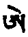
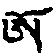

## 第五品 释明点

分三：丙一、略。丙二、广。丙三、结。

### 丙一、略

颂云：

&emsp;&emsp;如上依气与脉数&emsp;&emsp;述明点住与行次

如薄伽梵所说，《密集金刚续》中之三种明点。吉祥萨拉哈云：

> 三明点与忆念，及无念；世、出世三种明点皆在其中。

### 丙二、广

分五：丁一、离戏明点。丁二、错乱明点。丁三、物明点。丁四、能对治之智慧明点修法。丁五、兼言除明点之过患。

#### 丁一、离戏明点

&emsp;&emsp;主要为离戏明点&emsp;&emsp;迷乱无明明点二

&emsp;&emsp;彼之对治明点三&emsp;&emsp;初为自心俱生生

&emsp;&emsp;**体性空寂为离戏**&emsp;&emsp;**自性明则为报身**

&emsp;&emsp;**不灭大悲随化现**&emsp;&emsp;**此之三相如现在**

&emsp;&emsp;**一切皆如空显现**

根本明点者，说为自心之俱生智，本体空、自性明、相不灭，此三如次为法、报、化三身本体，前已略述。

其于现在所显现者：法身，则一切法空，诸法自性显现，不越乎此；报身者，所对境空，然其明相十种，宛然显现；化身者，前六识现境功能，各各具足。

&emsp;&emsp;性与明显现十种&emsp;&emsp;能生显现之能力

&emsp;&emsp;三者不虚境上现&emsp;&emsp;与知境者相契合

&emsp;&emsp;于不谬乱离分别&emsp;&emsp;此为离戏之明点

&emsp;&emsp;广为经续之所云

三者无分在境上显现，能显现境之智慧者，与境相连识，即是自本体，此即根本离戏论明点。此离分别明点现量，与之相应如何？龙树之《法界赞》云：

> &emsp;&emsp;意为主要诸法前，&emsp;&emsp;远离分别观察相，
>
> &emsp;&emsp;是为诸法无自性，&emsp;&emsp;应修如是之法界，
>
> &emsp;&emsp;眼见耳闻与鼻嗅，&emsp;&emsp;舌香乃至以身触，
>
> &emsp;&emsp;诸法了知本性圆，&emsp;&emsp;眼耳乃至于鼻舌，
>
> &emsp;&emsp;以及身意六入净，&emsp;&emsp;即此是为胜义相，
>
> &emsp;&emsp;心之本体见二相，&emsp;&emsp;即是世间出世间，
>
> &emsp;&emsp;世间执我乃流转，&emsp;&emsp;出世了知为胜义，
>
> &emsp;&emsp;贪欲清净为涅槃，&emsp;&emsp;嗔心愚痴清净已，
>
> &emsp;&emsp;如是清净为佛性，&emsp;&emsp;为诸众生作救主。

如上修法，又如阿阇黎巴屋多杰《四印次第》云：

> &emsp;&emsp;现量离戏久相续，&emsp;&emsp;即此假名之为修。

又如具德萨那哈云：

> &emsp;&emsp;面前背后及十方，&emsp;&emsp;现见彼彼即住彼。

如上修法，经论甚多。

析明点二字之义者，**明为显现诸境，点为大乐精华**，此白马麦札所定义，广则可参看显密诸经。

#### 丁二、错乱明点

一颂二句：

&emsp;&emsp;错乱无明之明点&emsp;&emsp;无明与行与识俱

&emsp;&emsp;遍计四名而转变&emsp;&emsp;乃成真言之明点

&emsp;&emsp;依他为意识之力&emsp;&emsp;此则名为风明点。

略述矣。此中错乱明点，由遍计、依他二者分出，即咒明点，与风明点，及五界物明点。佛于《金刚鬘》已述。由无明与行与识三者遍计，受想行识所成四种名，**加以对治**，则修念诵观想，**此为遍计咒明点**。由所缘缘，增上缘等，无间缘之动摇为风之作用，于此**励力修气**，此为**风明点**。现境色蕴所生物明点，当于下述。

#### 丁三、物明点

分五：戊一、中有缘受生。戊二、净分。戊三、浊分。戊四、三十六界。戊五、白分迁移次第。

##### 戊一、中有缘受生

已详前。

##### 戊二、净分

三颂半：

&emsp;&emsp;外境所显为色蕴&emsp;&emsp;为五界有形明点

&emsp;&emsp;世尊于相应续云&emsp;&emsp;如此有形之明点

&emsp;&emsp;外内二者内之义&emsp;&emsp;初言于此生之时

&emsp;&emsp;中阴能知识体性&emsp;&emsp;依父母缘生贪著

&emsp;&emsp;界则变化如上云&emsp;&emsp;现在住时清净二

&emsp;&emsp;清之心气已述完&emsp;&emsp;物净红白二明点

&emsp;&emsp;白分从中脉上端&emsp;&emsp;罕字自性如芥子

&emsp;&emsp;白而莹澈如玻璃&emsp;&emsp;从父所得最宝贵

&emsp;&emsp;红分三脉会合处&emsp;&emsp;红明如海面之火

&emsp;&emsp;短名亥母自性&emsp;&emsp;亦名为春与明点

现住时、清浊二种心气；心净分，已说物明点。

二净分为红白明点，颂中已言，其住处形相，大小颜色譬喻已；所谓海面火，以喻其热力颜色。吉祥兮噜噶云：

> &emsp;&emsp;红分为亥母本体，&emsp;&emsp;亦名为春与明点

此二，第八识与命气为所依，与外境相配，是菩提场、金刚座。《胜乐界生续》云：

> 顶上大乐轮有四叶莲花，住有微细菩提心，为一切所依之体，是为住于菩提场者。

《喜金刚》云：

> 精等形相为薄伽梵，彼之安乐即爱乐。

《胜乐》云：

> &emsp;&emsp;安住脐轮之体者，&emsp;&emsp;是为亥母性明点
>
> &emsp;&emsp;有如海火之热力。

又云：

> 梵门正当安住者，无坏罕字形相，如霜露点而下降，依喻假立名为春。

如上已广说净分矣。

&emsp;&emsp;依于八识之命气&emsp;&emsp;名菩提场金刚座

&emsp;&emsp;金刚空行续所云

##### 戊三、浊分

&emsp;&emsp;又谓虽然分清浊&emsp;&emsp;红分依火向上升

&emsp;&emsp;白分由顶而下降&emsp;&emsp;于初火供由此生

&emsp;&emsp;于外所持诸食品&emsp;&emsp;火供食子盛与灌

&emsp;&emsp;口灶供自五蕴佛&emsp;&emsp;腹内坐三面火神

&emsp;&emsp;火平气与胆与胃&emsp;&emsp;发热腐烂与变色

&emsp;&emsp;烧融尽化为纯净&emsp;&emsp;入肝四大脉中行

&emsp;&emsp;成为大脉向各脉&emsp;&emsp;血生肉又生脂肪

&emsp;&emsp;骨与骨髓与精液&emsp;&emsp;能持身者七净分

&emsp;&emsp;腹内浊分浓淡二&emsp;&emsp;浓分入大肠慢行

&emsp;&emsp;淡分入于小肠中&emsp;&emsp;慢慢趋入于膀胱

&emsp;&emsp;血浊分从肝入胆&emsp;&emsp;生后即往下方行

&emsp;&emsp;胆之浊分渣滓水&emsp;&emsp;与大香臭气黄气

&emsp;&emsp;肉之浊分皮肤垢&emsp;&emsp;至若脂肪之浊分

&emsp;&emsp;成为瘰疬中医指结核菌侵入淋巴结，发生核块的病，多在颈部。俗称“疬子颈”，有些地区称“老鼠疮”。应当知&emsp;&emsp;骨之浊分牙与爪

&emsp;&emsp;髓之浊分窍屎涕&emsp;&emsp;精液浊分往下流

&emsp;&emsp;精净分容光气力&emsp;&emsp;此上为略说一二

红菩提为血，由短阿火生而向上升。白菩提从罕而下降。行道广说如下。由依于父母所生，外则以饮食为火供物，左右手为二瓢，口为灶，由是长养蕴、界、处诸本尊。腹内拙火为三面火神。以其中原有火平气，及其足胃病作用、胆病作用，以分别烧融腐化变色，化饮食为净浊二分净分在肝上四大脉转变成血。食物之浊分则为大小便。血净分为肉，浊分为胆。胆浊分之浊分为小便中之渣滓，及大便中黄而臭者。肉净分为脂肪，肉浊分为皮肤与汗垢。脂肪净分为骨，浊分为瘰疬。骨净分为骨髓，骨浊分为爪齿。骨髓净分为精液，浊分为窍屎涕等。精净分为荣光与气力，浊分向外射出；故诸经说为七生。如巴屋多杰云：

> 身中精华净分血与肉、脂肪及骨、骨髓与明点；浊分如是亦复有七种，大小便及汗垢瘰疬等。

##### 戊四、三十六界

即十二净分与二十四浊分。

初十二净分，七颂：

&emsp;&emsp;广说为三十六界&emsp;&emsp;四者有如眼等识

&emsp;&emsp;相合则为四供养&emsp;&emsp;从离魔母死生界

&emsp;&emsp;上行向小舌插入&emsp;&emsp;此意即配黑半月

&emsp;&emsp;认持触法之一分&emsp;&emsp;五根本气前已述

&emsp;&emsp;前述中脉则分二&emsp;&emsp;上三面风下方者

&emsp;&emsp;香水精液三种依&emsp;&emsp;别述下方海螺母

&emsp;&emsp;配十五分之明点&emsp;&emsp;充满能生乐之脉

&emsp;&emsp;左脉为持血之界&emsp;&emsp;是为男女之分别

&emsp;&emsp;能作最上之胜根&emsp;&emsp;双融明点续所云

&emsp;&emsp;四方所住之四脉&emsp;&emsp;四大种为火体性

&emsp;&emsp;隅脉降五甘露处&emsp;&emsp;依此乃作四供养

&emsp;&emsp;如此心中心之间&emsp;&emsp;具五脉而正当住

&emsp;&emsp;于身口意之差别&emsp;&emsp;说为二十四大脉

&emsp;&emsp;依于住处等差别&emsp;&emsp;说明住处近住处

彼等于\<脉品\>中已述及，此处仅析界之认识法。彼八脉中之支分气行脉与眼等持境，作增上缘。离魔脉，在小舌降精与下半月黑分相配，持触之一小部分。五根本气，作用前已述。特别中脉降三气，以分大、小便、明点。气为一份，明点为一份，此为净分十二界师云：“此为《贡米注》中所载。依余意，离魔脉降甘露为一份，中脉下端海螺脉降明点为一份，合十气为十二净分”。《吻口明点续》云：

> &emsp;&emsp;四方安住之脉力，&emsp;&emsp;为诸大种明点灯
>
> &emsp;&emsp;隅脉则降五甘露，&emsp;&emsp;依彼说为四供养。

心即于心中、心间具五脉而正当住；此中四方灯体者，即四支分气、四空行体。降五甘露之隅脉，即降根本气与菩提心。《瑜伽母续》云：

> 隅脉瓶体，说善逝。

心间之五脉者：①三转脉。②欲脉。③家脉。④拙火脉。⑤离魔脉。如上十二净分说竟。

浊分二十四者从身、语、意之差别起，有十五颂半，如《三不札》云：

> 空行、地行、地下行与身、语、意相配，各八，共为二十四处明点。

平常安住配外内二者，彼等内脉配外境，脉中降界配外住处，住处又配合十地师云：“十地不详”。健按：即住处乃至近尸林十住处也。白明点普遍全身则圆满十地；确否待证。

&emsp;&emsp;此后由此处所生&emsp;&emsp;界则具有二十四

&emsp;&emsp;如上所云诸脉者&emsp;&emsp;不别脉在不黑依

&emsp;&emsp;说明能生齿与爪&emsp;&emsp;细色脉在札缕打

&emsp;&emsp;彼能出生诸毛孔&emsp;&emsp;游戏脉在乌金境

&emsp;&emsp;能生右耳与皮肤&emsp;&emsp;左者脉在雅不打

&emsp;&emsp;能生后背之诸肉&emsp;&emsp;白分常分名住处

&emsp;&emsp;短脉在角打瓦缕&emsp;&emsp;由彼能生筋之界

&emsp;&emsp;龟脉在夜迷嘎瓦&emsp;&emsp;能生鸟龟之支节

&emsp;&emsp;修脉在得尾角走&emsp;&emsp;能生肝脏之肉界

&emsp;&emsp;灌顶母在妈那瓦&emsp;&emsp;心脏一切肉从生

&emsp;&emsp;此则名为近住处

不别脉安住顶上，能生齿爪。细色脉安住肉髻，能生毛发。游戏脉安住右耳，能生皮垢。左者脉安住后脑，能生臀与肛门厚肉。彼等外者，诸空行母恒常安住；内者，白分恒安住；故名住处。短脉在左耳，能生筋。龟脉在眉间，能生骨。修脉在肝，能生两眼。灌顶脉在肩背相连一带，能生心与肩。外，诸空行有时住；内，白分有时住，故名近住处。

&emsp;&emsp;过失母脉在港乳&emsp;&emsp;眼珠内肉所由生

&emsp;&emsp;趋母脉在乌舍雅&emsp;&emsp;从乳尖生出胆胰

&emsp;&emsp;本母在走嗄古那&emsp;&emsp;由彼之脉能生肺

&emsp;&emsp;臆母脉在角嗄那&emsp;&emsp;肠鬘由此而出生

&emsp;&emsp;为受用田与近田

过失脉在两肋下相连，能生肝肉与眼珠肉。趋脉在两乳中间，能生肝与胰。外诸空行、内为受用田。本母脉在脐，能生肺。晚脉在鼻间，能生肋。此二为近受用田。

&emsp;&emsp;施涼脉在甲里甲&emsp;&emsp;与胯骨合乃生腹

&emsp;&emsp;热母脉在朗巴甲&emsp;&emsp;脐内大肠由此生

&emsp;&emsp;流通脉在根走境&emsp;&emsp;下粪依为增上缘

&emsp;&emsp;随喜在喜马那雅&emsp;&emsp;能生脊骨聪门肉

&emsp;&emsp;清浊在此混合住&emsp;&emsp;为混合处近混处

施涼脉在颐及肋骨一带，能生肠。热脉，或名腹脉，在喉脐之间，能生日妈亦云肠。外为空行母，内为清浊二分。清浊合者，名混合处。以上皆从左脉生出，为智慧分。

依于右脉分出者，为福德分，如下：流汇脉在心与肛门间，能生肛门。随喜脉在聪门与膀胱相连，能生聪门肉与背脊。此名近混合处。

&emsp;&emsp;具胜脉在即打不&emsp;&emsp;彼脉作用能生脓

&emsp;&emsp;总门在即厦斗瓦&emsp;&emsp;由此能生胃病痰

&emsp;&emsp;施财脉在苏缕札&emsp;&emsp;常时能生血功能

&emsp;&emsp;杂事在苏瓦都巴&emsp;&emsp;常时出汗由此生

&emsp;&emsp;清浊集处与近处

具胜色脉在阴门，能生脓。总脉在肛门，能生痰。彼等外空行会供轮，内清浊分集合，故名集合处。施财脉在大腿外边，能生血。杂事脉在胫，能生汗。此二名为近集合处。

&emsp;&emsp;喜悦脉在朗嘎瓦&emsp;&emsp;能生全身之脂肪

&emsp;&emsp;成就母脉在兴都&emsp;&emsp;由此脉能生口水

&emsp;&emsp;煮母脉在麻鲁境&emsp;&emsp;吐痰口水由此生

&emsp;&emsp;善意脉在古鲁打&emsp;&emsp;常时能降落鼻涕

&emsp;&emsp;无乐尸林近尸林

喜悦脉在趾，能生脂肪。成就脉在足背，能生口水。外空行施界处，内为无乐尸林故，名尸林者。煮脉在二大趾，能生痰与口水。善意脉在脐，能生鼻涕。此二为近尸林。

以上为金洲大师大阿阇黎所注，《喜金刚注解》所载。

又二十四处之名，与脉配合而言，见于颂文，则出《胜乐续》。此中意义，黑行论师所作《胜乐仪春论》、《明点论》已广说，可参看。此处仅由《三不札》中所载一份而集合者。

##### 戊五、白分迁移次第

&emsp;&emsp;如上界共二十四&emsp;&emsp;收摄则为极浊分

&emsp;&emsp;受用为清净白分&emsp;&emsp;主体则为风血合

&emsp;&emsp;每一个为三千数&emsp;&emsp;风与红白三自性

&emsp;&emsp;究竟遍满诸毛孔&emsp;&emsp;别则净分月亮者

&emsp;&emsp;顶门之上十六脉&emsp;&emsp;具有四界往喉降

&emsp;&emsp;十六半半诸明点&emsp;&emsp;于火一处而灌注

&emsp;&emsp;具螺最后乃漏出&emsp;&emsp;一切有情心皆喜

&emsp;&emsp;生贪愚痴及嗔心&emsp;&emsp;流转轮回之主因

初、由二十四处分出七万二千行法者，《金刚手法解》中云：

> 二十四处，由摄入、受用、主体三作用，而各分为三千；共为七万二千。

初、摄入者，其事已毕，界转成浊分，此名为完结。

受用者，白分与净分，此为正行。

能生彼等之主体者，根本为气血集合。风与红、白明点三者充满于全身，乃至三百五十万毛孔。别言明点下降次第者，净分月亮为顶门十六脉中之地、水、火、风各分小种四，则为十六明点。降于喉住一半，另一半降心；住一半另一半降脐；彼等于三脉会合处，成一集合明点，故名具明点；此点与红分短阿于海螺脉中相合为一，是即十六夜圆月。《喜金刚》云：

> &emsp;&emsp;**十五分之一自体，&emsp;&emsp;成为月之菩提心，**
>
> &emsp;&emsp;**为大乐母音本体，&emsp;&emsp;亦表十五瑜伽母。**

身外一切肢节明点之迁移者，《时轮》云：

> 从诸肢节次第渐次到肉髻，为初一乃至十五月圆；又由顶门乃至足趾，配黑分。

详言之，则初一为左诸足趾之初节阿字。初二、二节。初三、三节。初四、踝骨。初五、膝。初六、大腿上端。初七、左手诸指第一节。初八、二节。初九、三节。初十、小腕。十一、大腕。十二、肩，十三、喉左。十四、聪门。十五、梵门后。十六、梵门。如是右股则为下半月，次第可类推。

《胜乐金刚》则配“阿、哑、衣、以、乌、舞、利、里、惹、缕、欧、呕、阿、哑、盎”十五字，初一起左拇指阿，依次第配上半月。《医论》则云：

> 此等处为魂行脉，当其行期，不可放血、行灸云。

诸有情以漏失明点而贪乐，故有三毒；颂中已详。

#### 丁四、能对治之智慧明点修法

分三：戊一、如何修。戊二、修次第。戊三、修习之果。

##### 戊一、如何修

##### 戊二、修次第

&emsp;&emsp;世尊所说之方便&emsp;&emsp;离漏如同水银者

&emsp;&emsp;三种手印大束持&emsp;&emsp;幢之主脉四清净

&emsp;&emsp;灭后与见谛相合&emsp;&emsp;具足随念十六故

&emsp;&emsp;坚固已向上升提&emsp;&emsp;能生十二地次第

&emsp;&emsp;得见道十六欢喜&emsp;&emsp;究竟于十二缘起

&emsp;&emsp;身相好如花开敷&emsp;&emsp;说刹那现证菩提

&emsp;&emsp;佛说此即是真如

《薄伽梵无上续》云：

> 由离漏失，能得俱生智。

《喜金刚续》云：

> &emsp;&emsp;离一与离异，&emsp;&emsp;刹那胜欢喜，
>
> &emsp;&emsp;越言语行境，&emsp;&emsp;是三灌之力，
>
> &emsp;&emsp;诸佛智如是。

如上乃以喻、义二者融合而言。彼修习之法有三手印。《时轮》云：

> 手印者，业、智、理。

其注解云：

> 业手印者，由修咒力成办空行母，或名咒生空行母，或名田生。又有由种姓所生者，彼等皆具发乳。智手印以意修分别形相出生。理手印如幼女看境光，具足一切殊胜相，而离一切分别。

颂中所谓水银者，盖喻明点；彼与火相遇，则易散失；如是杵与产门相触，亦易漏失。水银当以药油等令不动；如是以修手印力，令明点不失。

修习次第者，由别摄、静虑支，而勤修命气，认持明点、防护淡浓。颂所谓幢即杵，彼之四脉当塞住，由此可配见道。此后由随念支，配修道。观自在菩萨云：

> 既见相矣，每日修遮止命气；尽其所有气普遍全身，说为见光明轮。

所谓色相，属内自体。最劣根则修二根相触；六月舍离坏乐，得不动安乐，修心、空无二乐。初学进行者，最后一刹那，现证圆满菩提相。一刹那者分二：一为贪，一为离贪之最后边际也。初贪刹那者，白月份到最后边际，第十六分之最后刹那也。离贪刹那者，黑月份趋向黑分，为现证菩提之形相，彼即成佛之刹那，以气数持千八百数，到密杵金刚宝尖上三千六百刹那时间能定已，得密莲花位师云：“即初二地”。如是脐、心、喉、眉间四者，依次四、六、八、十地，顶与肉髻为十一与十二地。如是身、语、意、智之欢喜、各具四喜，共为十六。由下得坚固而上溯；摧毁其动摇而得殊胜不变大贪，或名离贪。由嗔净故，说名大嗔，为佛异名。由净痴故，无痴之痴，是名大痴。如上贪嗔痴清净，其根本无明亦清净，是为大无明。无明灭除，从行乃至老死，十二缘起亦灭除，乃得三身究竟果。

#### 丁五、兼言除明点过患

&emsp;&emsp;浊分大半能生病&emsp;&emsp;脑髓白分生胃病

&emsp;&emsp;胃病住于顶之上&emsp;&emsp;地水自性向下降

&emsp;&emsp;集于密处风自性&emsp;&emsp;摄诸下气向上升

&emsp;&emsp;热病血病依肝中&emsp;&emsp;有如风多火上炎

&emsp;&emsp;痰胃病如水下流&emsp;&emsp;胃病依于具痴性

&emsp;&emsp;若胆病依于嗔恚&emsp;&emsp;风依贪顾以为体

&emsp;&emsp;水火风为生病缘&emsp;&emsp;身为病苦于心者

&emsp;&emsp;寻伺喜乐分别知&emsp;&emsp;三者为禅天之过

&emsp;&emsp;由此故能坏世间&emsp;&emsp;空界地界之二者

&emsp;&emsp;身心所依无有过&emsp;&emsp;因此之故善巧者

&emsp;&emsp;知为关键除三障

胃病者，依于脑髓白分，住地在顶，其本体为地大水大，故向下行。风病住地虽在脐与密处，然本体为风向上升。胆病依血与肝，住在身中部，然与风相合，亦向上行健按：胆病本体为火，故向上行。胆胃相合则向下行。三病之根本，胃病由痴所生，胆、嗔，风、贪。《医论八支》云：

> 此中**贪、嗔、痴**三者，依次生**风、胆、胃**病。

是故**水、火、风**使身生病，皆由变化所生。乃至他日摧毁三界，亦由于此。初禅以下毁于寻伺火，二禅天、喜乐水，三禅天、动摇风。《俱舍》云：

> &emsp;&emsp;三灾火、水、风，&emsp;&emsp;上三定为顶。
>
> &emsp;&emsp;如次内灾等，&emsp;&emsp;四不动故无。
>
> &emsp;&emsp;然彼器非常，&emsp;&emsp;情俱生灭故。
>
> &emsp;&emsp;要七火一水，&emsp;&emsp;七水火后风。

五界中，惟空界、地界能作身心之依，故无过失。善巧者，因此以除三障。《遣除过患论》云，即本颂所引者。盖地界者向下行，空界者向外出，故《时轮》云：

> &emsp;&emsp;对治胆病瓶气压，&emsp;&emsp;对治胃病气外出
>
> &emsp;&emsp;对治风病气上提

健按：此所谓风非全身中战斗之风，盖指寒病。如系全身起风动，则宜下压；上提反易生风也。

### 丙三、完结

五颂：

&emsp;&emsp;以物质真言风三&emsp;&emsp;无明明点相合故

&emsp;&emsp;此为流转于轮回&emsp;&emsp;由得方便与对治

&emsp;&emsp;必修此法之理由&emsp;&emsp;佛告金刚萨埵云

&emsp;&emsp;为贪心之所驱使&emsp;&emsp;于三有中之众生

&emsp;&emsp;为使彼等解脱故&emsp;&emsp;为说有行质明点

&emsp;&emsp;由于嗔心所驱使&emsp;&emsp;于业丑恶之身体

&emsp;&emsp;为使彼等解脱故&emsp;&emsp;为说真言之明点

&emsp;&emsp;由于痴心所迷故&emsp;&emsp;虽有得八成就果

&emsp;&emsp;又为得智慧果故&emsp;&emsp;乃为说风之明点

&emsp;&emsp;由上气脉明点三&emsp;&emsp;由于缘起乃显现

&emsp;&emsp;为金刚身智所依

如上物、咒、风三种明点，与无明相连，故为流转三界根本。若能知对治方便，则为能摧毁之对治明点。《喜金刚》云：

> &emsp;&emsp;众生暴恶业，&emsp;&emsp;由彼彼系缚。
>
> &emsp;&emsp;若知方便已，&emsp;&emsp;即此得解脱。
>
> &emsp;&emsp;由贪系世间；&emsp;&emsp;由贪得解脱。
>
> &emsp;&emsp;反此而修此，&emsp;&emsp;小外不能知。

三毒能净之法，云何？《金刚鬘》云：

> 薄伽梵告金刚萨埵云：“令具贪三有众生得解脱故，说红白菩提是为界，为物明点。令不可忍、大嗔众生得解脱故，说彼等遍计生起次第，是为咒明点。令大痴、身心迷乱众生于三有苦海中得解脱故，又特别成就随身空行等八成就，令得眼等现量果故，说风明点。彼等从方便善巧分出，具不可思议力，当了知之。”

云如上三品脉、气、明点，皆由心显现之缘起，为世俗菩提心所生；乃俱生智之所依故，说为金刚身。《真实喜金刚》云：

> &emsp;&emsp;妃莲大乐中，&emsp;&emsp;佛具卅二相，
>
> &emsp;&emsp;八十种相好，&emsp;&emsp;**即明点体性**，
>
> &emsp;&emsp;无彼则无乐，&emsp;&emsp;无功能何来，
>
> &emsp;&emsp;本尊瑜伽乐？&emsp;&emsp;此乐即是佛，
>
> &emsp;&emsp;而非普通物，&emsp;&emsp;亦非无有物，
>
> &emsp;&emsp;具足面手相。&emsp;&emsp;不变大乐体，
>
> &emsp;&emsp;众生俱生果。

如上通达其义为要。

第五品竟。