## 第九品 能净所净一切法根本者

分三：丙一、略。丙二、广。丙三、结。

### 丙一

今初、三句：

&emsp;&emsp;此后一切之法者&emsp;&emsp;说名能净与所净

&emsp;&emsp;决定如此已说竟

世、出世一切法，为心不清净与清净所变；所净为一切法，能净为本尊坛城。

### 丙二、广

分六：丁一、析真假二谛。丁二、断邪分别。丁三、对治根本。丁四、别说密部对治之决定。丁五、广说。丁六、即彼续一切尊之配合。

#### 丁一

今初、一颂半：

&emsp;&emsp;众生界者即佛藏&emsp;&emsp;无垢本具有二谛

&emsp;&emsp;此则智慧金刚云&emsp;&emsp;世俗执持所显现

&emsp;&emsp;谛者即如水中月&emsp;&emsp;胜义具十八空性

金刚大乘真实果者智，及与彼相顺，生起对治之慧，出生正见之因，而行诸佛清净白法果，因果差别故，此为果乘之道。若就胜义言，因果名言设施之道，思维分别等，惟是妄想增益，于胜义不相干涉。

或问：“何谓胜义？”

答曰：“**一切分别网，心本性清净，与有情界及如来藏三者，本来**为一”，故颂云：“众生界者即佛藏，无垢本具有二谛。”此中佛藏者，前所说错乱第八识，虽然无垢，但于二谛显现缘起所生，其愚痴故，所见各异，执着成为生死根本。圣者龙树云：

> &emsp;&emsp;如彼幻师所幻化，&emsp;&emsp;是为有情受用境，
>
> &emsp;&emsp;众生于自心幻化，&emsp;&emsp;彼等缘取所生法，
>
> &emsp;&emsp;如绘师所绘形相，&emsp;&emsp;若画怖畏之罗叉，
>
> &emsp;&emsp;而自怖畏如彼喻，&emsp;&emsp;不知流转亦如是，
>
> &emsp;&emsp;如以己足陷泥泞，&emsp;&emsp;如彼幼童堕泥中，
>
> &emsp;&emsp;一切有情不自拔，&emsp;&emsp;无体之上建有体，
>
> &emsp;&emsp;因此领纳诸苦受，&emsp;&emsp;心境二者皆如是，
>
> &emsp;&emsp;由分别毒而缠束。

此中《大乘论》中所错乱之大意，于此加以对治而得佛位者，亦就世俗言；于胜义中，佛位亦无有。此何故哉？彼论云：

> &emsp;&emsp;见彼三界无心要，&emsp;&emsp;由慧及悲心之意，
>
> &emsp;&emsp;欲于有情饶益故，&emsp;&emsp;设施圆满之佛位，
>
> &emsp;&emsp;欲获世俗之资粮，&emsp;&emsp;而得无上大菩提，
>
> &emsp;&emsp;合由分别中解脱。

或问：“有情与佛皆属世俗；胜义究竟何耶？”答曰：《密集》云：

> &emsp;&emsp;**离于一切事**、&emsp;&emsp;**蕴与处与界**，
>
> &emsp;&emsp;**远离能所取**，&emsp;&emsp;**法无我平等**，
>
> &emsp;&emsp;**自心本不生**，&emsp;&emsp;**是空性自体**

云云。如上许为胜义。又龙树云：

> &emsp;&emsp;诸佛菩提心，&emsp;&emsp;不由我及蕴，
>
> &emsp;&emsp;分别所盖覆，&emsp;&emsp;常许为性空

出其《菩萨析》中。如是二谛，于智慧密集金刚所说教义，略摄于本颂中云：“世俗执持所显现，谛者即如水中月，胜义具十八空性。”谛者，即无二智慧。世俗者，说为一切皆不是。能取、所取二种分别者，一切皆无有。慈氏云：

> &emsp;&emsp;外境及与内有情，&emsp;&emsp;我法及彼有表法，
>
> &emsp;&emsp;由识显现普遍生，&emsp;&emsp;然于胜义本不生。

如是胜义不生，余一切亦不生；能取、所取，一切时、一切相上，皆无有。若尔，世俗谛之谛者，如何建立耶？

答：“本来无有，仅为显现说为世俗谛，彼本体无有欺骗故。”

或曰：“若尔，即此不为胜义谛耶？凡无欺者，具有作用故；有作用者，说为胜义故；经中所云，不应理耶？”

答曰：“有种种异名，建立胜义谛。不同于法尔种姓行者，说为十八空。此中自性空，即前所说胜义谛。”又阿阇黎智慧藏云此中有颂文，师云：“其意见下注”，故未讲译：

> &emsp;&emsp;唯于显现为世俗，&emsp;&emsp;其余则许为胜义。

世俗许为二，一为世俗，二为世俗谛。颂云：

> &emsp;&emsp;显现虽相似，&emsp;&emsp;有无作用异。
>
> &emsp;&emsp;证与不证二，&emsp;&emsp;分二为世俗。

如是所云，二谛者，诸法与法尔真如，其余世俗及解脱等，说一、说异，皆不可。此理薄伽梵所证、所说一切法真义。如是《中观无畏析》云：

> 诸佛所说法，依于二谛而出生，为世间人所说。世间人所说世俗谛者，于诸法自体空中，由世间颠倒见，不知空性，而见一切法故，佛说为世俗谛。胜义谛者，由圣不颠倒悟入，见一切法不生，故佛为彼等说胜义谛。

如不了知此意，对于佛教甚深法，亦不能通达。

或谓：“一切法无生为胜义，则第二世俗言说谛，有何意义耶？”

答曰：“不依世俗言说，则于胜义无有可说；不依胜义，则不得涅槃，故当安立二谛。”

如上所言，正分别、正见出生，即颂云：

&emsp;&emsp;如此能知正分别，&emsp;&emsp;说为对治即能净。

如上义在如来藏及密经与唯识等典籍皆应理。在中观，则一切法无自性故，如来藏界亦不说，然不可随句行而错乱。《法界赞》云：

> &emsp;&emsp;如是一切种，&emsp;&emsp;如因而生果，
>
> &emsp;&emsp;若无种有果，&emsp;&emsp;有识亦不立，
>
> &emsp;&emsp;因乘即彼界，&emsp;&emsp;为诸法所依，
>
> &emsp;&emsp;渐由修习因，&emsp;&emsp;所得佛即此，
>
> &emsp;&emsp;无垢之日月，&emsp;&emsp;云及烟与雾，
>
> &emsp;&emsp;罗睺面与尘，&emsp;&emsp;由此五障覆，
>
> &emsp;&emsp;如是心光明，&emsp;&emsp;贪恚与掉疑，
>
> &emsp;&emsp;五障以盖覆，&emsp;&emsp;如以火濣衣，
>
> &emsp;&emsp;由有各种垢，&emsp;&emsp;令入于火中，
>
> &emsp;&emsp;垢烧衣未烧，&emsp;&emsp;如是心光明，
>
> &emsp;&emsp;贪等所生垢，&emsp;&emsp;由智火烧之，
>
> &emsp;&emsp;即此是光明，&emsp;&emsp;尽其佛所说，
>
> &emsp;&emsp;开示空性经，&emsp;&emsp;如是烦恼灭，
>
> &emsp;&emsp;彼界不能坏。

彼之异名见《宝性论》中云：

> &emsp;&emsp;清净心之界，&emsp;&emsp;即法身自性，
>
> &emsp;&emsp;真如与种姓

云云。由九喻尽其所有烦恼，摄为六十四清净之后，得佛六十四功德；所净、能净，数悉相合应理。如上依密经道理所说，正见双运，大离边二谛之理已完。

#### 丁二、断邪分别

分二：戊一、外道。戊二、小乘。

##### 戊一

今初、颂云：

&emsp;&emsp;谛者即无二智慧&emsp;&emsp;如此能知正分别

&emsp;&emsp;说为对治即能净&emsp;&emsp;如所净数说诸法

&emsp;&emsp;虽有诸梵等外道&emsp;&emsp;皆妄念所作所知

&emsp;&emsp;具有因缘与无缘&emsp;&emsp;种种见解身心者

&emsp;&emsp;由于执持之所生

诸外道者，梵天、遍入天、大自在天、浦巴、夜妈那、数论、裸体等是。彼等各各分别，建立外道宗派。《时轮》云：

> 自生吠陀书中立，众生由先供马巴，乃能出生手足等，其余无他出生之因，此为大梵天外道教义。我作者，业时自性，功德空性，有坏法，作因果，明显有等，遍入天外道教义。六道五无余胜位，咒身、了别、实我、真实、静寂趋入三道，和合、空事、明点、分别寂静，十二节遍身无余，此为大自在天教义。自在异熟果，无有，此为天上师蒲巴教义。诸豹虎地行者地名受用意有形无形皆由一切作者生起，诸具增上受用者，为欢喜等所赐，此为夜妈那教义。三时六物，六住处，命少许，六身五身有余，禁住调伏行，智慧、威权，此为数论教义。命者仅得身量，一切有则无量，得常解脱之量，在上为胜者，此为裸体教义。

如上外道各各宗义师云：“与显教所载略异”。如上说已，皆为邪见；破彼之理，彼续已详。《显教》、《中观》、《因明》等论曾广为破之。彼等略摄为二：具足因缘集合为数论派等之常边外道；另一种以为一切皆无，为断边外道。二者皆由于身心能取、所取出生。薄伽梵于《梵网经》中云：

> 如是于一切具我见之贪著有情前，以比量、现量之理破除其邪见，引入正道，是菩萨之事业。

##### 戊二、小乘宗派

二颂又三句：

&emsp;&emsp;外境极微隐蔽处&emsp;&emsp;八识具意之所显

&emsp;&emsp;由于不知此理故&emsp;&emsp;乃有我与能作者

&emsp;&emsp;当破故世尊曾云&emsp;&emsp;我及众生皆假立

&emsp;&emsp;无有微尘之实体&emsp;&emsp;若有无勤可解脱

&emsp;&emsp;或无解脱则有过&emsp;&emsp;此等皆心所显现

&emsp;&emsp;所断对治善巧说

彼等以为外境有极微分故，颂云：“外境极微隐秘处”云云。彼等即声闻经部，及差别部，以为除心另有极微有方分，无方分围绕有隔无隔，外境显现与不显现，如是等许为彼派教义。实则一切皆阿赖耶识与意之功能，乃有境显现。彼等不知，故有分别外境出生，实则除识以外，另有者实无，当于极微，了知无自性，无有我与作者，以对治之，世尊普广述矣。《菩萨注》云：

> &emsp;&emsp;能取所取者，&emsp;&emsp;除识别无有，
>
> &emsp;&emsp;外境无少许，&emsp;&emsp;是故物体者，
>
> &emsp;&emsp;总相皆无有，&emsp;&emsp;各识所显现，
>
> &emsp;&emsp;乃显现色等，&emsp;&emsp;如士夫心愚，
>
> &emsp;&emsp;如见幻阳焰，&emsp;&emsp;乾达婆城等，
>
> &emsp;&emsp;如是色等境，&emsp;&emsp;为断我执故，
>
> &emsp;&emsp;说蕴处界等。

故本颂云：“我及众生皆假立，无有微尘之实体。”是故声闻乘说有我等，仅为名言安立。若补特伽罗实有，则是一物；此物若许流转，则无得涅槃之理；若此物本已涅槃，则不修可以解脱；皆不应理。《庄严经论》云：

> 补特伽罗唯假立所说，所说名言无实有

如是心所显现诸因果，前已详。一切所见了知从心；断除诸恶见后，执心之见亦当断除。如是断已，则见真实义谛。《菩萨注》云：

> &emsp;&emsp;安住唯识者，&emsp;&emsp;大堪能亦断，
>
> &emsp;&emsp;诸说识者前，&emsp;&emsp;各种皆识成，
>
> &emsp;&emsp;识自性云何，&emsp;&emsp;于彼应续说，
>
> &emsp;&emsp;一切说为心，&emsp;&emsp;由佛之密意，
>
> &emsp;&emsp;免彼愚怖畏，&emsp;&emsp;唯心亦非是，
>
> &emsp;&emsp;**遍计及依他**，&emsp;&emsp;**圆成实三者**，
>
> &emsp;&emsp;**皆于空上立**，&emsp;&emsp;欢喜大乘者，
>
> &emsp;&emsp;诸法平等空，&emsp;&emsp;心从本不生，
>
> &emsp;&emsp;佛密意如是。

《庄严经论》亦云：

> &emsp;&emsp;除此无余能知已，&emsp;&emsp;心亦无有当通达，
>
> &emsp;&emsp;具有慧者二俱无，&emsp;&emsp;由不住彼住空性。

如上广说，当断执心识实有，趋入大乘道，于二谛真实应了知。

#### 丁三、断及对治根本

二颂半：

&emsp;&emsp;果乘显境如此身&emsp;&emsp;决定为气脉明点

&emsp;&emsp;断对如来已曾说&emsp;&emsp;别说具有金刚身

&emsp;&emsp;士夫百年所有气&emsp;&emsp;摄集为七十七京

&emsp;&emsp;与彼七兆又六亿&emsp;&emsp;有故清净所清净

&emsp;&emsp;法门与此亦相同&emsp;&emsp;八万四千为约数

《无上瑜伽续》中，亦许心第八识，依身缘起所生，由脉、气、明点决定，以为对治根本；此中能净、断除、对治皆为如来所说。圣者龙树云：

> &emsp;&emsp;如海中之水，&emsp;&emsp;虽无心动摇，
>
> &emsp;&emsp;如是第八识，&emsp;&emsp;依身而动摇，
>
> &emsp;&emsp;身若无有者，&emsp;&emsp;识有亦非也，
>
> &emsp;&emsp;通达如是义，&emsp;&emsp;说各各了别，
>
> &emsp;&emsp;决定是此物，&emsp;&emsp;如是不应理，
>
> &emsp;&emsp;如自所决定，&emsp;&emsp;令他不颠倒，
>
> &emsp;&emsp;善巧当趋入。

本颂云，“别说具有金刚身，士夫百年所有气”，南瞻部洲诸士夫具六界四时，寿究竟为一百年，此非就外一昼夜集合而言。内气二万一千六百为一昼夜。人一昼夜，彼身虫为一年。人寿百年，为下底梵名寿一年。下底寿一年，为无色有顶天炽然寿一息，故三界中皆以百年为究竟寿量。非时死者，由业增上，故寿未圆满而死。由此可知，众生皆具一百年，尽其所有业气，为所净故，七七七六〇〇〇〇〇〇〇〇，七十七京七兆六亿。于彼能净之智气如前所说。一业气中有少分智气，如彼相同气数，尽其所有，即为心分别之数；彼心分别能净白法，亦具如此数目。于彼白法，略摄之，则言八万四千法门。如上说对治所净之根本。

#### 丁四、今特就密宗而言

四颂：

&emsp;&emsp;如此所有智慧气&emsp;&emsp;呼吸具有涅槃道

&emsp;&emsp;最胜对治无上续&emsp;&emsp;此故百年智慧气

&emsp;&emsp;略说三年又三方&emsp;&emsp;三年千零八十日

&emsp;&emsp;三年身口意差别&emsp;&emsp;配成身口意三部

&emsp;&emsp;行道乃分为六续&emsp;&emsp;由配月数之分别

&emsp;&emsp;三业复成三大续&emsp;&emsp;由左右方便智慧

&emsp;&emsp;分别方便智慧续&emsp;&emsp;根本续具七十二

&emsp;&emsp;此即空行海续云&emsp;&emsp;手之数目清净表

前所说百年业气中之智慧气，摄合为三年又三方。如是所说一百年中智慧气，每一天六百七十五，百年共有二四三〇〇〇〇〇，二四兆三亿。此数即配金刚乘续，所分之支分数。三年又三方，为一一二五日，惟算三年整者，则千零八十日。彼一切续之根本有三，配身口意故，每一续皆具福慧二者，又配气息左右二道，则成六续。配太阳南行六月，北行六月；又配五方佛，及第六佛金刚萨埵。又依月数次第，分身语意各三，则十二乘三，为三十六续；各具福慧配左右行气，则为七十二续，此为根本续数。秘密主菩提萨埵云：

> &emsp;&emsp;七十二续中，&emsp;&emsp;合父续母续。

又《吉羊空行海续》云：

> 薄伽梵七十二手印，即表七十二续，内则表七十二脉，又表脐轮外六十脉，内十宫脉，由欲乐、不欲乐，共有七十二；为对治彼故，当具此数。

#### 丁五、广析

四颂半：

&emsp;&emsp;阿等母韵三十六&emsp;&emsp;嘎等父音亦如是

&emsp;&emsp;能表语字此为主&emsp;&emsp;每一分三十小续

&emsp;&emsp;是为一千八百数&emsp;&emsp;二万一千六百者

&emsp;&emsp;为其续数之支分&emsp;&emsp;圆点双圈与钺刀

&emsp;&emsp;分别短长与极长&emsp;&emsp;父音三十六变母

&emsp;&emsp;三百六十根本韵&emsp;&emsp;昼夜音亦为六十

&emsp;&emsp;此故气数于每天&emsp;&emsp;一年日数与音等

&emsp;&emsp;如是与父音相等&emsp;&emsp;当向微细韵对看

&emsp;&emsp;无上续部曾积集&emsp;&emsp;差别之相略如上

##### 初、父母音之决定

母音者：

&emsp;&emsp;&emsp;&emsp;阿以里乌缕 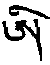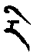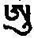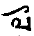 为五根本

&emsp;&emsp;&emsp;&emsp;阿呕哑噢雅 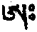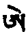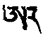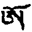 为五功德

&emsp;&emsp;&emsp;&emsp;哈雅惹瓦那 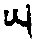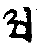 为五缘生

印度为雅那都舍打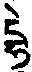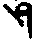

如上短音十五，加亚成长音，合为三十数。另有六者根本母音：钺刀‿，棒————，圆点。，双圈。。，犁头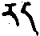，阿字为六。

父音者：

&emsp;&emsp;&emsp;&emsp;[口+戈]“格以”嫁佳雅 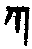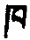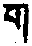

&emsp;&emsp;&emsp;&emsp;札扯炸窄“日雅” 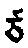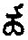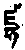

&emsp;&emsp;&emsp;&emsp;柘撦佳借那 

&emsp;&emsp;&emsp;&emsp;打他答达那 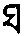

&emsp;&emsp;&emsp;&emsp;把扒八把马 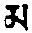

&emsp;&emsp;&emsp;&emsp;沙下卡吓果 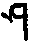⬜⬜林按：此处空两格，因“卡”、“果”不知何所指。

如上三十音，加哈雅惹哇那扯 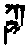 为三十六，是为能叙主要之字。

如上母三十字，每一字各配父嘎等三十字，如[口+戈]字，《金刚续》中加母音三十成[口+戈]、格以、古、格债等，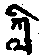 长短配成九百；各分福慧，则成千八百，此则配时与气。盖千八百数为一宫之气，十二宫合成二万一千六百数，与支分续数相等，适配一日之业气，外则适配一年时数按一日六十时，一年共二万一千六百时。彼二一六〇〇为身口意自性，由圆点、双圈、钺刀、长、短等相配，则成三年字数，与前支分续数相等此处所言支分续，究竟若干，师查各注疏，皆无记载。配天数者，[口+戈]等五者，由母音六，配成三十，札等五亦如是，如是如上共配二一六〇〇，外一年时数，内一天气数相等。《时轮金刚微细音》中有之，余所著《数论》，亦可参看。如上为略说，广说则更多。

#### 丁六、本尊与气三脉配合

分二：戊一、与智慧气相配合。戊二、与脉相配合。

##### 戊一

分五：己一、时轮。己二、胜乐。己三、大幻化网。己四、密集。己五、余尊。

###### 己一

今初，一颂半：

&emsp;&emsp;方便智慧无二续&emsp;&emsp;彼等主要约略述

&emsp;&emsp;三年大数以七除&emsp;&emsp;则得一百五十四

&emsp;&emsp;时轮金刚佛少数&emsp;&emsp;余二即方智自性

前所说一切续中，最胜无二本尊数，即与智慧气相配。三年又三方者，三年数智气，配时轮瑜伽母续本尊数，三方为诸父续本尊数，三年天数林按：一年以三六〇天计以七除之，则成一百五十四尊，此为时轮意坛城本尊数，除余二数配福慧。

###### 己二、大小胜乐轮

&emsp;&emsp;以月步十五除之&emsp;&emsp;则为七十二无余

&emsp;&emsp;具行贪主瑜伽母&emsp;&emsp;名为决说续之佛

&emsp;&emsp;摄言勇母三十七&emsp;&emsp;连一方便住于身

&emsp;&emsp;一个半月诸本尊&emsp;&emsp;是为分别方便续

二、大小胜乐轮者，三年天数，以月支分十五除之，得七十二数，是为淫主与俱生坛城天女数，此出《决说胜乐轮十万颂》中所载。《根本续》所摄，则为三十七，其中有一尊为方便者。

何故将方便计入者？

遍行之《安住一纹天灵盖续》云：

> &emsp;&emsp;二十四处无二故，&emsp;&emsp;有情轮回中解脱，
>
> &emsp;&emsp;是故唯现此勇士。

###### 己三、大幻化网

二颂：

&emsp;&emsp;乘时迁移十二数&emsp;&emsp;则为五百四十尊

&emsp;&emsp;如此幻化网续中&emsp;&emsp;三种坛四十九尊

&emsp;&emsp;四五四三具双数&emsp;&emsp;实有二百七十四

又方便续，本尊与智慧配者，如《幻化网》云：

> 彼等配三方，四十五尊，与十二宫相合，则成五百四十尊。

此三种幻化网坛为四十九尊、四十五尊及四十三尊；总数加一倍，则成二百七十四。

###### 己四、密集诸本尊

一颂半：

&emsp;&emsp;具德密集六种数&emsp;&emsp;九与十三与十九

&emsp;&emsp;二十五三二三四&emsp;&emsp;以方便智慧分别

&emsp;&emsp;则具二百六十四&emsp;&emsp;为方便智慧气等

分九尊、十三尊、十九尊、二十五尊，三十二尊、三十四尊等，又分福慧，则为二百六十四。彼《密集》与《幻化网》合计之，则为方便智慧气数。

###### 己五、余续

二颂又一句：

&emsp;&emsp;盖与金刚之甘露&emsp;&emsp;喜金刚等母续中

&emsp;&emsp;皆总集轮之所摄&emsp;&emsp;阎曼达等在密集

&emsp;&emsp;语自在时轮尊中&emsp;&emsp;具有具德星坛城

&emsp;&emsp;诸瑜伽续亦积集&emsp;&emsp;行部事部即支分

&emsp;&emsp;此即名为智慧风

《天灵盖》、《金刚甘露》、《喜金刚》，皆摄于《胜乐续》中所计算者。《大威德》、《马头》、忿怒诸法，皆摄于《密集》所计算者。《法界语自在》等，皆摄于《时轮》所计算者。

上析父、母续完。彼等支分，为金刚宫、坛城等，为瑜伽续所摄。事、行诸续本尊，又为瑜伽续之支分，一切皆智慧流出，此出《菩萨注》所云。如上气与本尊相配完。

##### 戊二、脉与本尊相配

分五：己一、时轮。己二、胜乐。己三、大幻化网。己四、密集。己五、余尊。

###### 己一

今初、三颂半：

&emsp;&emsp;于脉亦如是相配&emsp;&emsp;心脉命气即时轮

&emsp;&emsp;左右二脉足自性&emsp;&emsp;心轮六佛佛母八

&emsp;&emsp;智慧各种名为母&emsp;&emsp;瓶内矢溺肉骨髓

&emsp;&emsp;与夫精血及肉髻&emsp;&emsp;宝干椎如意树螺

&emsp;&emsp;诸蕴界配彼父母&emsp;&emsp;眼等六者与诸境

&emsp;&emsp;菩提萨埵具天母&emsp;&emsp;足事业自在十怒

&emsp;&emsp;诸脐脉可怖母等&emsp;&emsp;是为语坛城自在

脉与本尊相配者，如前次第，《时轮》所配，为三颂半；如智慧气数，脉亦同。心间命脉阿瓦都帝与风配时轮本身。其左右二脉配其足。心中六界配六脉。佛心八脉为八天女。内智慧光明界，为其佛母，名杂种母，亦名大手印母。

八瓶者，为矢、溺、肉、骨髓、精、血贡朱注：骨髓二、肉二。肉髻四脉为如意宝，干椎、如意树、海螺。六蕴、六界配六佛父母。眼等六根及色等六境配六菩萨、六天女。足等作业根及其所作业，配十忿怒。脐脉七十二，配可怖母七十二，此为语坛城。十二节三百六十脉为身坛城本尊。指爪为龙及暴母。三百六十五万毛孔，为活鬼自性。所欲三十六，不欲三十六，为语、身二坛城之供天女、金刚色母等。如上连同供天女等，皆为脉界所具；各具方慧互为印证，合计为一千零八十二。

###### 己二、吉羊胜乐轮

二颂半：

&emsp;&emsp;十二大节诸脉轮&emsp;&emsp;身之坛城居于是

&emsp;&emsp;指甲为龙及暴母&emsp;&emsp;毛孔为活鬼自性

&emsp;&emsp;愿与不愿诸念头&emsp;&emsp;具有供天女等等

&emsp;&emsp;脉界方便与智慧&emsp;&emsp;分述一千零八十

&emsp;&emsp;具德总集轮本尊&emsp;&emsp;三脉与彼离魔脉

&emsp;&emsp;心间四母为四供&emsp;&emsp;大脉女四瑜伽母

&emsp;&emsp;名极怒母等降界&emsp;&emsp;配盖勇父等之数

&emsp;&emsp;与鸦头十忿怒同

吉祥胜乐轮者，主尊父母，如前已说。心间四佛母为四供养。二十四大脉为二十四境瑜伽母。彼中降二十四界为一片天灵盖等二十四勇士。诸根门为乌鸦头等十忿怒母。此为胜乐小坛城。如上二十四分三作用，则成七十二本尊。更广者，则为十二节脉轮。如上所摄，见《上师决定续》与《金刚空行续》中，彼等本尊数甚多，未及详。

###### 己三、己四、大幻化网及密集金刚

五颂半：

&emsp;&emsp;摄入受用与主体&emsp;&emsp;尊具七十二之数

&emsp;&emsp;轮叶具一百二十&emsp;&emsp;金刚空行续所云

&emsp;&emsp;次述具德密集者&emsp;&emsp;是则名为五蕴佛

&emsp;&emsp;具四界触五天母&emsp;&emsp;二目为地藏心要

&emsp;&emsp;耳为金刚手本尊&emsp;&emsp;鼻为虚空藏本尊

&emsp;&emsp;舌为住世间自在&emsp;&emsp;意为文殊于法界

&emsp;&emsp;是为除盖障身体&emsp;&emsp;其名号为普贤尊

&emsp;&emsp;筋脉即为弥勒佛&emsp;&emsp;支分界密处与口

&emsp;&emsp;是为十忿怒自性&emsp;&emsp;事业种性脐上者

&emsp;&emsp;知母与忿怒天母&emsp;&emsp;共有六十四尊女

&emsp;&emsp;金刚性等心九母&emsp;&emsp;说明金刚之种性

&emsp;&emsp;莲花灯等有十六&emsp;&emsp;在喉为莲花自性

&emsp;&emsp;顶门有极醒等尊&emsp;&emsp;具轮种性三十二

&emsp;&emsp;广金刚鬘中已详

吉羊密集金刚者，五轮配五蕴、五佛，地等四大与所触为五境，配五佛母。目、地藏，耳、金刚手，鼻、虚空藏，舌、世间自在。彼等平等味契者，即色金刚母，声金刚母，香、味金刚母。意界为文殊，法界为除盖障，身界为普贤，筋脉为弥勒。彼等平等住者，为近色金刚母，近味金刚母等四者。此本《无二尊胜续》中所载。八支节与口与密为十忿怒。此上为三十四尊坛城。彼中一切脉，皆出于脐轮，地界，为事业种性，六十四脉配智天母与忿怒母等，合为六十四尊。心，水界，金刚种性，配金刚性等天女九尊。喉，火界，莲花种性，配莲花灯等十六天母。顶，风界，为轮种性，配极醒等天女三十二尊，皆三面六手，《金刚鬘》所载如是。如上析脉与界自性相配合。

###### 己五、余经论相配者：

&emsp;&emsp;此种坛城甚为多&emsp;&emsp;单独一尊具有者

&emsp;&emsp;乃至诸数已结集&emsp;&emsp;比如喜金刚九尊

&emsp;&emsp;心轮一尊亦如彼&emsp;&emsp;以上一切皆身脉

&emsp;&emsp;总说脉即是身体&emsp;&emsp;风即是真言与字

&emsp;&emsp;细明点即是正分&emsp;&emsp;如是诸火供事业

&emsp;&emsp;是为内能所清净

如上已述，单身乃至多数相配已完。

余经论者，顶配文殊等一切，为身坛。喉配无量光与马头等，为语坛。心配不动佛等，为意坛。脐配宝生佛与甘露等，为功德坛。密配不空成就、蒲巴等，为事业坛。四肢与脊背为妈木坛城；彼之支分为世间神及恶咒神等。如上一切身、脉、气、明点，诸续及口授中相配之法甚多，未引。

### 丙三、完结

颂云：

&emsp;&emsp;此中仅说明小分&emsp;&emsp;如是道果总持咒

&emsp;&emsp;定与无边尊真言&emsp;&emsp;身心之内之分别

&emsp;&emsp;能依一切智所云

略摄之，前所云一切脉为身自性，为起分；诸气为语自性，为念诵根本；微细明点为意自性，为正分。如前所云，内身火供，此处许为胜事业。般若乘所说，一切智为法界语自在坛，具十二地，配十二度、十二陀罗尼及三摩地等道果，皆本尊咒次第，从内心身出生者也，是薄伽梵。如是一切法皆缘起所生，一切圆满佛；彼二乘异生，难于通达故，乃守秘密。如上脉、气、明点、四时，外内相配者，是为所知基础。修本尊俱生自体之谛，真实之胜义法，身、脉、气、明点，及于智上清净一切法之理由、方便，皆已述矣。依于后之道次第，当于下品中详。

第九品竟。