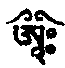

## 结论 摄一切义者，令通达明藏并回向发愿

分六：丙一、总析义。丙二、三藏义。丙三、密乘之别要。丙四、自性果。丙五、根据。丙六、于薄伽梵事业恭敬赞叹并回向忍赦。

### 丙一

今初、二颂：

&emsp;&emsp;世尊一切续之中&emsp;&emsp;外面共同所显现

&emsp;&emsp;内面气脉明点等&emsp;&emsp;其他遍计佛真言

&emsp;&emsp;具有垢净之证境&emsp;&emsp;与无垢慧为二种

&emsp;&emsp;一切胜义与世俗&emsp;&emsp;戏论离戏论所说

此上诸品所说次第，因佛一切智，分为四部。一切外、世间共同，如说诸吠陀，显现世间界内。所言气、脉、明点、金刚身，余所分别坛城，诸轮，诸本尊咒等。又一切烦恼所知垢染，尽其所有为所净根本。无垢之如所有、尽所有智，为究竟果。彼等一切，依于二谛名句文等，诸戏论，庄严为世谛。无能、所取，一切相离戏论之真实，为胜义谛。由一切有情根器分别不同，故有无量不同法门。《庄严经论》云：

> &emsp;&emsp;诸佛于有情，&emsp;&emsp;为饶益彼故，
>
> &emsp;&emsp;胜共二相法，&emsp;&emsp;如是正宣说。

此上为总义。

### 丙二、三藏

一、对法，此中分内，外二种

外对法者，颂半：

&emsp;&emsp;能作外者无他者&emsp;&emsp;缘起所现与自现

&emsp;&emsp;由分别不相应行&emsp;&emsp;情器粗细名句等

&emsp;&emsp;文字及与方时等&emsp;&emsp;佛谓外面之对法

此中因有情分别堕落，为向上引导，故说无外事作者等。有时之由缘起，说显现之身心。有时说外世间显现，由于内心所显，为当断诸法。如是建立对治之相，《集论》、《俱舍》等所云，摄于本颂矣。

其内对法者，四颂：

&emsp;&emsp;如彼外相内亦真&emsp;&emsp;脉与身形配世间

&emsp;&emsp;由气之语能生字&emsp;&emsp;明点配曜与星宿

&emsp;&emsp;河流火等决定云&emsp;&emsp;如同闭目不见色

&emsp;&emsp;开目则能见彼色&emsp;&emsp;揉目则能见二月

&emsp;&emsp;不知所以约束义&emsp;&emsp;难见自在之智慧

&emsp;&emsp;所依能约则能见&emsp;&emsp;虽无外面能显余

&emsp;&emsp;显亦遍计佛坛城&emsp;&emsp;此则是谓内对法

&emsp;&emsp;别说佛尊与坛城&emsp;&emsp;地道与夫到彼岸

如外所有与内相配，颂中已说，如前内心与外世间相配已详。此中方便善巧差别者，世间人眼闭不见色登，开则见月，揉目则见两月；如此喻欲趋入真道有情，外对治法虽然应断，其对治之理，虽明不能速达；于气脉明点，不能了知，不能见三有涅槃无差别之智；于气脉等了知已，而加以约束修习，十相显现，现证乐明无念功德，及显空无二智，比如开目也。

第二、经藏之理

一颂：

&emsp;&emsp;真言具咒菩提分&emsp;&emsp;得遍住背舍等定

&emsp;&emsp;说为深广之法门&emsp;&emsp;名密经与到彼岸

如《薄伽梵经》中所云，外内余三外。外对、内对法详前，余即指本尊坛城。又深广之法者，十地、五道、十度，陀罗尼咒、密咒、地道等，三十七道品，生圆支分、十遍住定，十背舍定，自利利他等定会合，是为深广之法。如上为密乘，为般若乘是也。

第三、律藏

颂半：

&emsp;&emsp;外身口戒三所摄&emsp;&emsp;具自性之所摄成

&emsp;&emsp;于内为自他二利&emsp;&emsp;令不愚痴发胜心

&emsp;&emsp;能转烦恼为智慧&emsp;&emsp;此故名为内戒律

如薄伽梵于律藏所说，外身、口防护，断除性罪、遮罪，与律相应，是为自身现证涅槃者，为外戒。内者，为利自他，意不愚痴，依于胜义，发起菩提心，戒多善巧差别，无非令尽所有烦恼，转为智慧，除烦恼罪，济三有有情。故密宗戒属内戒。

如上三藏相顺，故名为持明藏。

### 丙三、别别了知密宗之需要

颂半：

&emsp;&emsp;由了知戒与经部&emsp;&emsp;能得声闻之果位

&emsp;&emsp;方便善巧内义广&emsp;&emsp;能知如来藏之理

&emsp;&emsp;能作证得之果道&emsp;&emsp;最快得最上胜位

了知戒者，为小乘之必要；由戒藏、经藏，证声闻果。比前更胜者，当具深广之理，是经藏为必要。别说于彼广大善巧方便，当知金刚乘；其最需要者，为通达如来藏，获得无上圆满菩提。一切密续已述，本论亦略摄共、不共异名理趣矣。

### 丙四、 总析果

四颂：

&emsp;&emsp;一切所知智自性&emsp;&emsp;障此即为迷妄念

&emsp;&emsp;一念忽然而生起&emsp;&emsp;行蕴即由此出生

&emsp;&emsp;不能见真只见妄&emsp;&emsp;现前入于泥妄念

&emsp;&emsp;可怜幼童入轮回&emsp;&emsp;内外余三之智慧

&emsp;&emsp;证得即为佛自性&emsp;&emsp;所有世俗之二显

&emsp;&emsp;如同水月义当知&emsp;&emsp;胜义十八之空性

&emsp;&emsp;见无分别如一味&emsp;&emsp;烦恼所知与定障

&emsp;&emsp;离此三障自明智&emsp;&emsp;尽所如所二智明

初析俱生智体，一切所知之智自性，如前已述。根现量，意现量，自证现量，如此一切若以真实瑜伽认持已，是为一切现量俱生智本体。尔时能、所知尽其所有，一切正见摄持矣。于因果能别别观察，为妙观察智，及自体空智。于后得自在已，故能示现彼力，为成所作智。一切平等，为平等性智。安住真如不动，为大圆镜智。颂云：

> &emsp;&emsp;无欺无虚是法尔，&emsp;&emsp;诸相现证于菩提，
>
> &emsp;&emsp;远离于垢染习气，&emsp;&emsp;佛陀所证涅槃者，
>
> &emsp;&emsp;胜义之中无二分。

如上为法界体性智，为一切智自性。

若尔，彼智之障，从何所生耶？答：

> 由忽然念起，如前已及；染污意为根本，由彼执我、我所而出生。

法称论师云：

> &emsp;&emsp;有我故执他，&emsp;&emsp;令他起贪嗔，
>
> &emsp;&emsp;与彼等相合，&emsp;&emsp;出生一切罪。

如上现行已，不能安住真实，而于非实，执迷错乱，如见阳焰为水，如颂已喻。苟能离能知、所知之执着，则得成佛。颂云：“所有世俗之二显，如同水月义当知，胜义十八之空性，见无分别如一味。”此理当善通达，离于三障。《庄严经论》：

> &emsp;&emsp;吝嗔等分别，&emsp;&emsp;许为烦恼垢；
>
> &emsp;&emsp;分别三轮相，&emsp;&emsp;许为所知障。

另一则定障。如是三障清净已，二谛真实，由观察智可了知，如所有、尽所有智。《庄严经论》：

> &emsp;&emsp;如所、尽所中，&emsp;&emsp;智见清净故，
>
> &emsp;&emsp;集合不退众，&emsp;&emsp;具无上功德，
>
> &emsp;&emsp;众生本涅槃，&emsp;&emsp;如所有见故，
>
> &emsp;&emsp;自性清净故，&emsp;&emsp;烦恼本净故，
>
> &emsp;&emsp;所知究竟慧，&emsp;&emsp;一切智法尔，
>
> &emsp;&emsp;一切有情具，&emsp;&emsp;尽所有见故，
>
> &emsp;&emsp;如此诸通达，&emsp;&emsp;各各自智明，
>
> &emsp;&emsp;无垢空无著，&emsp;&emsp;无碍故清净。

如上通达已，为通达究竟之果。

### 丙五、本论根据

四颂：

&emsp;&emsp;此故金刚乘之中&emsp;&emsp;所说本性应当知

&emsp;&emsp;于内义中约略述&emsp;&emsp;广说则具足无量

&emsp;&emsp;由诸佛子所注疏&emsp;&emsp;于彼若广为参考

&emsp;&emsp;此论则为趋入门&emsp;&emsp;甚深内义之所述

&emsp;&emsp;非由我私见所作&emsp;&emsp;为一切智薄伽梵

&emsp;&emsp;佛所说者我所编

&emsp;&emsp;由诸善巧秘密主&emsp;&emsp;注释之力为所依

&emsp;&emsp;金刚乘中之内义&emsp;&emsp;不颠倒者我得到

&emsp;&emsp;世尊具足虚空智

如上诸品所说，集诸密续之大要，于广大智慧内、外、余三坛本尊，欲详加参究，可遍阅诸菩萨之注；本论有如入彼之门焉。本论非出自杜撰；由一切智所说密宗要义，吾特为摄集之耳。

或谓义具六边抉择，不尔难乎？

答，虽然如是，以能结集菩萨秘密主，及文殊、观音等注解、大阿阇黎龙树父子，及吉祥萨拉哈、莲花生、及八大自在瑜伽士，与大善巧底补巴、时轮足、吉祥大谛洛巴，及其他出生善巧成就诸大德，与已见真实金刚乘诸上师注疏之力，盖由慧眼所见，非出自自造也。

### 丙六、对薄伽梵恭敬赞叹及回向

分三：丁一、赞叹 丁二、回向 丁三、请忍赦

#### 丁一

今初：

&emsp;&emsp;如同太阳轮之中&emsp;&emsp;于十方世界轮回

&emsp;&emsp;显现无数之色身&emsp;&emsp;语如天鼓任运生

&emsp;&emsp;不必造作之经续&emsp;&emsp;如虚空界无勤勇

&emsp;&emsp;普令众生皆闻之&emsp;&emsp;心意有如如意宝

&emsp;&emsp;无须精进俱生智&emsp;&emsp;为利具有戏论者

&emsp;&emsp;宣示无戏论之经&emsp;&emsp;有情具俱生烦恼

&emsp;&emsp;此不能增彼之染&emsp;&emsp;故当于本来世尊

&emsp;&emsp;我致恭敬之膜拜

由佛成办无上金刚乘，究竟作已，战胜一切违品。在一切法中，解脱其身业者，具虚空身，无为任运，成办自体，第八识灭除，清净无生亦无灭，涅槃大究竟。月称论师云：

> &emsp;&emsp;所知之薪能烧火，&emsp;&emsp;内彼寂静佛法身，
>
> &emsp;&emsp;尔时无生亦无灭，&emsp;&emsp;心灭现证佛法身。

所净根本为心第八识，灭已，其对治之名为证智见如来。法界极清净故，为虚空身。彼等流顺因，由极甚深成办法身者，为四智故，故为智慧身。《时轮》说为太阳身，亦名为智慧太阳轮，盖取其喻义。如是智身示现事业，于十方无量世界，乃成为色身。于三有未空中不断示现，是当赞叹之身秘密。

其语业者，则如人天任运之鼓声，为除有情烦恼故，发出世、出世间欢喜增长之法螺语，不假功用，而能遍于虚空，令尽其所有众生，皆得闻之，是当赞叹之语秘密。

其心业者，则如摩尼宝，离一切垢，以妙观察智及成所作俱有故，虽无少许戏论，然于具戏论菩萨、二乘、异生前，能令其心中所有希求，皆得满足，是当赞叹之心秘密。

如上三秘密业成办事业，尽其所有众生，一切烦恼皆为转变，而佛于身语意业智上过患无有，安住无染，如太阳光，虽然照于宝山、地基，及不净尸林等处，令光令热，然彼等染污，不能染及太阳真实。《真实名义经》：

> &emsp;&emsp;安住虚空中，&emsp;&emsp;认持大牟尼，
>
> &emsp;&emsp;广大如意树，&emsp;&emsp;文殊胜宝瓶，
>
> &emsp;&emsp;佛如是利众。

《宝性论》云：

> &emsp;&emsp;自性身五相，&emsp;&emsp;总有五功德，
>
> &emsp;&emsp;具五种应知，&emsp;&emsp;无畏及无别，
>
> &emsp;&emsp;远离于二边，&emsp;&emsp;烦恼所知定，
>
> &emsp;&emsp;三障中解脱，&emsp;&emsp;无垢无分别，
>
> &emsp;&emsp;是诸瑜伽境，&emsp;&emsp;智慧普遍故，
>
> &emsp;&emsp;常故而光明。

如上说智慧身已。又佛事业者，经有云：

> &emsp;&emsp;帝释鼓鸣及梵天，&emsp;&emsp;太阳与彼摩尼宝，
>
> &emsp;&emsp;如来有如琵琶声，&emsp;&emsp;又如虚空如大地。

龙树云：

> &emsp;&emsp;诸佛法住处，&emsp;&emsp;认持诸行果，
>
> &emsp;&emsp;悉皆已转变，&emsp;&emsp;此诸为法身，
>
> &emsp;&emsp;习气解脱难思议，&emsp;&emsp;流转习气有思维，
>
> &emsp;&emsp;佛之功德难思议，&emsp;&emsp;任何人也不能知，
>
> &emsp;&emsp;超越言诠所行境，&emsp;&emsp;非诸根等所行境，
>
> &emsp;&emsp;如来意智所通达，&emsp;&emsp;于任何处我皆赞，
>
> &emsp;&emsp;涅槃心无垢，&emsp;&emsp;诸有情无体，
>
> &emsp;&emsp;彼体佛行境，&emsp;&emsp;菩提心增长，
>
> &emsp;&emsp;极无垢法身，&emsp;&emsp;无垢法身中，
>
> &emsp;&emsp;安住智慧海，&emsp;&emsp;如各种摩尼，
>
> &emsp;&emsp;从彼利有情。

如上可证。

又阿阇黎月称论师云：

> &emsp;&emsp;寂静之身如摩尼明显，&emsp;&emsp;心无分别如彼如意宝，
>
> &emsp;&emsp;众生未尽常住于世间，&emsp;&emsp;能仁一时等流离戏身，
>
> &emsp;&emsp;色身刹那功德显现时，&emsp;&emsp;明显了别正法出生理，
>
> &emsp;&emsp;无余示现作无余宣说。

又云：

> &emsp;&emsp;殊胜寂静世间未曾有，&emsp;&emsp;尽虚空界未曾通达时，
>
> &emsp;&emsp;智慧佛母与大悲乳母，&emsp;&emsp;认持涅槃能仁世稀有。

可引证，如上密宗道理，与龙树、无著，月称等所建立佛果，无有差别。为除邪分别故，故于此引证；于我本人，则毫无疑心。如上为自己，自心，法身，净与不净之理，为立论根本。《宝性论》云：

> &emsp;&emsp;如是性等具无垢，&emsp;&emsp;自修能修信心等，
>
> &emsp;&emsp;自然显现圆满佛，&emsp;&emsp;行住坐卧四威仪，
>
> &emsp;&emsp;各种皆具大庄严，&emsp;&emsp;说则具足寂静法，
>
> &emsp;&emsp;不说安住平等位，&emsp;&emsp;示现各种之变化，
>
> &emsp;&emsp;具足事业大威光，&emsp;&emsp;由诸有情现有故，
>
> &emsp;&emsp;苟能具足希欲乐，&emsp;&emsp;于彼菩萨道上行，
>
> &emsp;&emsp;取彼真实以为因，&emsp;&emsp;获得所求之地位，
>
> &emsp;&emsp;佛无分别无动摇，&emsp;&emsp;虽然如是能入世，
>
> &emsp;&emsp;由彼大义而安住，&emsp;&emsp;此则为自心显现，
>
> &emsp;&emsp;各各异生不知故，&emsp;&emsp;如是乃见彼色身，
>
> &emsp;&emsp;彼等亦具大义利，&emsp;&emsp;由彼渐次见佛已，
>
> &emsp;&emsp;于诸乘中得安住，&emsp;&emsp;渐次于彼正法身，
>
> &emsp;&emsp;由慧眼开而现见。

如上所云，生起胜解，故我恭敬、礼赞诸佛。本论既完，当为回向。

#### 丁二、回向

颂云：

&emsp;&emsp;甚深内义所叙述&emsp;&emsp;所有一切善业力

&emsp;&emsp;回向等虚空众生&emsp;&emsp;圆满速得智慧身

一切密续中甚深义，不可思议，愿等虚空众生，皆从生起智慧资粮之因，而获得如来智慧身。

#### 丁三、当请忍赦

颂云：

&emsp;&emsp;如有不敬之过失&emsp;&emsp;求空行众忍赦之

于派别见舍已，然或有一句半句义，于薄伽梵有失恭敬处故，当请空行忍赦；非有罪犯戒，而有请忍赦也。此中言空行者，为法主故。如《喜金刚》云：

> 已得灌已，若不秘密，则空行不喜；然完全不说，亦犯戒无疑。

如是所云，本人著此，毫不犯戒，本人亦非无知无识，亦非我慢、矜夸，故非犯戒而请忍赦也。为今彼等能阅甚深典籍故，而毫不滞过，以著此。如上已述十二品。今当略摄其义。如上宣说之甚深内义之二谛无分别，为正见；于气、脉、明点约束以方便，成办一切事业，为正行；其现证如来藏，为正果。彼前造论者，或仅一分通达，如解析句义不善巧，各种经论未遍阅，则以本论有不顺处，生起毁谤，望勿如是。又疑诸菩萨、诸大善巧，典籍互有出入，显密相违者，亦望舍之。

经颂云：

> &emsp;&emsp;离诸戏论金刚乘众说，&emsp;&emsp;密宗主要时轮名普称，
>
> &emsp;&emsp;天人中脉将五根心气，&emsp;&emsp;各别摄已所执相已断，
>
> &emsp;&emsp;现量证得一切法空中。

影相一切法为金刚阿瓦都帝所显现，如镜中看光。此中具足五支静虑心，成无分别心，骑彼五大种气，为能取、所取之依。离戏论无生，五智三金刚命力成已，气修到究竟，心气作用自在，由此有障红白界可以调伏。由降菩提心，成办无生，认持无漏大乐。所依中脉轮中执持安乐领纳力，此即大乐心气无二。

自所修本尊显现，证得身空影相，可以断除分别。其无生本尊身，如幻数数忆念修习；由三摩地力于有情界及佛刹行光明普遍，如雪供施，成办广大资粮，净除罪垢；如是修已，蕴界处一切垢染离开，无生三摩地支分究竟，是为无生心气无二。

又大乐心气无二，由拙火道基础修已，道全体圆满，即依加行六支、五次第诸续所载而修，连同手印道，一切受持而达到无生心气无二。

又无生心气无二者，为双运瑜伽道，即大乐与无生果，两两双运。能修者为大手印，由此大手印六支道，可离六界障。离地界垢，为三有一切清净轮种。离水界垢，为大乐莲花种。离火界垢，为大乐宝生种。离风界垢，清净烦恼为剑种。离空界垢，为智慧身，无分别金刚种。离智慧垢，为能断无知钺刀种。

五俱生智因中大乐兼带而有，若无则乐道虽修不生果。明点烧融及气微细瑜伽，彼等若无心气无二，则圆满果不能证得。

经云：

> &emsp;&emsp;莲花之中明点者，&emsp;&emsp;行彼证得分别位。

&emsp;&emsp;此修多罗皆开示灌顶，&emsp;&emsp;文殊与彼大悲水所生，

&emsp;&emsp;除恼智慧花园极茂盛，&emsp;&emsp;远处取来雪山用功经，

&emsp;&emsp;与彼龙树莲花生大士，&emsp;&emsp;水源无二相合于众前，

&emsp;&emsp;为利自他明显而著此，&emsp;&emsp;决定能显众生如来藏，

&emsp;&emsp;彼得闲暇人身而龙头，&emsp;&emsp;于诸典籍惟相似了知，

&emsp;&emsp;具舌与喉虚扬其声音，&emsp;&emsp;解析佛典唯上头花鬘，

&emsp;&emsp;见行各种下身不庄严，&emsp;&emsp;本论则非与彼等可比，

&emsp;&emsp;集诸佛子金刚乘句义，&emsp;&emsp;如彼宫殿具足宝庄严，

&emsp;&emsp;佛藏自在如彼帝释者，&emsp;&emsp;通达了知真实庄严鬘，

&emsp;&emsp;语句放出无垢之光明，&emsp;&emsp;天人有情所欲皆赐予，

&emsp;&emsp;如秘密主所述而宣说，&emsp;&emsp;具眼人前宜舍离执着，

&emsp;&emsp;二谛无别彼圣者所示，&emsp;&emsp;福慧无别牟尼自戴顶，

&emsp;&emsp;为生自他二利之本因，&emsp;&emsp;由此片善愿诸有情众，

&emsp;&emsp;通达现证甚深之真实，&emsp;&emsp;自如来藏速开显光明。

密宗无倒通达，对于《甚深内义》解析者，让蒋多杰，由世、出世一切功德庄严，善知识释迦依怙劝请，又善知识茆蓬自在亦劝请，乃于具足增长时于大乘法前，生起胜解。属牛年第二月，造于乌金堪布莲师大修法处。

吉羊圆满。《甚深内义》广注终。