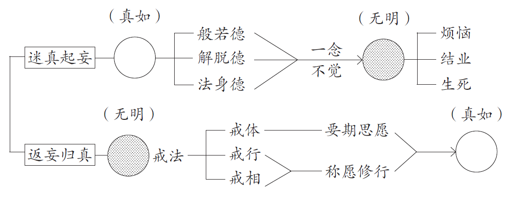

## 甲二、宗趣

所谓的宗趣，就是“宗旨”和“趣向”。宗旨是说虽然戒法的内容千变万化，但是万变不离其宗，它有一个共同的宗旨，是什么呢？就是要帮助我们调伏烦恼。并非佛陀随他个人的想法，规定我们这个不能做，那个不能做，来约束我们。实际上是佛陀以大慈悲、大智慧，透过戒法来帮助我们调伏烦恼，使内心安定下来，这个是持戒的宗旨。

依着这个宗旨，它最后的趣向是什么呢？就是恢复我们的本来面目，这就是持戒的宗趣。

我们首先以《法华经》“衣里明珠”的譬喻，来说明持戒的宗趣为何。

在《法华经》里描述：有一个人非常贫穷，不得已，只好去请一个很要好的朋友帮忙。这位好朋友也是有心想要帮他的忙，但是一开始并没有给他什么东西，只是和他喝酒、谈天。谈着谈着，穷人不知不觉地就醉倒了。而这位有钱的朋友，也刚好有事要离开。于是他就在这穷人的衣领里面，系了个无价宝珠，用这宝珠可以换取无量无边的珍宝，送完之后就先离开了。

这个穷人也是命里该穷，醒来之后，没有发现衣领里面有这宝珠，结果还是一直过着穷困潦倒的乞讨生活。过了很久，他们又一次相遇了。这位有钱的朋友很惊讶地问：“咦？我不是给你一个宝珠，就别在你的衣领里面吗？你怎么不拿出来用，拿来换取无量的珍宝呢？”这时候穷人才恍然大悟：“啊，原来这几年的穷困潦倒都是白受的，竟然带着这个价值连城的珠宝到处乞讨”……这个就是“衣里明珠”的譬喻。

这譬喻说明我们众生的自性宝，就像衣里明珠一样；也就是说众生的自性当中，本来就具足佛的无量智慧、无量功德，只是因为一念迷，因此带着这衣里明珠到处乞讨。也就是带着我们自性的功德到处漂泊，在三界当中轮回，到处流浪，受了无穷无尽的痛苦。实际上这无穷无边的痛苦是没必要的，因为我们自性的“衣里明珠”——自性的功德，始终不曾失去，只是没有开显而已。

当然，这个道理说来是容易，我们都有“衣里明珠”，只要承担就好了，就能够开显出来。但是所谓承担，不是一种意气凑泊——我就是要承担，我能够承担，我就是佛，不是狂禅的那种态度。口中说是佛，但是内心却还是贪、瞋、痴，这样子“衣里明珠”还是不能开显出来。

那么要怎样开显出来呢？佛陀慈悲地安立了戒法，因戒生定，因定发慧。有了戒法的力量，身心慢慢安定下来，不再有那么多的烦恼、那么多的困扰。我们自性本具的功德——这衣里明珠，就能够慢慢地开显出来，这个就是持戒的宗趣。

道宣律祖将声闻戒的戒法，以《法华经》的道理开显出来。无怪乎天人也好，印度来的三果圣人也好，都赞叹从佛陀入灭以来，对戒法的阐释，道宣律祖最为殊胜。

当然宣祖的功德，不止是运用了《法华经》的思想，还有《解深密经》的思想，以及对戒法条目，进行重新归纳整理。以后谈论到《持犯篇》就知道，这些都是道宣律祖的大智慧啊！《在家备览》很多内容都来自《行事钞》——宣祖三十一岁的著作，这只有大菩萨的境界，方能及此。

了解宗趣之后，我们接着来看下面的表解，具体地说明依持戒来返妄归真的原理。

图1-1的大结构，分为“**迷真起妄**”、“**返妄归真**”两阶段。

“迷真”就是迷失了我们的本来面目、本有的真如本性，而起种种的颠倒、妄想，也就是我们现在的境界。原本是“真如”的大圆镜、清净的大圆镜，具足“般若德”、“解脱德”、“法身德”三德。但是因为“一念不觉”，就变成充满黑点的无明，成为阿赖耶识，乃至其中熏习的种种恶业。从无明心中产生“烦恼”、“结业”、“生死”三障，这就是凡夫的流转，“迷真起妄”的过程。

我们先解释什么是“三德”、“三障”。

“三德”是“般若德”、“解脱德”、“法身德”。

“般若德”就是般若智慧，也就是成佛之后，所证得的照了法界没有障碍的智慧。它能够照了一切法全体法性，上至佛法界，下至秽恶的地狱法界，每一法的本质都是清净本然的真如。

我们可以举个譬喻来帮助理解：例如晚上做梦，有时候梦到堕入地狱、被人追杀，或者是被刀割、火烧，很痛苦；有时候梦到我们升天，受种种的快乐。但实际上梦到升天也好，梦到堕入地狱也好，这个梦境的体，都是我们这一念不生不灭、能够做梦的心，梦只是心所显现的影像，是心的投影罢了。同样道理，往生净土的快乐也好，堕入地狱的痛苦也好，实际上它的本质，都是这一念真如本性所显现的影像。能够照了此理，所显现的智慧就是“般若德”。

所以“般若德”虽说是佛陀所亲证的智慧功德，但是我们凡夫众生，如果能起智慧观照，也就跟“般若德”相应了。当可爱的境界来了，我们心中不迷、不取、不动，痛苦的境界来了，也是一样地不动。因为观察可爱也好，不可爱也好，这一切境界，就像梦境当中可爱、不可爱的境界，它的体是能够做梦的心，是没有什么可不可爱、没有生灭的，能这样观照的话，我们的心就自在，也就随顺于“般若德”。

亲证“般若德”之后，会产生什么作用呢？就是“解脱德”。“解脱德”就是起种种度化众生的作用，一切神通自在。例如阿弥陀佛的净土，就是“解脱德”的大用，以此摄受众生。或者像《维摩诘经》里所描述法身大士的境界：能够把一座须弥山纳入到一个小芥子、一个小菜种子里面去；或者把整个三千大千世界劈成两半，就像丢铁饼一样，丢到很远的地方去，然后再把它捡回来拼回去，而里面的众生都不觉不知，这就是“解脱德”的妙用。乃至佛菩萨种种无碍的辩才，千百亿化身，随缘显现，千江有水千江月，随众生的因缘，各得度脱，这些都是“解脱德”的妙用。因为证得了甚深的“般若德”智慧，所以在这个当中，能够生出解脱德的妙用。

虽然有“般若德”的智慧观照，或者“解脱德”的种种妙用，但是诸佛都是安住在不生不灭的法身理体当中，这不生不灭的法身理体，就是“法身德”。

就像千江有水千江月，虽然在全世界有水的地方，到处显现月影，但是天上的月是不动的；虽说不动，但是又同时能够随缘显现出无量无边的月影。无量无边的月影，就像“解脱德”，不动的月就像“法身德”。

所以在这不动的“法身德”中，才能够起“般若德”的智慧照了；乃至在般若的智慧照了当中，能生起利他的“解脱德”。虽说有三德，实际上体是不二的。就像梦境与梦心，虽说有二，但是其体无别。无论离开梦心寻找梦境，或者舍弃梦境寻觅梦心，皆了不可得。

三德是佛亲证的功德，也是我们修行人的依止处。要常常去忆念我们的“衣里明珠”——不生不灭的法身。虽然外在的境界会有生灭，但是这一切生灭相的本质，是不生不灭的法身理体，所以不要被外在的生灭所动。

就像天气刚开始很冷，渐渐转暖，接着又变冷了。我们的心就像天气一样，变来变去，忽冷忽热的。但是观察这一念能够起变化的心，其体为不生不灭的法身。依止这种智慧，随着境界起般若观照，这时候也能够有“解脱德”。这就是佛所证的三德，合称为“真如”。

为什么“三德”名为“真如”呢？真，是不虚伪的意思；如，是不变异、没有变化的意思，随缘不变义。

什么是不虚伪的“真”呢？就是不虚妄。为什么不虚妄？因为观察一切法，都是我们法身所现的影像，这就是真。我们认为世间可爱也好，不可爱也好，实际上都只是在内心所现的幻影上，虚妄分别罢了，境界本身没有所谓的好坏，境界就只是自心所显现的影像，而我们在心中生起爱憎取舍，这就是虚妄。

什么是不变异的“如”呢？外在的境界虽有生灭，但是我们的法身是不生不灭的。我们得到人的果报，只是自性本具，人的果报显现，但是法身本自具足，上至佛法界的功德，下至地狱法界的法，在轮回中都无增减。

如《六祖坛经》所说：“何期自性，本自清净；何期自性，本不生灭；何期自性，本自具足；何期自性，本无动摇；何期自性，能生万法。”我们应当依止这不生不灭的理体，来安住我们的身心，依止“真如”的大圆镜，就能够显现出“般若”、“解脱”、“法身”三德。

但是只因我们“一念不觉”，就在三德当中对应地起三障，般若德变成“烦恼”，解脱德变成“结业”，法身德变成“生死”。这三法能障碍清净心，使我们流转生死。如水结成冰，“三德”因此变成了“三障”。

为什么“般若德”会变成“烦恼”？因为般若照了不动的法身，而烦恼照了贪、瞋、痴。一样是照了的功能，但是一个照向不动的法身，成为般若德，另一个则是照向贪、瞋、痴的境界，变成烦恼。所以，烦恼即般若，就是这个道理，因为它的体都是这一念能够了别的心，只是这一念了别的心，去了别什么境界罢了。

我们愿意在世间放逸、造罪业，就是以真如本性当中般若德的用，转成染污烦恼的用。但是当我们在佛堂用功，念佛、拜佛、听经、观察实相时，就将原本烦恼的照了功能，转成清净般若德的照了功能。所以水跟冰是不二的，水冻结就变成冰，冰化了就成为水；“般若德”与“烦恼”不二，亦复如是。

同样，“解脱德”跟“结业”也是不二的。为什么呢？因为“解脱德”创造清净、自在的业，而“结业”则是造种种恶业。一样在造业，但一个是清净的业，现佛净土、现种种的神变、自在；另一个是被烦恼所捆绑，起杀盗淫等染污的业，故其体无二。

最后是“法身”与“生死”不二，因为“生死”是生灭相，生死流转，在三界内有无穷无尽的六道轮回，三界外有剎那生灭的变易生死，这些都是生灭的境界。而生灭与不生灭，实际上是不二的，为什么呢？我们从譬喻去观察就比较容易理解。例如能做梦的心，是不生灭的，而它所创造出来的梦境，却是生灭的。虽然梦境生灭，但能够做梦的心是不增不减、不垢不净，没有任何生灭的。但它并不是像冰块一样定死不动，它仍然随缘显现种种生死的境界，所以“法身”与“生死”不二。

因此“般若、解脱、法身”三德，与“惑、业、苦”三障是不二的，这就是我们“迷真起妄”的过程。

流转的原理知道了，我们接着就应当“返妄归真”。主要就是依着戒、定、慧来返妄归真，而本论主要依着戒法来说，因为它是修行定慧的基础。

所谓的“返”，并非真的有来去相可得，就只是把这念妄心停下来。就像古德所说：“东去西去，不如到万里无寸草处去。”因此“返妄归真”，就只是把我们的妄心停下来。

就像央掘摩罗过去没有信佛时，被魔所摄受，到处杀人，最后要杀他母亲时，佛陀知道他将造五逆罪，为了禁止他造这种业，所以就示现在他眼前，吸引他的注意力。央掘摩罗就反过来追佛陀，他追得越快，佛陀就走得越快；他追得越慢，佛陀也走得越慢，永远保持一个等距离。央掘摩罗最后急了，就说：“道人，停下来吧！”意思是停下来让我杀吧。佛陀说：“我早就停下来了，是你还在动。”这时央掘摩罗豁然醒悟，本来被魔所束缚的心顿然清醒。

这就是“返妄归真”的返，将我们的心停下来，也就是透过持戒的力量，将我们的妄想心停下来，而“归真”，回复到我们的本来面目。

那怎么返妄归真呢？请看“图1-1”，我们现在是充满黑点的无明状态。透过戒的四科：戒法、戒体、戒行、戒相，来返妄归真。关于这四科，后文会详细说明，在此先大略解释其义。

| 戒法：圣人制教     |                                        |
| ------------------ | -------------------------------------- |
| 戒体：纳法成业     |                                        |
| 戒行：依体起护     |                                        |
| 戒相：戒相有二义， | 一、约行为相，即“为行有仪”，如今所云。 |
|                    | 二 、以法为相，如后《持犯篇》所示。    |

图1-2

所谓戒法，就是圣人制教，名之为戒法。圣人就是佛陀，戒法只有佛陀才能够制定，不像经典，谁都能宣说，只要佛陀印可就可以了。而戒法就像法令，必须由国王，或者国家最高的司法单位才能够制定，一般老百姓或者官员，是不能制定的，这个就是戒法。

那么戒法的重点是什么呢？它主要规范我们的身口意三业，这轨范不是捆绑，而是帮助我们，把妄想心停下来的方法，称之为戒法。这当中包括五戒、八关斋戒、菩萨戒，乃至出家的比丘、比丘尼戒等等，这些轨则，都称之为戒法。

而戒法本身只是一种轨则，一个无情的法，怎么样把它纳入我们的心中，成为保护的力量呢？这就必须纳法成业，将戒法转成心中的戒体，也就是阿赖耶识里面的善种子，它能产生一种防非止恶的力量，所以称之为戒体。

而戒体怎么来的呢？重点是通过“要期思愿”。我们在受戒时，念三归依之后，拜下去时要观想面对十法界的有情无情，未来都要断恶、修善、度众生，这就是“要期思愿”。

所谓“要期”是就时间来说，我们受五戒是尽形寿，我这辈子决定要这么做，这是时间上的“要期”。空间上的“要期”，就是十法界一切有情无情的境界，都是我们未来持戒的目标，后文会详细解说。

“思愿”是一种愿心，也就是说我的愿望是尽形寿，面对十法界有情、无情的境界，都能断恶、修善、度众生。所以总的来说，这就是菩提心，以菩提心为体、为内因，结合外在的佛、法、僧三宝境界为外缘。其中佛宝就是受戒时，所面对的佛像；法宝就是受戒的仪轨；僧宝就是授戒师。在佛、法、僧三宝的加持下，配合内在的菩提心，在阿赖耶识中熏习一个善种子，这就是戒体。

戒体不是普通的善种子，它是有力量的，它有任运防非止恶的功能，所以跟一般世间的善法是不同的。同时，戒体能保护我们。例如受持五戒之后，若能谨护戒体，若遇到杀生等事，戒体自然而然就会产生一种抗拒的力量、一种防非止恶的功能，禁止我们去造恶业。如果长时间的守护戒体，使它的力量强大，甚至在梦中都能做得了主。因此当我们临终时，正念依旧做得了主，这就是戒体的重要性！

但是光有戒体还不够，我们同时也要保护戒体，戒体才能保护我们。如果我们都不去守护它，甚至破坏它，慢慢戒体任运防非止恶的功能，也就消失了。

要保护戒体的话，则要配合戒行、戒相。戒行，主要指的是意业的依体起护，戒相主要是指身口业的守护，后面《持犯篇》会讲到。总的来说，都是称愿修行，符合当初在登坛受戒时，观想面对十法界有情无情，所发起断恶、修善、度众生的本愿而修行。

例如过去，看到家里的苍蝇、蚂蚁、蚊子，就想杀它。但是得到戒体的人，看到这个境界，有可能第一念还是会想杀，但第二个念头，戒体就产生一种排斥的力量，告诉他不能杀生。如果随顺这个排斥的力量不去杀生，这样依体起护的善行，就返回来熏戒体的种子，使戒体的力量更加强大，这就是保护我们的戒体。

所以当戒体发挥出力量时，我们就随顺它，不去造恶业，这就是“戒行”。因为有了戒行，于是为行有仪，就有了戒相(此为戒相的第一义)。因为有意业清净防护的行为，所以表现在外，自然也就是清净庄严的相状。就像我们看印光大师、弘一大师的相片，就是清净庄严，跟世俗人完全不同。这并非由于穿着，也不像世间人化妆，或是矫揉造作。即使不挂主持、法师的头衔，与他们接触时，就知道这不是普通人。为什么呢？因为他们有戒体，同时又以戒行去保护戒体，所以表现在外，就是清净庄严的相状，这就是戒相。

所以透过“戒法”、“戒体”、“戒行”、“戒相”这四个法，得到并保护戒体。因为与戒体相互保护，便能不断辗转增上，将原本“惑”、“业”、“苦”三障的境界，慢慢回复成清净本然的法性。这就是道宣律祖以《法华》、《涅槃》的一佛乘思想，教授持戒的“宗趣”。

所以懂得这道理的话，持戒也是圆顿法门。要是不懂这个道理，就会说持戒是小乘、是着相，那就很可惜了。所以学习《南山律在家备览》的教授时，只要心中不存有成见，真正去体会法义，就会真正地了解，持戒真的是趣向解脱的要道，很重要，很重要！