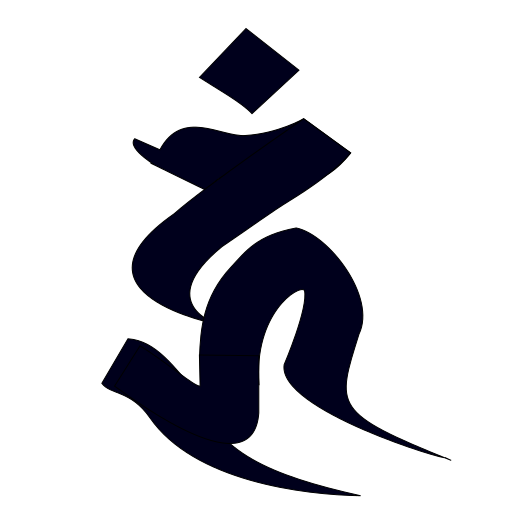
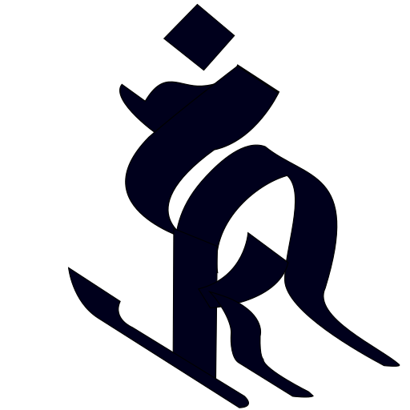
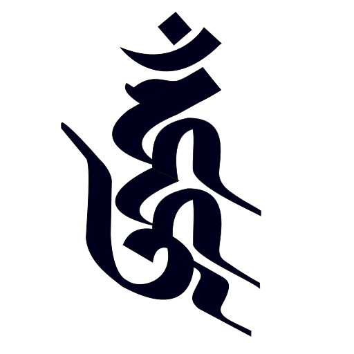
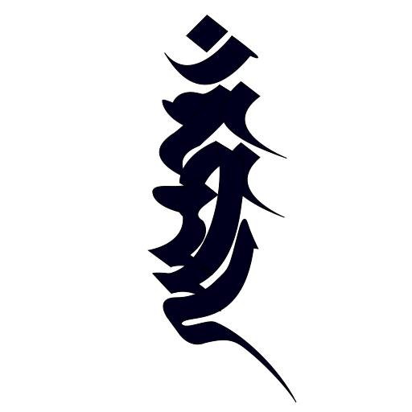

| 天城文   | 转写     | 悉昙文      | 中文   | 悉昙文图像                                                   |
| -------- | -------- | ----------- | ------ | ------------------------------------------------------------ |
| अ        | a        | 𑖀           |        |  |
| अं        | aṃ       | 𑖀𑖽 𑖀𑖼    |        |  |
| अः       | aḥ       | 𑖀𑖾          |        |  |
| आ        | ā        | 𑖁           |        |  |
| आः       | āḥ       | 𑖁𑖾 𑖀𑖲𑖾  |        |  |
| आंः       | āṃḥ      | 𑖁𑖲𑖼𑖾        |        |  |
| इ        | i        | 𑖂           |        |  |
| ई        | ī        | 𑖃           |        |  |
| ॐ        | oṃ       | 𑖌𑖼 𑖌𑖽   | 唵     |  |
| क        | ka       | 𑖎           |        |  |
| क्ष       | kṣa      | 𑖎𑖿𑖬         |        |  |
| खा       | khā      | 𑖏𑖯          | 佉     |                                                              |
| ग        | ga       | 𑖐           |        |  |
| गः       | gaḥ      | 𑖐𑖾          |        |  |
| ङ        | ṅa       | 𑖒           |        |  |
| च        | ca       | 𑖓           |        |  |
| ज्ञा      | jñā      | 𑖕𑖿𑖗𑖯        |        |                                                              |
| त        | ta       | 𑖝           | 多     |  |
| तं        | taṃ      | 𑖝𑖽          |        |                                                              |
| त्रि      | tri      | 𑖝𑖿𑖨𑖰        |        |                                                              |
| त्रं       | traṃ     | 𑖝𑖿𑖨𑖽        |        |                                                              |
| त्राः     | trāḥ     | 𑖝𑖿𑖨𑖯𑖾       |        |  |
| त्राःत्राः | trāḥtrāḥ | 𑖝𑖿𑖨𑖯𑖾𑖝𑖿𑖨𑖯𑖾  |        |                                                              |
| द        | da       | 𑖟           |        |  |
| ध        | dha      | 𑖠           |        |  |
| धी       | dhī      | 𑖠𑖱          |        |                                                              |
| धृ        | dhṛ      | 𑖠𑖴          |        |  |
| धं        | dhaṃ     | 𑖠𑖽          |        |                                                              |
| धिः      | dhiḥ     | 𑖠𑖰𑖾         |        |  |
| ध्वं       | dhvaṃ    | 𑖠𑖿𑖪𑖽        |        |                                                              |
| न        | na       | 𑖡           |        |  |
| नृ        | nṛ       | 𑖡𑖴          |        |  |
| पृ        | pṛ       | 𑖢𑖴          |        |  |
| प्र       | pra      | 𑖢𑖿𑖨         |        |                                                              |
| फं        | phaṃ     | 𑖣𑖽          |        |                                                              |
| बु        | bu       | 𑖤𑗜          |        |  |
| बं        | baṃ      | 𑖤𑖽 𑖤𑖼   |        |                                                              |
| ब्र       | bra      | 𑖤𑖿𑖨         |        |  |
| भः       | bhaḥ     | 𑖥𑖾          |        |    |
| भै        | bhai     | 𑖥𑖹          |        |  |
| भ्रूं       | bhrūṃ    | 𑖥𑖿𑖨𑖳𑖼       |        |  |
| म        | ma       | 𑖦           | 麼     |  |
| मि       | mi       | 𑖦𑖰          |        |                                                              |
| मे        | me       | 𑖦𑖸          |        |                                                              |
| मो       | mo       | 𑖦𑖺          |        |  |
| मं        | maṃ      | 𑖦𑖼          |        |  |
| य        | ya       | 𑖧           |        |  |
| यं        | yaṃ      | 𑖧𑖽          |        |  |
| यु        | yu       | 𑖧𑖲          |        |  |
| युः       | yuḥ      | 𑖧𑗜𑖾         |        |  |
| र        | ra       | 𑖨           | 囉     |  |
| रं        | raṃ      | 𑖨𑖽          |        |                                                              |
| लं        | laṃ      | 𑖩𑖽          |        |                                                              |
| व        | va       | 𑖪           | 嚩     |  |
| वं        | vaṃ      | 𑖪𑖼          | 鑁     |  |
| वा       | vā       | 𑖪𑖯          |        |  |
| वि       | vi       | 𑖪𑖰          |        |  |
| वी       | vī       | 𑖪𑖱          |        |                                                              |
| वै        | vai      | 𑖪𑖹          |        |  |
| शी       | śī       | 𑖫𑖱          |        |                                                              |
| श्री      | śrī      | 𑖫𑖿𑖨𑖱        |        |  |
| स        | sa       | 𑖭           | 娑     |  |
| सं        | saṃ      | 𑖭𑖽          |        |                                                              |
| सः       | saḥ      | 𑖭𑖾          |        |  |
| सु        | su       | 𑖭𑗜          | 蘇     |  |
| स्त्वं      | stvaṃ    | 𑖭𑖿𑖝𑖿𑖪𑖽      | 薩多鑁 |  |
| ह        | ha       | 𑖮           |        |  |
| हः       | haḥ      | 𑖮𑖾          |        |  |
| हं        | haṃ      | 𑖮𑖽          |        |  |
| हां       | hāṃ      | 𑖮𑖯𑖼         |        |  |
| हृ        | hṛ       | 𑖮𑖴          |        |                                                              |
| हुं        | huṃ      | 𑖮𑗜𑖽         |        |  |
| हूं        | hūṃ      | 𑖮𑖳𑖽 𑖮𑗝𑖽 | 吽     |  |
| ह्रीः     | hrīḥ     | 𑖮𑖿𑖨𑖱𑖾       |        |  |
| ह्रूं       | hrūṃ     | 𑖮𑖿𑖨𑖳𑖽       |        |  |
| ह्हूं       | hhūṃ     | 𑖮𑖿𑖮𑖳𑖼       |        |  |
| ह्म्मां     | hmmāṃ    | 𑖮𑖿𑖦𑖿𑖦𑖯𑖼     |        |  |